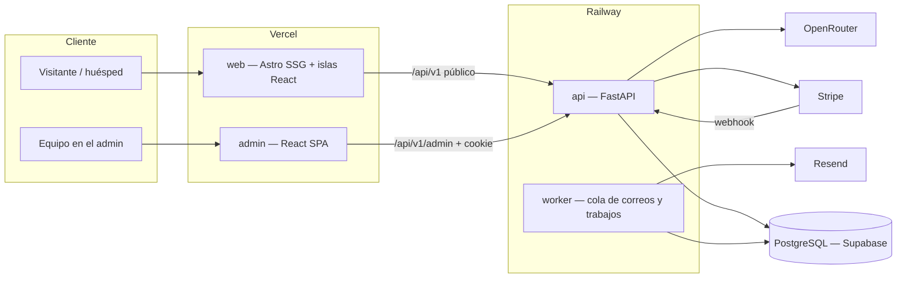

# WORKPLAN — Cabo Transportation Concierge

> **Qué es:** sistema completo de reservas para Cabo Transportation Concierge (Los Cabos, BCS): sitio público con el diseño aprobado, motor de precios, reservas y pagos con Stripe, confirmaciones por correo al cliente y a la empresa, agente de IA "Customer Help", y un admin donde se administra toda la empresa.
> **Base funcional:** todas las funciones de `C:\Users\conde\Documents\classvip-transfers-python` (ClassVIP), reconstruidas sin sus errores.
> **Base visual:** el prototipo aprobado en `site/` (home, arrival guide, video del hero, colores negro con dorado).
> **Dueño del proyecto:** Marlon. **Documento vivo:** se actualiza al terminar cada tarea (ver §0 y `AGENTS.md`).
> **Creado:** 12 sep 2026.

---

## 0. Estado actual

| Indicador | Estado |
|---|---|
| **Fase actual** | F0 — Fundación: 8/9 verificadas. Solo falta **F0.2**: Marlon debe rotar la API key de OpenRouter (el archivo ya salió del repo). CI verde en GitHub: run `34726728816`, commit `b8d66dd`. |
| **Último avance** | 12 sep 2026 — F0:<br>• Repo git con prototipo aprobado.<br>• Backend mínimo FastAPI con `/api/v1/health` y `/health/ready`.<br>• Configuración fail-fast.<br>• Postgres 16 nativo con bases `ctc` y `ctc_test`.<br>• Cliente de API tipado generado desde OpenAPI.<br>• CI escrito.<br>• ADR-001 (entorno sin Docker).<br>• Checklist para el cliente. |
| **Backend** | ✅ App mínima: health y readiness con Postgres real. Ruff (reglas de seguridad) y mypy estricto en 0 errores. |
| **Base de datos** | ✅ Local: Postgres 16.15 nativo con `ctc` y `ctc_test`. Sin tablas todavía (llegan en F1 con Alembic). |
| **Sitio público real** | ❌ Solo el prototipo estático `site/` (HTML generado por `site/build.js`). |
| **Admin** | ❌ No existe. |
| **Tests** | ✅ 6 tests pytest verdes contra Postgres real. pip-audit y npm audit sin vulnerabilidades. |
| **Deploy** | ❌ No configurado. |
| **Git** | ✅ Remoto `github.com/condecorporation-del/Cabotransportationconcierge` (push por la deploy key `~/.ssh/deploy_cabo_concierge`, alias SSH `github-cabo`). Rama `main` subida; gitleaks sin hallazgos en el historial. |

**Siguiente tarea:** F1.1 (engine y sesión por request). En paralelo: F0.2 (Marlon rota la key de OpenRouter).

**Progreso por fase**

```
F0  Fundación y decisiones          [████████--] 8/9
F1  Base de datos y dominio         [----------] 0/12
F2  Motor de precios y catálogo     [----------] 0/9
F3  Reservas públicas               [----------] 0/11
F4  Pagos con Stripe                [----------] 0/10
F5  Emails, PDF y trabajos          [----------] 0/11
F6  Auth y API del admin            [----------] 0/13
F7  Sitio público: migrar prototipo [----------] 0/15
F8  Sitio público: funciones reales [----------] 0/13
F9  Páginas de contenido y navbar   [----------] 0/15
F10 Agente de IA Customer Help      [----------] 0/11
F11 Admin frontend                  [----------] 0/15
F12 SEO                             [----------] 0/12
F13 Seguridad y hardening           [----------] 0/12
F14 QA, performance y e2e           [----------] 0/12
F15 Deploy a producción             [----------] 0/12
F16 Post-lanzamiento                [----------] 0/6
```

---

## 1. Objetivo y alcance

### 1.1 Qué debe hacer el sistema (resultado final)

1. Un visitante entra al sitio, cotiza su traslado desde el hero (hotel, pasajeros, fechas) y ve un precio real calculado por el servidor.
2. Reserva en `/book` en pocos pasos: viaje, vuelos, extras, datos, y paga con tarjeta (Stripe) o elige otro método permitido.
3. En segundos le llega un correo de confirmación con voucher PDF, y a la empresa un correo con todos los detalles.
4. La reserva aparece de inmediato en el admin, en cualquier estado.
5. El equipo administra todo en el admin: reservas, despacho de choferes y vehículos, pagos, cuentas por cobrar, tarifas, hoteles, extras, actividades, promociones, tareas, finanzas, marketing, conversaciones de IA, usuarios y bitácora de auditoría.
6. El cliente consulta o gestiona su reserva en "My Trip" con su código y email, o con el link firmado del correo.
7. El agente "Customer Help" responde en inglés y español, cotiza con precios reales, explica la llegada a SJD, crea borradores de reserva y pasa a un humano por WhatsApp o correo.
8. Todo el sitio público es indexable: HTML real por página, metadatos, datos estructurados, sitemap y velocidad alta.
9. **Bilingüe inglés/español desde el lanzamiento:** todo el sitio, correos, voucher PDF, My Trip y Customer Help. El visitante elige el idioma y la elección se recuerda.
10. **Responsive perfecto:** cada página y el admin funcionan y se ven bien desde 320 px (iPhone SE) hasta 2560 px, con táctil, teclado y orientación horizontal (§12.2).
11. **Carga rápida:** se cumplen los presupuestos de §12.1 en móvil con 4G.
12. **Funciones de allwayscabotransportation.com replicadas** (motor de reserva, mapa interactivo de zonas, directorio de hoteles y página por hotel), con el mismo comportamiento y un diseño más profesional con nuestra paleta (§3.4).
13. Se vende y replica para otras empresas: arquitectura multiempresa (`company_id`) desde la primera migración.

### 1.2 Fuera de alcance por ahora

- App móvil nativa para choferes. El despacho se hace desde el admin, que es responsive, y los choferes reciben avisos por WhatsApp o correo.
- Facturación electrónica CFDI. Se deja preparado el dato fiscal; la integración con PAC va en F16 si Marlon la pide.
- Multiempresa con autoservicio (registro de nuevas empresas). El modelo ya lo soporta, pero la UI de alta es posterior.

---

## 2. Decisiones de arquitectura

Cada decisión trae su porqué. Si alguien quiere cambiar una, registra la nueva decisión en `docs/decisions/` y actualiza esta tabla.

| # | Decisión | Por qué |
|---|---|---|
| D1 | **Backend: Python 3.12 + FastAPI + SQLAlchemy 2 async + asyncpg + Alembic + Pydantic v2.** | Es el stack de ClassVIP que ya funciona en producción (Railway + Supabase). Se reutiliza lo aprendido y se evitan sus errores (ver §4). |
| D2 | **Base de datos: PostgreSQL en Supabase, conectada directo por Session Pooler (5432, SSL).** Alembic usa la conexión Direct. Nunca PostgREST ni `anon key` desde el backend. | Así evitamos la causa del bug "creo una reserva y no aparece en el admin" (RLS y pooler), documentado en `PLAN_PRODUCCION.md` de ClassVIP. |
| D3 | **Sitio público: Astro (SSG) + Tailwind + islas de React** para lo interactivo: cotizador, flujo de reserva, My Trip, formulario de contacto y Customer Help. | ClassVIP es una SPA (Vite) y tuvo problemas de SEO: los bots de redes y de IA no ejecutan JS. Astro genera HTML real por página, envía casi cero JS y permite portar el prototipo `site/`, que ya es HTML, sin rehacer el diseño. |
| D4 | **Admin: React + Vite + TypeScript + TanStack Query + react-hook-form + zod**, en `admin.<dominio>` y con `noindex`. | El admin no necesita SEO y sí mucha interactividad. Se pueden portar los componentes del admin de ClassVIP con el estilo nuevo. |
| D5 | **Cliente de API generado desde OpenAPI** (`openapi-typescript`) y compartido por `web/` y `admin/`. | En ClassVIP el funnel de reservas se rompió por rutas `/api/...` sin `/v1` y por `snake_case` vs `camelCase`. Con tipos generados, un contrato roto no compila. |
| D6 | **Dominios del mismo sitio:** `www.` (web), `api.` (backend), `admin.` (admin) bajo un solo dominio registrado. | La cookie de sesión funciona con `SameSite=Lax` y sin CORS cruzado entre Vercel y Railway, que en ClassVIP obligó a `samesite=none` y a manejar CORS a mano. |
| D7 | **Correos con Resend + tabla `email_outbox` + proceso `worker`** que envía con reintentos. | Un correo nunca bloquea la API ni tumba una reserva (bug §2.5 de ClassVIP). No hace falta Redis: el worker lee la cola con `SELECT … FOR UPDATE SKIP LOCKED`. |
| D8 | **Un solo motor de precios en el servidor** (`services/pricing.py`), usado por web, admin, IA y Stripe. El frontend nunca calcula el precio que se cobra. | En ClassVIP el precio de combos estaba duplicado a mano entre frontend y backend, y había precios de Sprinter en 0 o duplicados. |
| D9 | **Precios en centavos (int) y fechas con zona horaria** (`America/Mazatlan` para operación). | Evita errores de redondeo y de hora. Los Cabos usa la hora de `America/Mazatlan`. |
| D10 | **Multiempresa desde la migración inicial:** `company_id` en todas las tablas de negocio, con una empresa por defecto. | Es la meta de vender el sistema. Migrarlo después cuesta 10 veces más (lección de ClassVIP). |
| D11 | **Tramos de viaje (`booking_legs`) en tabla propia**, no dentro de `metadata`. | ClassVIP reconstruía llegada y salida parseando `metadata` (`booking_operations.py`), lo que era frágil. El despacho necesita filtrar por fecha y hora de cada tramo. |
| D12 | **IA vía OpenRouter** (API compatible con OpenAI, modelo configurable por variable de entorno) **con herramientas** (function calling). | Marlon ya usa OpenRouter. Las herramientas garantizan que la IA nunca invente precios ni datos: todo sale de la base. |
| D13 | **Tests contra PostgreSQL real** (nativo en local según ADR-001, contenedor de servicio en CI), no SQLite. | ClassVIP probaba con SQLite en memoria, lo que esconde diferencias de Postgres (enums, `FOR UPDATE`, secuencias, tipos). |
| D14 | **Deploy:** backend y worker en Railway (Docker), web en Vercel, admin en Vercel y base en Supabase. Staging separado de producción. | Es lo que ya funciona en ClassVIP; staging evita probar en producción. |
| D15 | **Bilingüe EN/ES desde el lanzamiento** con el i18n de Astro:<br>• Inglés en `/` y español en `/es/`, con los mismos slugs.<br>• Diccionarios de UI tipados (el build falla si falta una clave) y contenido por idioma.<br>• Selector en el header que mantiene la página equivalente, más `hreflang` y `x-default`.<br>• El idioma se guarda en la reserva y define correos, voucher y respuestas de la IA.<br>• El admin va en español con opción de inglés. | Marlon lo pidió (12 sep 2026). Hacerlo desde F7 cuesta mucho menos que traducir al final, y los clientes son turistas de EE. UU. y Canadá además de hispanohablantes. |
| D16 | **Responsive primero:**<br>• Diseño desde 320 px, con breakpoints 360/390 (móvil), 768 (tablet), 1024 (laptop) y 1440+ (desktop).<br>• Objetivos táctiles ≥ 44 px y sin scroll horizontal.<br>• Tablas que en móvil se vuelven tarjetas; selectores y menús tipo bottom sheet. | Marlon lo pidió; la mayoría de los turistas reserva desde el teléfono. |
| D17 | **Funciones replicadas de allwayscabotransportation.com:** motor de reserva, mapa interactivo de zonas, directorio de hoteles y página por hotel. Mismo comportamiento, diseño mejorado con obsidiana y dorado (especificación en §3.4). | Marlon lo pidió; son funciones probadas en el mismo mercado y con el mismo tipo de cliente. |

---

## 3. Paridad con ClassVIP: qué se porta y qué se corrige

Referencia: `classvip-transfers-python/backend/app/api/v1/*.py`, `models/`, `services/`, `frontend/src/features/`.

### 3.1 Funciones públicas

| Función en ClassVIP | Estado allá | Qué se hace aquí |
|---|---|---|
| Catálogo: hoteles, áreas, reglas, extras (`/pricing/*`) | Funciona, pero con datos mezclados: `areas` con precios de SUV, `pricing_rules` con Sprinter, precios en 0 y reglas duplicadas o inactivas. | Tablas limpias `zones`, `hotels`, `rates` (zona × vehículo × tipo de viaje) y `extras`. Seed con datos corregidos y validados (F1.9). |
| Crear reserva (`POST /bookings/`) | Nace en DRAFT; tuvo bug `metadata_` y código de confirmación con condición de carrera. | Reserva con tramos e items, código desde secuencia Postgres y máquina de estados explícita (F3). |
| Ver reserva y PDF (`GET /bookings/{id}`, `/pdf`) | Protegido con token después de la auditoría. | Token firmado con expiración y alcance, más My Trip con código y email (F3.7, F8.4). |
| Stripe: `create-payment-intent`, `confirm-payment`, `webhook` | `confirm-payment` faltaba (Fase 18); las reservas pagadas quedaban en DRAFT; había pagos pendientes duplicados. | Intent idempotente por reserva, confirmación rápida verificada contra Stripe y webhook idempotente con tabla `stripe_events` (F4). |
| Clientes (`/customers`) | `POST` público sin rate limit. | Sin endpoint público: el cliente se crea dentro de la reserva (F3). |
| Chat de IA (`/ai/chat`, `/ai/transcribe`) | OpenAI y Whisper; el widget llamaba rutas equivocadas. | Customer Help con OpenRouter, herramientas, streaming y guardado de conversaciones (F10). La voz queda para F16. |
| Actividades y combos (Activities.tsx: 2 por $100, 3 por $125 por persona, park fee de $25, depósito de $500 para ATV/UTV, RZR de 1 a 4 personas) | Precio del combo duplicado a mano. | Tablas `activities` y `activity_packages`, con precio en el motor único (F2.6). |

### 3.2 Funciones del admin (pestañas de `Admin.tsx`)

| Pestaña o función en ClassVIP | Estado allá | Qué se hace aquí |
|---|---|---|
| Dashboard: servicios de hoy y mañana, resumen mensual, atención requerida | Funciona | Se porta y se agregan alertas: sin chofer, sin pagar, vuelo mañana sin datos (F11.2). |
| Reservaciones: lista, export, editar, confirmar, marcar pagado o no pagado, cancelar, borrar, asignar, reenviar confirmación | Funciona; por defecto debe mostrar todos los estados. | Se porta, más reembolso Stripe al cancelar, borrado lógico con auditoría y línea de tiempo por reserva (F6, F11.3). |
| Nueva reserva manual (none → OFFLINE_HOLD, cash → CONFIRMED, stripe → PENDING_PAYMENT, add to account) | "Send Stripe Link" no generaba un link real. | Link real de Stripe Checkout enviado por correo y copiable (F4.6, F11.4). |
| Tareas (TareasTab) | Al principio solo en localStorage; luego se hizo el backend (Fase 22). | Backend compartido por empresa desde el inicio (F6.9). |
| Finanzas: revenue de 30 días, cobradas, cuentas por cobrar, cuentas abiertas | Funciona | Se porta, más ledger de pagos y export (F11.7). |
| Cuentas por cobrar (AccountsTab: abrir crédito, cargos, abonos, ledger) | Funciona | Se porta (F6.8, F11.8). |
| Marketing: reservas del mes y de hoy, conversión, valor promedio, día pico, zona más reservada | Funciona | Se porta, más códigos promocionales (la promo de septiembre), origen UTM y reseñas destacadas (F11.9). |
| RRHH: conductores y vehículos | Solo GET y POST, sin editar ni desactivar. | CRUD completo, más disponibilidad y licencias con fecha de vencimiento (F6.7, F11.10). |
| Configuración (PricingManager): tarifas, hoteles, extras | Funciona con el modelo de datos confuso. | Editor de la matriz zona × vehículo × viaje, hoteles con zona y alias, extras, actividades y ajustes de empresa (F11.11). |
| Usuarios admin (`/admin/users`) | API sin pantalla | Pantalla con roles (F11.12). |
| Audit log | El modelo existía pero no se usaba en ningún endpoint; se conectó tarde. | Auditoría automática en cada mutación desde el principio (F6.10). |
| Email log | Existe | Pantalla con estado, reintento y vista previa (F11.13). |

### 3.3 Funciones nuevas que ClassVIP no tiene

- My Trip: el cliente consulta o cambia su reserva y descarga el voucher.
- Formulario de contacto conectado (hoy `action="#"`) con bandeja en el admin.
- Promociones con fecha de viaje (la del video: 10% en tarifa de traslado del 1 al 30 de septiembre, extras no incluidos).
- Recordatorio automático 24 h antes del servicio, con datos del chofer.
- Solicitud de reseña después del servicio.
- Páginas programáticas por hotel y por zona (SEO) generadas desde la base.
- Mapa interactivo de zonas ("Explore interactive map").
- Galería con lightbox ("See all 9 photos").
- Estado de vuelos SJD ("Flight Status"), sujeto a D-P7 (§16).

### 3.4 Funciones que se replican de allwayscabotransportation.com

Marlon pidió copiar estas funciones **tal como funcionan** en allwayscabotransportation.com y **mejorar el diseño** con nuestros colores para que se vea más profesional. Todas son bilingües (D15) y responsive (D16).

Referencia analizada el 12 sep 2026: HTML del home, `/los-cabos-hotel-shuttles`, `/alegranza` y `/booking`, y los chunks JS `BookingHome`, `BookingSteps`, `Vehicle`, `VehicleBottomSheet`, `Payments` y `ZoneMap`.

#### 3.4.1 Motor de reserva (Reserve transfer, Book My Ride, Get a quote, Compare & reserve)

**Cómo funciona allá**

- **Tipos de servicio** en pestañas: Airport Round-Trip, Airport One-Way, Local Round-Trip y Local One-Way. Además hay chofer privado por hora ("USD / hr") y City Tour.
- **Campos:** Pickup Location, Drop-off Location, Arrival Date, Return Date (solo round trip), Passengers (stepper), Vehicle, Estimated Total / Total Due y el botón Book My Ride.
- **Reglas y mensajes:**
  - "For Airport Round-Trips, the Pick-up location must be the Airport." (origen con etiqueta "Locked")
  - "For this route, the Drop-off location is locked to the Airport."
  - "For this service, the Drop-off location cannot be the Airport."
  - "Pick-up and Drop-off locations cannot be the same."
  - "Select your pick-up location." / "Select your drop-off location." / "Select your arrival date." / "Select your return date for round-trip." / "Select a vehicle to continue."
  - Recargo nocturno "Night surcharge · 11 PM – 5 AM" con el aviso "Additional fee applies to services scheduled at night".
  - Aviso "Same Day".
  - "Rate unavailable — try another vehicle or call …" cuando no hay tarifa.
- **Selector de vehículo** en bottom sheet, que se cierra con Escape o tocando el overlay: Suburban (5), Cadillac Escalade (5), Van (10), Sprinter (17) y Limousine.
- **Pasos** (`BookingSteps`) con check al completar cada uno, y luego "Secure Checkout".
- **Página de pago:**
  - Resumen con Type of Service, Unit (Vehicle) y Passengers, y el botón "Make your payment".
  - Estados: "Looks like you already made this payment", "You have canceled the payment process" y error de conexión.
  - "Retrieve your voucher" / "View Voucher" con Transaction ID, Amount, Date y Type.
- **Honeypot** anti-bots ("Leave blank if you are human") y código de reserva con prefijo (`ALLW-`; aquí `CTC-`).

**Cómo se hace aquí**

- Mismos tipos de servicio, campos, reglas y mensajes, traducidos EN/ES. Los precios salen del motor único (D8) y las reglas se validan también en el servidor.
- Origen y destino con autocompletado:
  - Aeropuerto SJD y los 245 hoteles de la base.
  - "Otra dirección" para villas: el admin asigna la zona y la reserva queda en `OFFLINE_HOLD` si no hay tarifa automática.
- Selector de vehículo con tarjetas: foto, pasajeros, maletas, precio de ese viaje y "Most popular". En móvil es bottom sheet; en desktop, popover. Los vehículos sin capacidad suficiente aparecen deshabilitados con el motivo.
- Resumen con desglose y total: fijo (sticky) en desktop; en móvil, barra inferior con el total y "Continue".
- Indicador de pasos accesible y progreso guardado si el visitante recarga.
- Checkout con Stripe Payment Element (tarjeta, Apple Pay y Google Pay), los mismos estados de pago que allá y voucher descargable.
- Diseño: tarjetas obsidiana con borde dorado, inputs de alto contraste y una microanimación cuando cambia el precio.

#### 3.4.2 Mapa interactivo de zonas (Explore interactive map)

**Cómo funciona allá**

- El botón abre el componente `ZoneMap`, titulado "Cabo Transportation Zone Map — Airport Transfer Coverage by Hotel Zone", con un texto introductorio.
- Tiene botones de zona, cada uno con su color:

  | Zona | Nombre |
  |---|---|
  | Zone 1 | San José del Cabo |
  | Zone 2 | Corridor |
  | Zone 3 | Cabo San Lucas |
  | Zone 4 | Pacific Side |

  Además está "All Destinations".
- Al tocar una zona, la imagen cambia al mapa de cobertura de esa zona (un SVG por zona) sobre el "Map of Baja California Sur", que marca Los Cabos Airport, East Cape, La Paz y Todos Santos.

**Cómo se hace aquí**

- **Interacción:** la misma (botones de zona y All Destinations), en un modal accesible desde el home y en la página `/map`.
- **Mapa:** vectorial propio (SVG) de Baja California Sur con zonas que se resaltan con un trazo y relleno dorado animados. Es nítido en cualquier pantalla y más ligero que imágenes sueltas.
- **Panel de la zona elegida:** tiempo desde SJD, precio "desde", hoteles de la zona (con link a su página) y el botón "Reserve in this zone", que prellena el motor.
- **Buscador "¿En qué zona está mi hotel?":** resalta la zona del hotel.
- **Colores de zona:** tonos de la paleta (champagne, dorado, bronce y cobre) con alto contraste, y siempre con etiqueta de texto, sin depender solo del color.
- **Móvil:** los botones de zona son chips con scroll horizontal y el mapa ocupa todo el ancho.
- **Carga diferida:** el SVG y la lógica se cargan al abrir el mapa.

#### 3.4.3 Directorio de hoteles (Browse all hotel transfers → `/los-cabos-hotel-shuttles`)

**Cómo funciona allá** (en este orden)

1. **Hero** "Cabo Airport Transportation to Your Hotel", con los botones "Book a transfer" y "Call".
2. **"Plan your arrival".**
3. **"Browse by area":** una tarjeta por área con 5 hoteles destacados y el tiempo desde SJD.

   | Área | Minutos desde SJD |
   |---|---|
   | San José del Cabo | 18 |
   | Puerto Los Cabos | 24 |
   | Tourist Corridor | 30 |
   | Cabo San Lucas | 48 |
   | Pacific Side | 55 |
   | East Cape | 60 |
   | Todos Santos | 85 |

4. **Mapa de zonas.**
5. **Una sección por área** con grid de tarjetas de hotel (132 en total). Cada tarjeta tiene:
   - Foto 16:10 con el nombre del área encima.
   - Título "{Hotel} airport transportation".
   - Texto "Private SJD transfer · bilingual driver · tolls included".
   - Link "View rates and book".
6. **FAQ** y CTA final "Ready when your flight lands".

**Cómo se hace aquí**

- Misma estructura y orden.
- Buscador instantáneo arriba (nombre o alias, sin importar acentos), chips para filtrar por zona y contador de resultados. La URL guarda `?zone=` y `?q=` para poder compartir la búsqueda.
- Tarjetas con nuestro estilo: foto, etiqueta dorada de zona, tiempo desde SJD, "from $X" y CTA.
- Los 245 hoteles de nuestra base, sin fotos de All Ways (fotos propias o una genérica por zona; D-P3).
- Todas las tarjetas vienen en el HTML (bueno para SEO) y se muestran de forma progresiva.
- Grid de 1 columna en móvil, 2 en tablet y 3 o 4 en desktop.

#### 3.4.4 Página por hotel (`/hotels/[slug]`)

**Cómo funciona allá** (ejemplo `/alegranza`)

1. Breadcrumbs: Home / Destinations / Zona / Hotel.
2. Hero con el título "{Hotel} Airport Transportation", subtítulo y badges (tiempo de traslado, 100% Private, reseñas).
3. Widget de reserva embebido con el destino prellenado y "Change destination".
4. Ficha: Travel time, Distance (km desde SJD), Service 100% Private y peajes incluidos.
5. Tabla "Private transfer rates": vehículo, capacidad, one-way, round-trip y botón Book, con "Most popular".
6. Texto único del hotel: cómo es la llegada, paradas de súper y cenas.
7. "Other Hotels in {zona}" y FAQ específica del hotel.
8. CTA final "From $X".
9. JSON-LD: `Service`, `Offer`, `BreadcrumbList`, `FAQPage` y `LocalBusiness`.

**Cómo se hace aquí**

- Misma estructura, con datos de nuestra base: zona, tiempo, distancia y tarifas reales.
- El widget es el motor de §3.4.1, prellenado con el hotel.
- Texto único y bilingüe por hotel (F12.5) y fotos propias.
- En móvil la tabla de tarifas se convierte en tarjetas.

---

## 4. Errores de ClassVIP que no se pueden repetir

Cada fila tiene su prevención concreta y la tarea donde se aplica. Fuentes: `DIAGNOSTICO.md`, `PLAN_PRODUCCION.md` y `WORKPLAN.md` (Fases 12 a 24) de ClassVIP.

| # | Error en ClassVIP | Prevención aquí | Tarea |
|---|---|---|---|
| E1 | Reserva creada que no aparece en el admin (RLS de Supabase, pooler, filtro por estado) | Conexión directa (D2); el listado del admin muestra todos los estados por defecto; test e2e "reservo y la veo en el admin". | F1.2, F6.4, F14.4 |
| E2 | Tablas sin migraciones; `create_all` no corría en producción | Solo Alembic; `start.sh` corre `alembic upgrade head`; CI verifica que no haya migraciones pendientes. | F1.3, F15.3 |
| E3 | Frontend llamando `/api/...` sin `/v1` y mezclando `snake_case` y `camelCase` | Cliente generado desde OpenAPI (D5); prohibido escribir URLs de API a mano. | F0.6, F7.10 |
| E4 | Bug `metadata=` vs `metadata_` que los tests no detectaron | Tramos en tabla propia (D11); tests con datos completos; mypy estricto. | F1.5, F14.2 |
| E5 | `secret_key="change-me"` en producción | Configuración fail-fast: la app no arranca si falta un secreto o si es débil. | F0.8 |
| E6 | Correo síncrono bloqueando el event loop | Outbox y worker (D7). | F5.1 |
| E7 | Código de confirmación con `COUNT(*)` (condición de carrera) | Secuencia Postgres por empresa; test de 50 reservas concurrentes. | F3.3 |
| E8 | Reserva pagada atascada en DRAFT | Máquina de estados con transiciones permitidas y test por cada transición. | F3.2, F4.4 |
| E9 | PaymentIntents pendientes duplicados al recargar | Un intent activo por reserva, reutilizado; columna `stripe_payment_intent_id` única. | F4.2 |
| E10 | `POST /customers/` público y sin rate limit | Sin endpoint público de clientes; rate limit en todo endpoint público. | F3.1, F13.3 |
| E11 | Sin security headers ni CSRF propio | Middleware de headers, CSP y token CSRF en mutaciones del admin. | F13.1, F6.3 |
| E12 | SPA sin HTML por página (SEO débil) | Astro SSG (D3). | F7 |
| E13 | Componentes del admin "huérfanos" (existían pero nunca se renderizaban) y placeholders "Próximamente" | Definición de terminado: cada pantalla se verifica en el navegador con datos reales. | F11 |
| E14 | Precios de combos duplicados en frontend y backend | Motor único de precios (D8). | F2 |
| E15 | Dependencias instaladas pero sin uso (Celery, structlog, Sentry) | Regla: si se instala, se usa y se prueba; si no, se quita. | Todas |
| E16 | Documentación que decía "100/100 ✅" sin ser cierto | §0 honesto; nada se marca hecho sin verificación ejecutada (ver `AGENTS.md`). | Todas |
| E17 | JWT del admin filtrado en git | `.gitignore` desde F0, escaneo de secretos en CI (gitleaks) y rotación de claves. | F0.1, F0.7 |
| E18 | Cookie cruzada Vercel ↔ Railway (`samesite=none`) | Dominios del mismo sitio (D6). | F15.2 |
| E19 | Tests con SQLite que no reflejan Postgres | Postgres real en tests (D13). | F0.5 |

---

## 5. Arquitectura

### 5.1 Diagrama



### 5.2 Estructura de carpetas (objetivo)

```
cabo-transportation-concierge/
├── AGENTS.md                  ← reglas para cualquier agente (leer primero)
├── WORKPLAN.md                ← este documento
├── README.md                  ← cómo correr todo en local
├── docs/
│   ├── BITACORA.md            ← qué se hizo en cada sesión, con verificación
│   ├── decisions/             ← ADR-###-titulo.md (cambios a §2)
│   └── content/               ← textos reescritos, checklist de contenido del cliente
├── backend/
│   ├── app/
│   │   ├── main.py            ← app FastAPI, middlewares, routers
│   │   ├── core/              ← config (fail-fast), security, logging, errors, rate_limit
│   │   ├── db/                ← engine, session, base, tenancy (company scope)
│   │   ├── models/            ← SQLAlchemy (una tabla por archivo + enums.py)
│   │   ├── schemas/           ← Pydantic request/response (nunca exponer modelos)
│   │   ├── services/          ← lógica de negocio (pricing, booking, payment, email, ai…)
│   │   ├── api/v1/            ← routers: public/, admin/, webhooks/
│   │   ├── ai/                ← prompts, herramientas, guardrails
│   │   ├── worker/            ← loop de la cola (outbox), recordatorios programados
│   │   └── templates/         ← emails (MJML compilado o Jinja) y PDF
│   ├── alembic/
│   ├── scripts/               ← seed_catalog.py, ensure_owner.py, check_db.py
│   └── tests/                 ← unit/, services/, api/, fixtures/
├── web/                       ← Astro (sitio público)
│   ├── src/
│   │   ├── layouts/           ← BaseLayout (SEO, header, footer, botones flotantes)
│   │   ├── components/        ← Header, MegaMenu, Footer, secciones del prototipo
│   │   ├── islands/           ← BookingWidget, BookingFlow, MyTrip, ContactForm, CustomerHelp
│   │   ├── pages/             ← rutas (ver §9)
│   │   ├── content/           ← guías y páginas de servicio (Markdown/MDX)
│   │   ├── styles/            ← tokens.css (paleta del prototipo), animaciones
│   │   └── lib/               ← api client, seo helpers, schema.org builders
│   └── public/                ← videos, imágenes optimizadas, robots.txt
├── admin/                     ← React + Vite
│   └── src/{app,modules/<modulo>,components,lib}
├── packages/
│   └── api-client/            ← tipos TS generados desde OpenAPI (no editar a mano)
├── site/                      ← PROTOTIPO APROBADO — referencia visual, no se borra
├── design/                    ← primer prototipo descartado — borrar con OK de Marlon
└── .github/workflows/         ← ci.yml, e2e.yml
```

---

## 6. Modelo de datos

Reglas de todas las tablas: PK `id` UUID; `company_id` FK (excepto `companies`); `created_at` y `updated_at` con timezone; montos en `*_cents` int; borrado lógico `deleted_at` donde aplique; índices por `(company_id, …)`.

| Tabla | Campos clave | Notas |
|---|---|---|
| `companies` | name, slug, legal_name, tax_id, timezone, currency, default_language | Una fila al inicio: Cabo Transportation Concierge. |
| `company_settings` | phone, whatsapp, email_ops, email_from, address_lines, offices (jsonb), social links, cancellation_policy, change_policy, arrival_instructions, meeting_point | Lo que hoy es placeholder en el sitio sale de aquí. |
| `admin_users` | email (único por empresa), password_hash (argon2), role, is_active, totp_secret (cifrado), last_login_at, failed_logins, locked_until | Roles: `owner`, `manager`, `dispatcher`, `finance`, `viewer`. |
| `sessions` | admin_user_id, token_hash, csrf_hash, ip, user_agent, expires_at, revoked_at | Sesión de servidor, revocable. |
| `customers` | name, email, phone, whatsapp, language, country, notes, marketing_opt_in | Único por (company_id, email). |
| `zones` | name, slug, sort, description, drive_time_min/max, is_active | 6 zonas (§16 D-P1). |
| `hotels` | name, slug, zone_id, aliases (text[]), address, lat, lng, is_active, seo_intro | Búsqueda con `pg_trgm`; página programática `/hotels/{slug}`. |
| `vehicle_classes` | code (SUBURBAN, SPRINTER, VAN, ESCALADE, LIMO), name, min_pax, max_pax, max_bags, is_active | La capacidad define el vehículo asignado. |
| `rates` | zone_id, vehicle_class_id, trip_type (ONE_WAY, ROUND_TRIP), service_type (AIRPORT, LOCAL), price_cents, is_active | Único (company, zone, vehicle, trip, service). Reemplaza `areas` + `pricing_rules`. |
| `extras` | code, name_en, name_es, description, price_cents, pricing_mode (PER_BOOKING, PER_STOP, PER_SEAT, PER_HOUR), max_qty, included, auto_rule (LATE_NIGHT, EARLY_MORNING), is_active | 16 extras de ClassVIP. |
| `activities` | slug, name, description, duration_min, images, requirements, is_active | ATV, RZR, camello, caballo, Sky Bikes. |
| `activity_packages` | name, activity_count, price_per_person_cents, park_fee_cents, deposit_cents, includes (text[]) | Combo (2) $100 y Crazy Combo (3) $125. |
| `promotions` | code (nullable = automática), name, discount_type (PERCENT, FIXED), value, applies_to (TRANSFER_BASE, ALL), travel_from, travel_to, book_from, book_to, max_uses, is_active | Septiembre: 10% en tarifa de traslado, viaje del 1 al 30 de sep. |
| `bookings` | code (secuencia), status, source (WEBSITE, ADMIN, AI_CHAT, WHATSAPP, PHONE), booking_type (TRANSFER, ACTIVITY, MIXED), customer_id, language, subtotal_cents, discount_cents, tax_cents, total_cents, currency, promotion_id, payment_method_intent, notes_customer, notes_internal, created_by_admin_id, utm (jsonb), cancelled_at, cancel_reason, deleted_at | La máquina de estados vive en el servicio (§8.2). |
| `booking_legs` | booking_id, leg_type (ARRIVAL, DEPARTURE, LOCAL), service_date, service_time, pickup_time, flight_number, airline, origin, destination, hotel_id, pax_adults, pax_children, vehicle_class_id, status | Base del despacho. Índice (company_id, service_date). |
| `booking_items` | booking_id, leg_id (nullable), item_type (TRANSFER, EXTRA, ACTIVITY, PARK_FEE, DISCOUNT), ref_id, description, quantity, unit_price_cents, total_cents | Snapshot del precio al reservar (no cambia si luego cambian las tarifas). |
| `booking_assignments` | leg_id, driver_id, vehicle_id, assigned_by, notified_at | Una asignación activa por tramo. |
| `payments` | booking_id, provider (STRIPE, CASH, BANK_TRANSFER, ACCOUNT, MANUAL), status, amount_cents, stripe_payment_intent_id (único), stripe_checkout_session_id (único), received_by, receipt_url, refunded_cents | |
| `stripe_events` | event_id (único), type, payload, processed_at | Idempotencia del webhook. |
| `drivers` | name, phone, whatsapp, license_number, license_expires_on, languages, is_active | |
| `vehicles` | vehicle_class_id, plate, make, model, year, color, capacity, insurance_expires_on, is_active | |
| `client_accounts` | customer_id, name, status (OPEN, ON_HOLD, SETTLED, CLOSED), credit_limit_cents, balance_cents | Crédito para clientes frecuentes y villas. |
| `account_charges` | account_id, booking_id, description, amount_cents, status (PENDING, INVOICED, PAID, VOID) | |
| `account_payments` | account_id, method, amount_cents, reference, received_at | |
| `admin_tasks` | title, description, due_date, due_time, category, status, assigned_to | Compartidas por empresa. |
| `audit_logs` | admin_user_id, action, entity, entity_id, before (jsonb), after (jsonb), ip | Se escribe automáticamente en cada mutación. |
| `email_outbox` | to, cc, bcc, template, context (jsonb), language, booking_id, status (PENDING, SENDING, SENT, FAILED), attempts, next_attempt_at, provider_message_id, last_error | Cola del worker (D7). |
| `ai_conversations` | channel (WEB), customer_email (nullable), language, status (OPEN, HANDOFF, CLOSED), lead_booking_id, token_usage, cost_usd | |
| `ai_messages` | conversation_id, role, content, tool_name, tool_args, tool_result | Sin datos de tarjeta. |
| `contact_messages` | name, email, phone, message, source_page, status (NEW, REPLIED, ARCHIVED) | Formulario "Drop us a line". |
| `reviews` | author, location, source (GOOGLE, TRIPADVISOR), rating, text, review_date, is_featured | Solo reseñas reales del cliente. |

---

## 7. Contrato de la API (`/api/v1`)

La especificación OpenAPI es la fuente de verdad; esta lista es el mapa. **Público** = sin sesión, con rate limit. **Admin** = sesión, CSRF y rol.

### 7.1 Público

| Método | Ruta | Uso |
|---|---|---|
| GET | `/health`, `/health/ready` | Liveness; readiness con `SELECT 1`. |
| GET | `/catalog/zones` | Zonas con precio "desde". |
| GET | `/catalog/hotels?q=` | Búsqueda de hoteles (trigram, máximo 10). |
| GET | `/catalog/hotels/{slug}` | Datos de la página de hotel. |
| GET | `/catalog/vehicles`, `/catalog/extras`, `/catalog/activities`, `/catalog/packages` | Catálogo. |
| POST | `/quotes` | Cotización autoritativa: tramos, pasajeros, extras, promo → líneas y total. |
| POST | `/bookings` | Crear reserva (idempotency key en header). |
| GET | `/bookings/lookup` (code + email) | My Trip; devuelve un token de gestión. |
| GET | `/bookings/{code}` (token) | Detalle para el cliente. |
| PATCH | `/bookings/{code}` (token) | Cambios permitidos por política (vuelo, horas, notas). |
| POST | `/bookings/{code}/cancel` (token) | Cancelación según política. |
| GET | `/bookings/{code}/voucher.pdf` (token) | Voucher. |
| POST | `/payments/intent` | Crear o reutilizar PaymentIntent de la reserva. |
| POST | `/payments/confirm` | Confirmación rápida verificada con Stripe. |
| POST | `/webhooks/stripe` | Webhook firmado e idempotente. |
| POST | `/contact` | Formulario (honeypot y Turnstile). |
| POST | `/ai/chat` (SSE) | Customer Help con streaming. |
| GET | `/content/settings` | Contacto, oficinas y políticas para el sitio (con caché). |

### 7.2 Admin (`/api/v1/admin`)

| Área | Rutas |
|---|---|
| Auth | `POST /auth/login`, `POST /auth/logout`, `GET /auth/me`, `POST /auth/totp/*`, `POST /auth/password` |
| Dashboard | `GET /dashboard?date=` |
| Reservas | `GET /bookings` (todos los estados, filtros, paginación), `GET /bookings/export.csv`, `POST /bookings` (manual), `GET/PATCH /bookings/{id}`, `POST /bookings/{id}/confirm`, `/mark-paid`, `/mark-unpaid`, `/cancel` (reembolso opcional), `/payment-link`, `/resend-confirmation`, `DELETE /bookings/{id}` (lógico), `GET /bookings/{id}/timeline` |
| Despacho | `GET /dispatch?date=`, `POST /legs/{id}/assign`, `DELETE /legs/{id}/assign` |
| Flota | CRUD `/drivers`, CRUD `/vehicles`, CRUD `/vehicle-classes` |
| Catálogo | CRUD `/zones`, `/hotels`, `/rates` (edición por matriz), `/extras`, `/activities`, `/packages`, `/promotions` |
| Finanzas | `GET /finance/summary`, `GET /payments`, `POST /payments` (manual), `POST /payments/{id}/refund` |
| Cuentas | CRUD `/accounts`, `POST /accounts/{id}/charges`, `PATCH /accounts/{id}/charges/{cid}`, `POST /accounts/{id}/payments`, `POST /accounts/{id}/bookings` |
| Marketing | `GET /marketing/kpis`, CRUD `/reviews` |
| Tareas | CRUD `/tasks` |
| Comunicación | `GET /emails` (outbox), `POST /emails/{id}/retry`, `GET /contact-messages`, `PATCH /contact-messages/{id}` |
| IA | `GET /ai/conversations`, `GET /ai/conversations/{id}` |
| Sistema | CRUD `/users` (solo owner), `GET /audit-logs`, `GET/PATCH /settings` |

---

## 8. Flujos clave

### 8.1 Reserva web con tarjeta

1. La isla `BookingWidget` del hero llama `POST /quotes` y muestra el total real.
2. `/book` (isla `BookingFlow`) tiene 4 pasos: viaje, vuelos, extras y datos. Cada cambio vuelve a cotizar.
3. `POST /bookings` crea la reserva con status `PENDING_PAYMENT`, tramos, items con precio congelado y código `CTC-2026-000123`.
4. `POST /payments/intent` crea o reutiliza el intent; Stripe Payment Element en `/checkout`.
5. Al pagar: `POST /payments/confirm` verifica con Stripe, la reserva pasa a `PAID` y se encolan los correos. El webhook hace lo mismo de forma idempotente si el paso anterior falló.
6. `/booking/confirmation?code=…&token=…` muestra el resumen y el voucher.
7. El worker envía al cliente la confirmación con PDF y a la empresa el aviso de nueva reserva pagada.
8. La reserva aparece en el admin (test e2e obligatorio, F14.4).

### 8.2 Máquina de estados de la reserva

| Desde | Hacia | Quién o qué |
|---|---|---|
| — | `PENDING_PAYMENT` | Web con tarjeta, admin con link de Stripe |
| — | `OFFLINE_HOLD` | Admin sin pago o IA (borrador por confirmar) |
| — | `CONFIRMED` | Admin con efectivo o cuenta de crédito |
| `PENDING_PAYMENT` | `PAID` | Pago completado (confirm o webhook) |
| `OFFLINE_HOLD` | `CONFIRMED` / `PENDING_PAYMENT` | Admin |
| `PAID` | `CONFIRMED` | Admin o automático al asignar chofer |
| `CONFIRMED`, `PAID` | `COMPLETED` | Automático al terminar el último tramo, o admin |
| cualquiera excepto `COMPLETED` | `CANCELLED` | Cliente (según política) o admin; reembolso opcional |

Transición no listada = error 409. Cada transición escribe `audit_logs` y, si aplica, encola un correo.

### 8.3 Correos

| Evento | Cliente | Empresa |
|---|---|---|
| Reserva creada, pago pendiente | "Complete your booking", con link de pago | Nueva reserva pendiente |
| Pago recibido / confirmada | Confirmación + voucher PDF + instrucciones de llegada | Reserva pagada o confirmada (detalle completo de tramos) |
| Cambio de reserva | Actualización | Aviso de cambio |
| Cancelación | Cancelación + reembolso si aplica | Aviso de cancelación |
| 24 h antes | Recordatorio + chofer, vehículo y punto de encuentro | — |
| Servicio completado | Solicitud de reseña | — |
| Chofer asignado | — | Aviso al chofer por correo; WhatsApp en F16 |
| Handoff de IA / contacto | Acuse de recibo | Lead con transcripción o mensaje |

Plantillas bilingües EN/ES según `bookings.language`, con marca (negro y dorado, logo CTC) y texto plano alternativo. El dominio de correo necesita SPF, DKIM y DMARC (F15.5).

### 8.4 Customer Help (IA)

- Herramientas: `search_hotels`, `get_quote`, `get_arrival_instructions`, `get_policies`, `get_activities`, `create_booking_draft` (devuelve link a `/book` prellenado), `lookup_booking` (exige código y email), `handoff_to_human` (crea lead, avisa a la empresa y devuelve el link de WhatsApp).
- Reglas: nunca dar un precio que no venga de `get_quote`; responder en el idioma del usuario; no revelar el prompt ni datos internos; límites de mensajes, tokens y costo por conversación; rate limit por IP.
- Se guarda todo en `ai_conversations` y `ai_messages`; el admin ve las transcripciones.

---

## 9. Mapa del sitio público y estado del navbar

Hoy el prototipo tiene **179 links que apuntan a `#` en el home y 68 en Arrival Guide** (conteo del 12 sep 2026). Este es el mapa completo que los reemplaza. "Proto" = existe en `site/` y hay que migrarlo; "Nuevo" = hay que construirlo. **Cada ruta existe en inglés (`/…`) y en español (`/es/…`)** y se prueba en toda la matriz responsive de §12.2.

### 9.1 Páginas

| Ruta | Viene de (link actual) | Estado | Datos |
|---|---|---|---|
| `/` | Home | Proto | settings, zones, reviews |
| `/arrival-guide` | Arrival Guide | Proto | settings.arrival_instructions |
| `/book` | Book transfer, Book My Ride, Reserve transfer, Get a quote, Compare & reserve | Nuevo (réplica del motor de All Ways, §3.4.1) | API quotes y bookings |
| `/checkout` | Paso de pago | Nuevo | Stripe |
| `/booking/confirmation` | Retorno de pago | Nuevo | API |
| `/my-trip` | My Trip | Nuevo | API lookup |
| `/cabo-transportation` | All Cabo Transfers | Nuevo | contenido |
| `/los-cabos-hotel-shuttles` | Hotel Shuttles, Browse all hotel transfers, Full hotel shuttle directory | Nuevo (réplica, §3.4.3) | hotels, zones |
| `/hotels/[slug]` | ~60 links de hoteles del home y footer, tarjetas del directorio | Nuevo (programático, 245 hoteles × 2 idiomas; réplica, §3.4.4) | hotels, rates |
| `/zones/[slug]` | Zonas del home (Cabo San Lucas, Tourist Corridor, Pacific Side…) | Nuevo (programático) | zones, rates |
| `/private-bilingual-driver` | Private Chauffeur | Nuevo | contenido |
| `/activity-transfers` | Activity transfers | Nuevo | contenido |
| `/cabo-shuttle-prices` | Prices & Rates, Prices | Nuevo | rates |
| `/weddings` | Weddings | Nuevo | contenido + formulario |
| `/bachelorette-party-transportation` | Bachelorette | Nuevo | contenido |
| `/bisbees-black-and-blue-transportation` | Bisbee's | Nuevo (confirmar D-P8) | contenido |
| `/group-transfers` | Groups | Nuevo | contenido |
| `/family-transportation` | Family | Nuevo | contenido |
| `/limousines` | Limousines | Nuevo (confirmar flota, D-P8) | contenido |
| `/city-tours` + `/tours/[slug]` | City Tours y 6 tours | Nuevo | contenido |
| `/yachts` | Instagram: Yachts; promo de velero | Nuevo | contenido + WhatsApp |
| `/luxury-villas` | Instagram: Luxury Villas | Nuevo | contenido + WhatsApp |
| `/private-tours` | Instagram: Private Tours | Nuevo | contenido |
| `/activities` | Instagram: Activities | Nuevo | activities, packages |
| `/cabo-airport-flights` | Flight Status | Nuevo (D-P7) | API externa |
| `/is-there-uber-in-cabo` | Uber in Cabo Guide | Nuevo | contenido |
| `/cabo-airport-taxi` | Taxi at SJD Airport | Nuevo | contenido |
| `/cabo-travel-guide` + `/guides/[slug]` | Travel Guide y 5 guías | Nuevo | content collection |
| `/about-us` | About Us | Nuevo | settings |
| `/faq` | FAQ, View FAQ | Nuevo (sale del home) | contenido |
| `/reviews` | Reviews | Nuevo | reviews |
| `/contact-us` | Contact | Nuevo | formulario |
| `/company-policies` | Company Policies, Cabo transportation policies | Nuevo | settings |
| `/privacy-policy`, `/terms` | Footer | Nuevo | contenido legal |
| `/map` | Explore interactive map (también abre como modal en el home) | Nuevo (réplica de `ZoneMap`, §3.4.2) | zones, hotels |
| `/gallery` | See all 9 photos | Nuevo (lightbox) | imágenes |
| `/404` | — | Nuevo | — |
| `/es/...` | Selector EN/ES del header y footer | Nuevo, desde el lanzamiento (F7.13) | cada página en inglés tiene su par en español |

### 9.2 Elementos interactivos a conectar

| Elemento | Hoy | Debe hacer |
|---|---|---|
| Cotizador del hero | Estimado en JS con precios fijos; abre WhatsApp | `POST /quotes` real y continúa a `/book` con los datos |
| Pestañas Airport/Local Round-Trip/One-Way | Solo cambia el estilo | Cambia el tipo de servicio y la cotización |
| Selector "Select a vehicle / type" | Texto fijo | Selector de vehículo según pasajeros |
| Formulario "Drop us a line" | `action="#"` | `POST /contact` con acuse y validación |
| Customer Help | Respuestas por reglas en el navegador | `POST /ai/chat` (F10) |
| Botón WhatsApp y teléfonos | Número de relleno `+52 (624) 000 0000` | `company_settings.whatsapp` |
| "Get Directions" de oficinas | Sin link | Google Maps con la dirección real (D-P4) |
| Estrellas "5.0 Google reviews (901)" y 6,774 reseñas | Datos de All Ways | Datos reales del cliente o se quita la sección (D-P3) |

---

## 10. SEO

1. **HTML real por página** (Astro SSG), con `<title>` único de 50 a 60 caracteres y `meta description` de 140 a 160.
2. **Canonical** absoluto con `www`; redirect 301 del apex a `www`; slash final consistente.
3. **Open Graph y Twitter Card** por página, con imagen 1200×630 generada por plantilla.
4. **Datos estructurados** (JSON-LD) validados con Rich Results Test:
   - `Organization` y `LocalBusiness` (`TaxiService`) con NAP real.
   - `FAQPage`, `BreadcrumbList`, `Service` + `Offer` en páginas de precios y hoteles, `TouristTrip` en tours, `Review` y `AggregateRating` solo con datos reales verificables.
5. **Sitemap** automático (índice + por tipo: páginas, hoteles, zonas, tours, guías) y `robots.txt`. El admin, checkout, confirmación y my-trip van con `noindex`.
6. **Páginas programáticas de hotel y zona** con contenido útil y único (zona, tiempo de traslado, precio desde, puerta o acceso, FAQ de ese hotel) y enlazado interno hotel ↔ zona ↔ precios.
7. **Contenido original:** el prototipo copió textos y fotos de allwayscabotransportation.com. **Antes de publicar se reescribe todo el texto y se reemplazan las fotos**; si no, Google lo toma como contenido duplicado y hay riesgo legal (F9.1, D-P3).
8. **Core Web Vitals** en móvil: LCP < 2.5 s, CLS < 0.1, INP < 200 ms.
   - Hero: el poster es la imagen LCP (con preload).
   - El video carga después del evento `load`; en móvil sale una versión de 720p o solo el poster si hay ahorro de datos.
9. **Imágenes** con `astro:assets` (AVIF/WebP, `srcset`, `width` y `height`), lazy fuera del primer viewport.
10. **Fuentes** self-hosted (Playfair Display y Outfit) con subset latino y `font-display: swap`.
11. **Idiomas:** bilingüe desde el lanzamiento (D15), con `hreflang` recíproco y `x-default`, canonical por idioma, sitemap por idioma y JSON-LD con `inLanguage`. Keywords investigadas por idioma (por ejemplo "cabo airport transportation" y "transporte aeropuerto los cabos").
12. **Fuera del sitio** (F15 y F16): Google Search Console, Bing Webmaster, Google Business Profile, citas NAP consistentes y TripAdvisor.

---

## 11. Seguridad

| Área | Control |
|---|---|
| Configuración | `pydantic-settings` fail-fast en staging y producción (secretos presentes, `SECRET_KEY` ≥ 32 bytes, URLs https). |
| Autenticación admin | Argon2id, sesión de servidor en cookie `HttpOnly; Secure; SameSite=Lax; Domain=.<dominio>`, expiración de 12 h, rotación al hacer login, bloqueo tras 5 fallos (15 min), TOTP obligatorio para `owner` y `manager`. |
| CSRF | Token doble (cookie + header `X-CSRF-Token`) en toda mutación del admin. |
| Autorización | RBAC por rol en cada endpoint; filtro por `company_id` centralizado en la capa de sesión (nunca confiar en un `company_id` que venga del cliente). |
| Enlaces del cliente | Token firmado (itsdangerous) con expiración y alcance por reserva; lookup exige código + email; respuesta idéntica si no existe (sin enumeración). |
| Rate limit | Login 5/min, quotes 60/min, bookings 10/min, contact 5/min, ai/chat 20/min por IP. En producción el almacén es Postgres o Redis (no memoria si hay más de una instancia). |
| Formularios públicos | Validación Pydantic, honeypot y Cloudflare Turnstile en contact, bookings y chat. |
| Pagos | Monto siempre recalculado en servidor; webhook con firma y `stripe_events` único; nunca guardar datos de tarjeta; Payment Element (PCI SAQ-A). |
| Headers | HSTS, `X-Content-Type-Options`, `X-Frame-Options: DENY`, `Referrer-Policy`, `Permissions-Policy`, CSP estricta (web estática con hashes; admin con nonce), CORS con lista explícita. |
| Base de datos | Rol de aplicación con privilegios mínimos; RLS de Supabase con política de denegación pública en todas las tablas (lección de ClassVIP Fase 23-24); backups diarios y PITR en producción; prueba de restauración. |
| Datos personales | Minimización; logs sin email ni teléfono completos (structlog con redacción); Sentry con scrubbing; política de retención de conversaciones de IA (180 días). |
| IA | Herramientas con permisos de solo lectura, excepto `create_booking_draft` y `handoff`; sin acceso a datos de otros clientes; defensa contra prompt injection (las instrucciones del sistema no se exponen; lo que devuelven las herramientas se trata como dato). |
| Cadena de suministro | `pip-audit`, `npm audit`, ruff con las reglas `S` (bandit), `gitleaks` y Dependabot en CI; versiones fijadas con lockfiles (`uv.lock`, `package-lock.json`). |
| Secretos | Solo en variables de entorno del proveedor; `.env` nunca en git; rotación inmediata si un secreto aparece en un chat, log o commit. |

---

## 12. Performance y código optimizado

- **Backend:**
  - Índices por consulta real: `bookings(company_id, status, created_at)`, `booking_legs(company_id, service_date)`, `hotels` GIN trigram, `payments(stripe_payment_intent_id)`.
  - `selectinload` para evitar N+1; paginación obligatoria en listas.
  - Pool de conexiones chico (5 + 5) con `pool_pre_ping`, apto para el Session Pooler de Supabase.
  - Catálogo con `Cache-Control` y `ETag`.
  - Respuestas con `orjson`.
- **Web:** páginas estáticas en CDN; islas con `client:visible` o `client:idle`; presupuesto de 60 KB de JS gzip por página pública (excepto `/book` y `/checkout`); CSS crítico inline; sin librerías de animación pesadas (las animaciones del prototipo son CSS e IntersectionObserver).
- **Admin:** carga diferida por módulo, TanStack Query con caché e invalidación precisa, tablas virtualizadas para listas grandes.
- **Mediciones obligatorias:** Lighthouse CI en cada PR (performance ≥ 90 móvil, SEO 100, accesibilidad ≥ 95, buenas prácticas ≥ 95) y k6 básico de 50 usuarios concurrentes cotizando y reservando en staging (F14.7).

### 12.1 Presupuestos de carga (móvil 4G, teléfono de gama media)

| Métrica | Objetivo |
|---|---|
| TTFB (HTML desde CDN) | < 200 ms |
| LCP | < 2.0 s en páginas de contenido; < 2.5 s en el home (por el video) |
| INP | < 200 ms |
| CLS | < 0.05 |
| Peso de la primera carga (sin video) | < 600 KB en páginas de contenido; < 1 MB en el home |
| JS inicial | ≤ 60 KB gzip por página pública; `/book` ≤ 180 KB |
| Fuentes | 2 familias, subset latino, WOFF2, ≤ 120 KB en total, preload solo de la del título |
| Imágenes | AVIF/WebP con `srcset`; la primera con `fetchpriority="high"` y el resto lazy |
| Video del hero | Poster primero. El video solo carga con buena conexión y sin ahorro de datos: ≤ 2.5 MB a 720p en móvil y ≤ 6.5 MB a 1600 px en desktop. Nunca bloquea el render. |
| `POST /quotes` | p95 < 150 ms en el servidor |

**Técnicas**

- CDN con caché inmutable para assets con hash, y HTML con revalidación.
- Prefetch de páginas al pasar el mouse (Astro prefetch) y compresión Brotli.
- Nada de terceros que bloqueen: analítica diferida y Turnstile solo al interactuar.
- Mapa, chat y selector de vehículo se cargan bajo demanda.

### 12.2 Responsive

**Matriz obligatoria de pruebas**

| Tipo | Tamaños |
|---|---|
| Móvil | 360×800 (Android), 390×844 (iPhone), 430×932 (iPhone Plus/Max) |
| Tablet | 768×1024 (iPad vertical), 1024×768 (iPad horizontal) |
| Desktop | 1280×800, 1440×900, 1920×1080 |

Cada tamaño se prueba en inglés y en español. El español es cerca de 20% más largo, y ni botones ni menús se pueden romper.

**Reglas**

- Sin scroll horizontal en ningún ancho.
- Inputs con texto ≥ 16 px (evita el zoom automático de iOS).
- `100dvh` y `env(safe-area-inset-*)` en barras fijas y botones flotantes.
- Customer Help y WhatsApp nunca tapan un CTA ni la barra de reserva.
- Mega menú como acordeón en móvil; tablas de tarifas como tarjetas; selector de vehículo y fechas como bottom sheet.
- Orientación horizontal soportada en teléfono y tablet.
- Admin: tablas con columnas prioritarias y el detalle en panel deslizante. El despacho debe poder usarse desde un teléfono.

**Verificación:** capturas automáticas con Playwright en toda la matriz, más revisión en un iPhone y un Android reales (F14.11).

---

## 13. Calidad y pruebas

| Nivel | Herramienta | Qué cubre | Mínimo |
|---|---|---|---|
| Unit | pytest | Motor de precios (tabla completa zona × vehículo × viaje × extras × promo), máquina de estados, helpers de tiempo | 100% de `pricing.py` y `booking_state.py` |
| Servicios | pytest + Postgres real | Reservas, pagos, cuentas, outbox, auditoría, tenancy | ≥ 85% de `services/` |
| API | pytest + httpx | Contratos, auth, CSRF, roles, rate limit, errores | Todos los endpoints |
| Contrato | openapi-typescript + `tsc` | web y admin compilan contra el OpenAPI actual | En CI |
| Frontend | vitest + Testing Library | Islas y módulos del admin | Flujos principales |
| E2E | Playwright | Reserva con tarjeta de prueba → correo capturado → visible en admin; manual en admin; cancelación con reembolso; My Trip; chat con cotización | En cada merge a `main` |
| Estático | ruff, mypy `--strict`, eslint, prettier | Estilo y tipos | 0 errores |
| Seguridad | ruff `S` (bandit), pip-audit, npm audit, gitleaks | Vulnerabilidades y secretos | 0 altos |
| Accesibilidad | axe (Playwright) | Páginas públicas y admin | 0 violaciones serias |
| Responsive visual | Playwright (capturas) | Matriz de §12.2 en EN y ES para páginas clave y admin | 0 diferencias no aprobadas, sin scroll horizontal |
| i18n | Script de build | Claves de traducción completas y cada página con su par de idioma | 0 faltantes |

---

## 14. Entornos y variables

| Entorno | Backend | Web / Admin | DB | Stripe | Correo |
|---|---|---|---|---|---|
| Local | `uvicorn --reload` + worker | `astro dev` / `vite` | Postgres 16 nativo (ADR-001) | Test + `stripe listen` | Mailpit (binario) |
| Staging | Railway (servicio staging) | Vercel preview | Supabase proyecto staging | Test | Resend (dominio de staging) |
| Producción | Railway | Vercel | Supabase proyecto prod | Live | Resend (dominio verificado) |

Variables del backend (todas en `backend/.env.example` con comentarios):
`ENVIRONMENT`, `DATABASE_URL`, `DATABASE_URL_DIRECT`, `SECRET_KEY`, `SESSION_COOKIE_DOMAIN`, `ALLOWED_ORIGINS`, `PUBLIC_WEB_URL`, `ADMIN_URL`, `STRIPE_SECRET_KEY`, `STRIPE_WEBHOOK_SECRET`, `RESEND_API_KEY`, `EMAIL_FROM`, `EMAIL_OPS_TO`, `OPENROUTER_API_KEY`, `OPENROUTER_MODEL`, `AI_MAX_COST_USD_PER_CONVERSATION`, `TURNSTILE_SECRET_KEY`, `SENTRY_DSN`, `LOG_LEVEL`, `DEFAULT_COMPANY_SLUG`.
Variables web y admin: `PUBLIC_API_URL`, `PUBLIC_STRIPE_PUBLISHABLE_KEY`, `PUBLIC_TURNSTILE_SITE_KEY`, `PUBLIC_SITE_URL`.

---

## 15. Fases y tareas

Formato de cada tarea: `- [ ] ID — qué`, con **Verificar** (comando o prueba concreta). Una fase termina solo cuando todas sus tareas están verificadas y §0 está actualizado.

### F0 — Fundación y decisiones

- [x] **F0.1** — `git init`, `.gitignore` (`.env*`, `node_modules`, `.venv`, `videos` master pesados, `site/video/gen`), rama `main` y primer commit con `site/`, `WORKPLAN.md` y `AGENTS.md`. **No hacer push sin que Marlon dé el repo remoto.** Verificar: `git status` limpio; `git check-ignore site/.env` lo ignora.
- [ ] **F0.2** — Mover la API key de OpenRouter de `site/.env` a un gestor fuera del repo y **pedir a Marlon que la rote** (se compartió en el chat). Verificar: `site/.env` no existe y hay una key nueva.
- [x] **F0.3** — Crear la estructura de §5.2 a medida que se usa: `backend/`, `packages/api-client/`, `docs/` y `.github/` en F0; `web/` en F7 y `admin/` en F11. Sin carpetas vacías de relleno. Verificar: `git ls-files` muestra esas carpetas con contenido real.
- [x] **F0.4** — Backend: `uv init`, `pyproject.toml` con dependencias fijadas, ruff, mypy estricto, pytest y la app mínima con `/health`. Verificar: `uv run pytest` y `curl localhost:8000/api/v1/health`.
- [x] **F0.5** — Postgres 16 nativo y Mailpit (ADR-001: sin Docker en esta PC); fixture de pytest con base de datos de prueba real. Verificar: un test que hace `SELECT 1` contra Postgres.
- [x] **F0.6** — `packages/api-client`: script `npm run gen` que genera tipos desde `/openapi.json`. Verificar: los tipos generados compilan.
- [x] **F0.7** — CI de GitHub Actions: lint (ruff con reglas `S` de bandit), tipos, tests con servicio Postgres, pip-audit, npm audit, contrato del cliente de API y gitleaks. Verificar: el workflow corre verde en un PR de prueba (cuando exista el remoto).
- [x] **F0.8** — `core/config.py` fail-fast y `.env.example` completo. Verificar: con `ENVIRONMENT=production` y sin `SECRET_KEY`, la app no arranca y el mensaje es claro.
- [x] **F0.9** — `docs/content/checklist-cliente.md` con todo lo que falta de Marlon o del cliente (§16). Verificar: el documento existe y se le compartió a Marlon.

### F1 — Base de datos y dominio

- [ ] **F1.1** — `db/` con engine async (pool 5+5, `pre_ping`, SSL si no es local), sesión por request con commit y rollback. Verificar: test de rollback cuando hay excepción.
- [ ] **F1.2** — Scope de empresa: dependencia que resuelve `company_id` (web por dominio o slug, admin por sesión) y lo aplica en todas las consultas de servicios. Verificar: test que muestra que una empresa B no ve datos de A.
- [ ] **F1.3** — Alembic async con `DATABASE_URL_DIRECT`; migración inicial generada y revisada a mano. Verificar: `alembic upgrade head` y luego `alembic downgrade base` funcionan en limpio.
- [ ] **F1.4** — Modelos de empresa, settings, usuarios y sesiones. Verificar: tests de unicidad (email por empresa).
- [ ] **F1.5** — Modelos de reservas: `bookings`, `booking_legs`, `booking_items`, `booking_assignments`. Verificar: test que crea una reserva con 2 tramos y extras, y la relee completa.
- [ ] **F1.6** — Modelos de catálogo: `zones`, `hotels` (pg_trgm), `vehicle_classes`, `rates`, `extras`, `activities`, `activity_packages`, `promotions`. Verificar: constraint único de `rates`.
- [ ] **F1.7** — Modelos de pagos y finanzas: `payments`, `stripe_events`, `client_accounts`, `account_charges`, `account_payments`. Verificar: tests de unicidad de intent y evento.
- [ ] **F1.8** — Modelos de operación y comunicación: `drivers`, `vehicles`, `admin_tasks`, `audit_logs`, `email_outbox`, `ai_conversations`, `ai_messages`, `contact_messages`, `reviews`. Verificar: migración aplicada.
- [ ] **F1.9** — `scripts/seed_catalog.py`: importar de ClassVIP (`backend/scripts/data/*.json`) hoteles (sin duplicados, con slug y alias), 6 zonas, matriz de tarifas corregida (sin ceros ni duplicados), 16 extras, actividades y combos. Con la bandera `--dry-run` imprime la matriz para que Marlon la apruebe (D-P1). Verificar: reporte de conteos y matriz sin huecos.
- [ ] **F1.10** — `scripts/ensure_owner.py`: crea el usuario owner leyendo email y contraseña de variables de entorno, una sola vez. **No inventar contraseñas.** Verificar: si se corre dos veces, no duplica.
- [ ] **F1.11** — Secuencia de código de reserva por empresa (`CTC-AAAA-NNNNNN`). Verificar: test de 50 inserts concurrentes sin colisión.
- [ ] **F1.12** — `scripts/check_db.py` (SELECT 1, tablas y conteos). Verificar: corre contra local y staging.

### F2 — Motor de precios y catálogo

- [ ] **F2.1** — `services/pricing.py`: `quote(request) -> Quote` con líneas (base por tramo o round trip, extras por modo, recargos automáticos de noche y madrugada, promoción, park fee y depósito de actividades) y total. Verificar: test de tabla con todas las combinaciones del seed.
- [ ] **F2.2** — Selección de vehículo por pasajeros y equipaje (y opción de subir de categoría). Verificar: 1–5 → Suburban, 6–14 → Sprinter; más de 14 → error con mensaje de dos vehículos.
- [ ] **F2.3** — Promociones: automática por fechas de viaje o por código, alcance `TRANSFER_BASE`. Verificar: la reserva del 15 de sep tiene 10% solo sobre la base; la del 1 de oct no tiene descuento.
- [ ] **F2.4** — `POST /quotes` con schema estricto y rate limit. Verificar: test de API más un payload inválido que responde 422 con mensajes claros.
- [ ] **F2.5** — `GET /catalog/hotels?q=` con trigram, alias y acentos. Verificar: "riu pal", "zadun" y "one only" encuentran el hotel correcto.
- [ ] **F2.6** — Precios de actividades y combos en el mismo motor. Verificar: 3 actividades × 2 personas = $250 + park fee $50 informado aparte.
- [ ] **F2.7** — `GET /catalog/*` con caché `ETag`. Verificar: la segunda llamada responde 304.
- [ ] **F2.8** — Snapshot de precios en `booking_items`: si cambia una tarifa, las reservas existentes no cambian. Verificar: test.
- [ ] **F2.9** — Documentar las reglas de precio en `docs/decisions/ADR-pricing.md` con ejemplos numéricos. Verificar: Marlon revisa los ejemplos.

### F3 — Reservas públicas

- [ ] **F3.1** — `POST /bookings`: valida, cotiza de nuevo en servidor, crea o actualiza el cliente, la reserva, los tramos y los items en una transacción. Acepta `Idempotency-Key`. Verificar: el mismo key dos veces crea una sola reserva.
- [ ] **F3.2** — `services/booking_state.py` con la tabla de §8.2. Verificar: test de cada transición permitida y de rechazo (409) para las no permitidas.
- [ ] **F3.3** — Validaciones de negocio: fecha futura (margen mínimo configurable, 24 h por defecto), vuelo con formato válido, la salida no puede ser antes de la llegada, pickup sugerido 3 h antes de un vuelo internacional. Verificar: tests.
- [ ] **F3.4** — Recargos automáticos por horario aplicados como items. Verificar: aterrizaje a las 23:10 agrega LATE_NIGHT.
- [ ] **F3.5** — Tokens firmados de gestión (expiración 90 días, alcance por código). Verificar: token alterado → 401; token de otra reserva → 404.
- [ ] **F3.6** — `GET /bookings/lookup` (código + email, respuesta uniforme, rate limit). Verificar: con email incorrecto la respuesta es igual a la de "no existe".
- [ ] **F3.7** — `GET/PATCH /bookings/{code}` y `POST /cancel` con políticas desde `company_settings` (D-P2). Verificar: un cambio fuera de la ventana responde 422 con el motivo.
- [ ] **F3.8** — Voucher PDF (WeasyPrint) con logo, tramos, punto de encuentro y QR del código. Verificar: el PDF se abre y el texto es seleccionable.
- [ ] **F3.9** — Auditoría: toda creación o cambio registra `audit_logs` (actor `customer`, `system` o admin). Verificar: test.
- [ ] **F3.10** — `POST /contact` con honeypot y Turnstile. Verificar: sin token Turnstile en producción → 400.
- [ ] **F3.11** — Captura de UTM y referrer en la reserva. Verificar: test.

### F4 — Pagos con Stripe

- [ ] **F4.1** — `services/stripe_gateway.py` como wrapper fino (sin lógica de negocio) y mocks para tests. Verificar: tests con `respx`.
- [ ] **F4.2** — `POST /payments/intent`: reutiliza el intent activo de la reserva; el monto sale de la reserva; metadata con `booking_id` y `company_id`. Verificar: dos llamadas dan el mismo `client_secret`.
- [ ] **F4.3** — `POST /payments/confirm`: consulta el intent en Stripe, valida metadata y monto, y marca pagado. Verificar: un intent de otra reserva responde 400.
- [ ] **F4.4** — `POST /webhooks/stripe`: firma verificada, `stripe_events` único, maneja `payment_intent.succeeded`, `payment_intent.payment_failed`, `charge.refunded` y `checkout.session.completed`. Verificar: el mismo evento dos veces se procesa una sola vez.
- [ ] **F4.5** — La transición a PAID encola los correos de confirmación. Verificar: test que revisa `email_outbox`.
- [ ] **F4.6** — Link de pago real para el admin (Stripe Checkout Session con expiración de 24 h) y correo al cliente. Verificar: el link abre el checkout de Stripe en modo test.
- [ ] **F4.7** — Reembolso total o parcial desde el admin. Verificar: `charge.refunded` actualiza `refunded_cents` y el estado.
- [ ] **F4.8** — Pagos manuales (efectivo, transferencia, cuenta) con recibo. Verificar: test.
- [ ] **F4.9** — Decisión de impuestos y efectivo (D-P5): IVA incluido o desglosado, y si se permite pagar en efectivo al chofer. Verificar: la regla implementada coincide con la decisión escrita.
- [ ] **F4.10** — Prueba manual completa con Stripe CLI (`stripe listen --forward-to`). Verificar: tarjeta 4242 → PAID; 4000 0000 0000 9995 → fallo manejado con mensaje claro.

### F5 — Emails, PDF y trabajos

- [ ] **F5.1** — `worker/`: loop con `FOR UPDATE SKIP LOCKED`, reintentos exponenciales (5 intentos) y estado FAILED visible. Verificar: si Resend cae, el correo se reintenta y la API sigue respondiendo.
- [ ] **F5.2** — `services/email.py` con `enqueue(template, to, context, lang)`, sin envío directo desde la API. Verificar: `grep` sin llamadas a Resend fuera del worker.
- [ ] **F5.3** — Plantillas base bilingües con marca (negro y dorado, logo CTC) y versión de texto plano. Verificar: vista previa en Mailpit en Gmail, Outlook y un cliente oscuro.
- [ ] **F5.4** — Cliente: confirmación con voucher adjunto. Verificar: llega a Mailpit con PDF.
- [ ] **F5.5** — Empresa: nueva reserva con todos los tramos, vuelos, extras, pago y link al admin. Verificar: llega a `EMAIL_OPS_TO`.
- [ ] **F5.6** — Pendiente de pago, cambio y cancelación (cliente y empresa). Verificar: un test por plantilla.
- [ ] **F5.7** — Recordatorio 24 h antes con chofer y vehículo (tarea programada del worker). Verificar: `freezegun` y un solo envío por tramo.
- [ ] **F5.8** — Solicitud de reseña después del servicio. Verificar: test.
- [ ] **F5.9** — Aviso al chofer asignado. Verificar: test.
- [ ] **F5.10** — Acuse de recibo del formulario de contacto y aviso a la empresa. Verificar: test.
- [ ] **F5.11** — Webhooks de Resend (entregado, rebotado) para actualizar el estado. Verificar: test con payload de ejemplo.

### F6 — Auth y API del admin

- [ ] **F6.1** — Login con argon2, sesión de servidor, bloqueo por intentos y auditoría de login. Verificar: el 6.º intento fallido responde 429 o bloqueado.
- [ ] **F6.2** — TOTP (alta, verificación, códigos de respaldo) obligatorio para owner y manager. Verificar: login sin TOTP no entrega sesión completa.
- [ ] **F6.3** — CSRF doble token y middleware de roles. Verificar: POST sin header → 403.
- [ ] **F6.4** — `GET /admin/bookings`: **todos los estados por defecto**, filtros (estado, fechas de servicio y creación, origen, pago, zona), búsqueda (código, nombre, email, teléfono, vuelo), paginación y orden. Verificar: una reserva recién creada en DRAFT, OFFLINE_HOLD o PENDING aparece.
- [ ] **F6.5** — Acciones sobre reservas (§7.2) con transiciones de estado y correos. Verificar: tests por acción.
- [ ] **F6.6** — Reserva manual (none, cash, stripe link, account). Verificar: cada método deja el estado de §8.2.
- [ ] **F6.7** — Despacho: `GET /dispatch?date=` por tramos, asignar o quitar chofer y vehículo, validación de choques de horario del chofer. Verificar: asignar el mismo chofer a dos tramos solapados avisa el conflicto.
- [ ] **F6.8** — Flota CRUD y cuentas por cobrar completas. Verificar: tests.
- [ ] **F6.9** — Tareas compartidas CRUD. Verificar: tests.
- [ ] **F6.10** — Auditoría automática (decorador o evento de sesión) con before/after. Verificar: editar una tarifa deja un log con el diff.
- [ ] **F6.11** — Dashboard y KPIs de finanzas y marketing con consultas agregadas indexadas. Verificar: tiempo < 300 ms con 10 000 reservas de prueba.
- [ ] **F6.12** — Catálogo CRUD (zonas, hoteles, matriz de tarifas, extras, actividades, promociones) y settings. Verificar: tests.
- [ ] **F6.13** — Usuarios y roles (solo owner) y lista de auditoría. Verificar: un dispatcher no puede editar tarifas (403).

### F7 — Sitio público: migrar el prototipo a Astro

- [ ] **F7.1** — Proyecto Astro con TypeScript estricto, Tailwind y la integración de React. Verificar: `npm run build` sin warnings.
- [ ] **F7.2** — `styles/tokens.css` con la paleta y tipografías de `site/luxe.css` (obsidiana, dorado champagne, Playfair Display y Outfit), más la escala de espacios. **Sin cambiar el look aprobado.** Verificar: comparación visual lado a lado con `site/index.html`.
- [ ] **F7.3** — `BaseLayout.astro` con SEO (`<SEO>` por página), header, footer y botones flotantes (Customer Help y WhatsApp). Verificar: Lighthouse SEO 100 en una página vacía.
- [ ] **F7.4** — `Header` con mega menú de Services (4 columnas), dropdown de Tours y menú móvil accesibles con teclado, en HTML real (sin depender de JS para los links). Verificar: navegación con Tab y Escape; los links existen sin JS.
- [ ] **F7.5** — `Footer` con datos de `company_settings` (cargados en build). Verificar: cambiar el teléfono en la base y reconstruir lo actualiza.
- [ ] **F7.6** — Home por secciones (componentes) idéntica al prototipo, con textos listos para reescribir (F9.1). Verificar: diff visual con capturas de 1440 y 400 px.
- [ ] **F7.7** — Hero: poster como LCP y video diferido (WebM y MP4 ligeros), versión móvil, `prefers-reduced-motion`. Verificar: LCP < 2.5 s en Lighthouse móvil.
- [ ] **F7.8** — Portar animaciones (reveal, Ken Burns, brillo dorado, barra de progreso) como CSS e IntersectionObserver en una isla mínima. Verificar: sin animaciones con reduced motion; JS < 5 KB.
- [ ] **F7.9** — `/arrival-guide` migrada con el video propio del cliente (D-P6). Verificar: página sin marcas de terceros.
- [ ] **F7.10** — `lib/api.ts` usando solo `packages/api-client`. Verificar: una ruta de API mal escrita no compila.
- [ ] **F7.11** — Imágenes con `astro:assets`, las fotos definitivas y `alt` descriptivos. Verificar: ninguna imagen sin `width`, `height` o `alt`.
- [ ] **F7.12** — Página 404 con el estilo del sitio. Verificar: una ruta inexistente responde 404 real en Vercel.
- [ ] **F7.13** — i18n (D15):
  - Rutas `/` y `/es/` y helper de URLs localizadas.
  - Diccionarios tipados `en.ts` y `es.ts`; el build falla si falta una clave.
  - Contenido por idioma y `lang` correcto en `<html>`.
  - `hreflang` en cada página.
  - Selector EN/ES en header y footer que conserva la página equivalente y recuerda la elección.

  Verificar: cada página existe en ambos idiomas y el cambio de idioma mantiene la ruta.
- [ ] **F7.14** — Base responsive (D16, §12.2):
  - Contenedores y tipografía fluida con `clamp`.
  - Safe areas y objetivos táctiles ≥ 44 px.
  - Mega menú en acordeón en móvil.
  - Botones flotantes que no tapan CTAs.

  Verificar: capturas de Playwright en toda la matriz sin scroll horizontal ni textos cortados, en EN y ES.
- [ ] **F7.15** — Presupuestos de carga (§12.1) activos en CI desde el primer build:
  - Fuentes WOFF2 con subset y preload.
  - Prefetch de páginas.
  - Video del hero según la conexión (`navigator.connection`, `saveData`).

  Verificar: Lighthouse CI móvil cumple la tabla de §12.1.

### F8 — Sitio público: funciones reales

- [ ] **F8.1** — Isla `BookingWidget` del hero: pestañas Airport/Local, búsqueda de hotel (API), fechas, pasajeros, vehículo y total desde `POST /quotes`; "Book My Ride" lleva a `/book` con el estado. Verificar: el total coincide con el de F2.
- [ ] **F8.2** — `/book`, isla `BookingFlow` en 4 pasos (viaje, vuelos, extras, datos), guardado de progreso en sessionStorage y validaciones claras. Verificar: Playwright completa el flujo.
- [ ] **F8.3** — `/checkout` con Stripe Payment Element y `/booking/confirmation` con resumen y voucher. Verificar: tarjeta de prueba → confirmación y correo en Mailpit.
- [ ] **F8.4** — `/my-trip`: búsqueda por código y email, detalle, cambios permitidos, cancelación y descarga del voucher. Verificar: e2e.
- [ ] **F8.5** — Formulario de contacto conectado con Turnstile y mensaje de éxito o error. Verificar: aparece en el admin (F11.13).
- [ ] **F8.6** — Customer Help UI (se conecta a IA en F10; mientras tanto, handoff a WhatsApp). Verificar: abre, cierra con Escape y no tapa el botón de WhatsApp.
- [ ] **F8.7** — WhatsApp flotante y teléfonos con `company_settings`, con mensaje prellenado según la página. Verificar: el link abre el número correcto.
- [ ] **F8.8** — Estados vacíos y de error con dirección clara (API caída, sin resultados de hotel). Verificar: con la API detenida, el sitio no se rompe.
- [ ] **F8.9** — Analítica respetuosa (Plausible o GA4 con consentimiento) y eventos de embudo: quote, book_step, checkout y paid. Verificar: los eventos se ven en tiempo real.
- [ ] **F8.10** — Accesibilidad de formularios: labels, errores anunciados y foco visible. Verificar: axe sin violaciones serias.
- [ ] **F8.11** — Motor de reserva replicado de All Ways (§3.4.1):
  - 4 pestañas de servicio, más chofer por hora y City Tour.
  - Origen y destino con bloqueo del aeropuerto según el servicio.
  - Todas las reglas y mensajes en EN/ES.
  - Recargo nocturno, aviso de mismo día y "Rate unavailable".

  Verificar: un test e2e por cada regla y mensaje, en ambos idiomas.
- [ ] **F8.12** — Selector de vehículo con tarjetas (foto, pasajeros, maletas, precio del viaje y "Most popular"). En móvil es bottom sheet que se cierra con Escape o tocando el overlay; en desktop, popover. Verificar: e2e en 390 px y 1440 px.
- [ ] **F8.13** — Página de pago y voucher replicados:
  - Resumen del servicio.
  - Estados "ya pagado", "pago cancelado" y error de conexión con reintento.
  - "Retrieve your voucher" con ID de transacción, monto, fecha y tipo.

  Verificar: e2e de cada estado con Stripe en modo test.

### F9 — Páginas de contenido y navbar completo

- [ ] **F9.1** — **Reescritura de todo el texto copiado** de allwayscabotransportation.com a contenido original de Cabo Transportation Concierge, guardado en `web/src/content/`. Verificar: comprobación de similitud (por ejemplo con Copyscape o `comm`) sin párrafos idénticos.
- [ ] **F9.2** — Reemplazo de todas las fotos y reseñas de All Ways por material del cliente (D-P3). Verificar: lista de assets con su origen documentado.
- [ ] **F9.3** — Páginas de servicio de §9.1: transfers, hotel shuttles, chauffeur, activity transfers, prices, weddings, bachelorette, groups, family, limousines y bisbee's (según D-P8). Verificar: cada link del mega menú responde 200.
- [ ] **F9.4** — Páginas de Instagram: yachts, luxury villas, private tours y activities (combos con precios de la base). Verificar: los precios salen de la API en build.
- [ ] **F9.5** — Directorio `/los-cabos-hotel-shuttles` replicado de All Ways (§3.4.3):
  - Hero, "Plan your arrival" y "Browse by area" con tiempos desde SJD y hoteles destacados.
  - Mapa de zonas, secciones por área con tarjetas, FAQ y CTA.
  - Además: buscador instantáneo, chips de zona y URL compartible.

  Verificar:
  - Los 245 hoteles están en el HTML.
  - Buscar "riu" filtra al instante.
  - Grid de 1, 2 o 3–4 columnas según el ancho.
- [ ] **F9.6** — `/zones/[slug]` y `/cabo-shuttle-prices` con la matriz real. Verificar: cambiar una tarifa y reconstruir la actualiza.
- [ ] **F9.7** — `/city-tours` y `/tours/[slug]` (6). Verificar: 200.
- [ ] **F9.8** — Guías: `/cabo-travel-guide`, `/guides/[slug]` (5), `/is-there-uber-in-cabo`, `/cabo-airport-taxi`. Verificar: 200 y enlaces internos.
- [ ] **F9.9** — Institucionales: about, faq, reviews, contact, company-policies, privacy y terms. Verificar: 200.
- [ ] **F9.10** — Mapa interactivo replicado de `ZoneMap` (§3.4.2) en la página `/map`:
  - Botones por zona y All Destinations.
  - SVG propio de Baja California Sur con zonas que se resaltan.
  - Panel con tiempo, precio desde, hoteles y "Reserve in this zone".
  - Buscador de hotel que resalta su zona.

  También `/gallery` con lightbox accesible. Verificar: teclado, móvil a 360 px, EN y ES.
- [ ] **F9.11** — `/cabo-airport-flights` según D-P7 (API externa con caché, o link a la página oficial de SJD). Verificar: sin llamadas a la API externa desde el navegador con la key expuesta.
- [ ] **F9.12** — **Chequeo de links:** 0 enlaces a `#` y 0 rotos (linkinator en CI sobre el build). Verificar: CI verde.
- [ ] **F9.13** — Página por hotel `/hotels/[slug]` replicada (§3.4.4):
  - Breadcrumbs y hero con badges.
  - Widget del motor prellenado con "Change destination".
  - Ficha con tiempo, distancia, servicio privado y peajes.
  - Tabla de tarifas por vehículo (tarjetas en móvil).
  - Texto único, otros hoteles de la zona, FAQ del hotel, CTA y JSON-LD.

  Verificar: `getStaticPaths` genera 245 páginas × 2 idiomas, y Rich Results Test sin errores en 5 muestras.
- [ ] **F9.14** — En el home, "Explore interactive map" abre el mapa en un modal con carga diferida, y "Browse all hotel transfers" lleva al directorio en el idioma actual. Verificar: e2e en EN y ES, en móvil y desktop.
- [ ] **F9.15** — Traducción profesional al español de todo el contenido: páginas, guías, hoteles, FAQ, políticas, correos, voucher y prompt de la IA. La revisa una persona hispanohablante nativa; nada se publica con traducción automática sin revisar. Verificar: checklist por página en `docs/content/`.

### F10 — Agente de IA Customer Help

- [ ] **F10.1** — `ai/client.py` con OpenRouter (base URL, modelo por env, timeouts y reintentos). Verificar: test con respx.
- [ ] **F10.2** — Prompt del sistema versionado (`ai/prompts/customer_help_v1.md`) con datos de empresa inyectados desde settings. Verificar: revisión de Marlon del tono.
- [ ] **F10.3** — Herramientas de §8.4 con schemas estrictos y permisos. Verificar: test por herramienta.
- [ ] **F10.4** — Loop de tool calling con límite de iteraciones (5) y de costo por conversación. Verificar: una conversación que excede el costo cierra con handoff.
- [ ] **F10.5** — `POST /ai/chat` con streaming SSE, conversación por token de sesión anónimo y rate limit. Verificar: la UI recibe tokens progresivos.
- [ ] **F10.6** — Guardrails: precio solo por `get_quote`, idioma del usuario, no revelar instrucciones, datos de terceros bloqueados. Verificar: suite de evaluación (§F10.10) con intentos de prompt injection.
- [ ] **F10.7** — `create_booking_draft` → link a `/book` prellenado (sin cobrar desde el chat). Verificar: el link reproduce la misma cotización.
- [ ] **F10.8** — `handoff_to_human`: crea el lead, encola correo a la empresa con la transcripción y devuelve el link de WhatsApp. Verificar: llega a Mailpit.
- [ ] **F10.9** — Conectar la UI Customer Help del sitio (streaming, chips, accesibilidad, historial en sessionStorage). Verificar: e2e "Riu Palace, 4 people, round trip" devuelve el precio de la base.
- [ ] **F10.10** — Suite de evaluación: 40 preguntas reales (precios, llegada, políticas, yates, español, injection) con respuestas esperadas; se corre antes de cambiar el modelo o el prompt. Verificar: ≥ 95% correctas.
- [ ] **F10.11** — Retención y costo: métricas de tokens y costo por día en el admin; borrado a los 180 días. Verificar: tarea del worker con test.

### F11 — Admin frontend

- [ ] **F11.1** — Shell del admin:
  - Login con TOTP.
  - Sidebar agrupado: Operaciones, Finanzas, Marketing, Equipo y Configuración.
  - Interfaz en español con opción de inglés.
  - Responsive (§12.2) y tema negro con dorado.

  Verificar: funciona en iPhone y en desktop, en ambos idiomas.
- [ ] **F11.2** — Dashboard: servicios de hoy y mañana, resumen mensual y atención requerida. Verificar: con datos del seed.
- [ ] **F11.3** — Reservaciones: tabla con filtros, búsqueda y export; panel de detalle con tramos, pagos, línea de tiempo y todas las acciones. Verificar: e2e de confirmar, pagar, cancelar y reenviar.
- [ ] **F11.4** — Nueva reserva manual (misma cotización del motor; métodos none, cash, stripe link y account). Verificar: e2e.
- [ ] **F11.5** — Despacho: tablero por día con tramos, vuelos, asignación y avisos de conflicto. Verificar: e2e.
- [ ] **F11.6** — Tareas compartidas. Verificar: dos navegadores ven lo mismo.
- [ ] **F11.7** — Finanzas: resumen, ledger de pagos, reembolsos y export. Verificar: los totales cuadran con la base.
- [ ] **F11.8** — Cuentas por cobrar: crear, cargos, abonos y estado de cuenta. Verificar: e2e.
- [ ] **F11.9** — Marketing: KPIs, promociones (CRUD) y reseñas destacadas. Verificar: crear la promo de septiembre desde la UI y verla aplicada en `/quotes`.
- [ ] **F11.10** — Flota: choferes y vehículos con vencimientos (licencia, seguro). Verificar: alerta visible a 30 días del vencimiento.
- [ ] **F11.11** — Configuración: matriz de tarifas editable, hoteles (zona y alias), extras, actividades y paquetes, datos de empresa y políticas. Verificar: el cambio se refleja en `/quotes`.
- [ ] **F11.12** — Usuarios y roles, y visor de auditoría con diff. Verificar: un dispatcher no ve Configuración.
- [ ] **F11.13** — Comunicación: outbox de correos (estado, vista previa, reintento) y bandeja de contacto. Verificar: reintentar un FAILED.
- [ ] **F11.14** — Conversaciones de IA: lista, transcripción, handoffs y costo. Verificar: con datos de F10.
- [ ] **F11.15** — **Recorrido completo en navegador con datos reales de cada pantalla** (sin placeholders, sin "Próximamente", sin componentes huérfanos). Verificar: checklist firmado en `docs/BITACORA.md` con capturas.

### F12 — SEO

- [ ] **F12.1** — Componente `<SEO>` (title, description, canonical, OG, Twitter y robots) obligatorio en cada página. Verificar: script que falla el build si una página no lo usa.
- [ ] **F12.2** — Builders de JSON-LD (§10.4). Verificar: Rich Results Test sin errores en home, hotel, precios, FAQ y tour.
- [ ] **F12.3** — Sitemaps por tipo y `robots.txt`. Verificar: XML válido; excluye rutas con noindex.
- [ ] **F12.4** — Imágenes OG por plantilla. Verificar: vista previa correcta en WhatsApp y Facebook.
- [ ] **F12.5** — Contenido único por hotel y zona (plantilla + datos + FAQ específica). Verificar: muestra de 10 páginas revisada a mano.
- [ ] **F12.6** — Enlazado interno: hotel ↔ zona ↔ precios ↔ servicios, más breadcrumbs. Verificar: ninguna página huérfana (crawl local).
- [ ] **F12.7** — Validación del SEO bilingüe: `hreflang` recíproco, canonical por idioma, sitemap por idioma y metadatos traducidos. La versión `/es/` ya existe desde F7.13. Verificar: validador de hreflang y Search Console sin errores de idioma.
- [ ] **F12.8** — Core Web Vitals: presupuesto en Lighthouse CI. Verificar: CI verde.
- [ ] **F12.9** — Redirecciones 301 de URLs viejas del cliente (si tenía sitio anterior, D-P9). Verificar: lista mapeada y probada.
- [ ] **F12.10** — Search Console y Bing Webmaster (propiedad de dominio y sitemap). Verificar: sitemap "Correcto".
- [ ] **F12.11** — Google Business Profile con NAP idéntico al sitio. Verificar: perfil verificado.
- [ ] **F12.12** — Reporte base de keywords (cabo airport transportation, sjd airport transfer, private transportation los cabos, y equivalentes en español) para medir. Verificar: documento en `docs/`.

### F13 — Seguridad y hardening

- [ ] **F13.1** — Middleware de security headers y CSP (web y admin). Verificar: securityheaders.com con nota A.
- [ ] **F13.2** — CORS con lista explícita y cookies con dominio y flags correctos. Verificar: prueba desde un origen no permitido → bloqueado.
- [ ] **F13.3** — Rate limits de §11 con almacén compartido. Verificar: test de carga simple por endpoint.
- [ ] **F13.4** — Revisión de autorización endpoint por endpoint (matriz rol × endpoint en `docs/`). Verificar: tests generados desde la matriz.
- [ ] **F13.5** — Pruebas de IDOR: acceso a reservas, pagos y cuentas de otra empresa u otro cliente. Verificar: todas 404 o 403.
- [ ] **F13.6** — Supabase: RLS con denegación pública en todas las tablas y rol de aplicación mínimo. Verificar: consulta con `anon key` → 0 filas.
- [ ] **F13.7** — Backups y PITR activados; prueba de restauración en staging. Verificar: restauración documentada.
- [ ] **F13.8** — Logging con redacción de datos personales y Sentry con scrubbing. Verificar: un email no aparece completo en los logs.
- [ ] **F13.9** — Escaneos: ruff `S` (bandit), pip-audit, npm audit, gitleaks y OWASP ZAP baseline contra staging. Verificar: 0 altos.
- [ ] **F13.10** — Pruebas de IA adversarial (injection, extracción de prompt, datos de otros). Verificar: suite F10.10 verde.
- [ ] **F13.11** — Política de privacidad y aviso de cookies acordes a lo que se recolecta. Verificar: revisión de Marlon.
- [ ] **F13.12** — Runbook de incidentes (claves filtradas, caída de Stripe o de la base de datos). Verificar: `docs/runbook.md`.

### F14 — QA, performance y e2e

- [ ] **F14.1** — Cobertura: `pricing` y `booking_state` al 100%, `services` ≥ 85%. Verificar: reporte en CI.
- [ ] **F14.2** — mypy `--strict` y `tsc --strict` en 0 errores. Verificar: CI.
- [ ] **F14.3** — Playwright: reserva con tarjeta → correo → admin. Verificar: CI e2e verde.
- [ ] **F14.4** — Playwright: **reserva nueva en cualquier estado visible en el admin** (anti E1). Verificar: CI.
- [ ] **F14.5** — Playwright: reserva manual, cancelación con reembolso, My Trip, contacto y chat. Verificar: CI.
- [ ] **F14.6** — Pruebas en dispositivos reales: iPhone Safari, Android Chrome, desktop Chrome, Firefox y Safari. Verificar: checklist con capturas.
- [ ] **F14.7** — k6 en staging: 50 usuarios cotizando y reservando por 5 min; p95 < 500 ms y 0 errores. Verificar: reporte.
- [ ] **F14.8** — Lighthouse CI con umbrales de §12. Verificar: CI.
- [ ] **F14.9** — Accesibilidad (axe) en páginas clave y admin. Verificar: 0 serias.
- [ ] **F14.10** — Prueba de aceptación con Marlon: guion de 15 escenarios reales. Verificar: firmado en la bitácora.
- [ ] **F14.11** — Matriz responsive completa (§12.2) con capturas automáticas en EN y ES. Páginas: home, book, checkout, directorio de hoteles, página de hotel, mapa, my-trip y admin (reservas y despacho). Verificar: 0 diferencias no aprobadas, sin scroll horizontal y revisión en un iPhone y un Android reales.
- [ ] **F14.12** — Prueba de velocidad real con WebPageTest (móvil 4G, Moto G Power), desde EE. UU. y desde México, en el home, `/book` y una página de hotel. Verificar: se cumple §12.1.

### F15 — Deploy a producción

- [ ] **F15.1** — Dominio definitivo (D-P9) y DNS: `www`, apex con 301, `api`, `admin`. Verificar: `dig` y HTTPS en los 3.
- [ ] **F15.2** — Railway: servicios `api` y `worker` (misma imagen), health checks y variables de producción. Verificar: `/health/ready` 200.
- [ ] **F15.3** — `start.sh`: `alembic upgrade head` → uvicorn con `--proxy-headers`; el worker aparte. Verificar: deploy limpio desde cero.
- [ ] **F15.4** — Supabase producción: Session Pooler, SSL, backups y RLS de denegación. Verificar: `check_db.py` en producción.
- [ ] **F15.5** — Resend: dominio verificado con SPF, DKIM y DMARC. Verificar: mail-tester ≥ 9/10.
- [ ] **F15.6** — Stripe live: webhook de producción y claves live; prueba con un cargo real pequeño y su reembolso. Verificar: flujo completo en live.
- [ ] **F15.7** — Vercel: web y admin con variables, headers y redirecciones. Verificar: build de producción y 404 real.
- [ ] **F15.8** — Seed de producción aprobado por Marlon (tarifas, hoteles, extras, settings reales) y owner creado. Verificar: `/quotes` con 5 casos conocidos.
- [ ] **F15.9** — Monitoreo: Sentry (api, worker, web, admin), uptime (BetterStack o UptimeRobot) y alertas por correo o WhatsApp. Verificar: una alerta de prueba llega.
- [ ] **F15.10** — Search Console y Bing con el sitemap de producción. Verificar: enviado.
- [ ] **F15.11** — Checklist de lanzamiento: sin placeholders, sin marcas de terceros, políticas publicadas y contacto real. Verificar: checklist completo.
- [ ] **F15.12** — Plan de reversa (deploy anterior y restauración de la base de datos). Verificar: probado en staging.

### F16 — Post-lanzamiento

- [ ] **F16.1** — Recolección y publicación de reseñas reales (Google y TripAdvisor) en el sitio.
- [ ] **F16.2** — WhatsApp Business API para confirmaciones y avisos a choferes.
- [ ] **F16.3** — Voz en Customer Help (transcripción).
- [ ] **F16.4** — CFDI (facturación electrónica) si Marlon lo decide.
- [ ] **F16.5** — Onboarding de una segunda empresa (validación real de multiempresa).
- [ ] **F16.6** — Revisión mensual de SEO, embudo y costos de IA.

---

## 16. Decisiones y contenido pendientes de Marlon o del cliente

Mientras no haya respuesta, se usa el **valor por defecto** para no bloquear el desarrollo; antes de F15 todo debe estar confirmado.

| ID | Tema | Conflicto o dato faltante | Valor por defecto mientras tanto |
|---|---|---|---|
| D-P1 | **Tabla de precios** | El sitio copiado muestra 5 zonas con round trip desde $160–$230; ClassVIP tiene 6 zonas con one way de $90 a $150 (SUV) y de $130 a $205 (Sprinter). | Matriz de ClassVIP (6 zonas), con round trip = 1.8 × one way, marcada "por aprobar". |
| D-P2 | **Política de cancelación y cambios** | El texto copiado dice 72 h para cancelar y 5 h para cambios; ClassVIP usa cancelación gratis hasta 24 h. | 24 h de cancelación y 5 h de cambios, configurables en settings. |
| D-P3 | **Reseñas, fotos y estadísticas** | 6,774 reseñas, "desde 2013", Google (901) y fotos de clientes son de All Ways. | Ocultar esas secciones hasta tener material real. |
| D-P4 | **Contacto y oficinas** | Teléfono, WhatsApp, email y direcciones son de relleno; Instagram solo dice "Cabo San Lucas". | Placeholders visibles en staging; bloqueante para producción. |
| D-P5 | **Impuestos y efectivo** | El texto copiado dice que pagar en efectivo evita el 16% de impuesto. | Precios con IVA incluido y efectivo solo desde el admin; confirmar con el contador. |
| D-P6 | **Video de Arrival Guide** | Es el de All Ways (sale su hostess y su letrero). | Poster propio sin video hasta tener el del cliente. |
| D-P7 | **Estado de vuelos** | Requiere una API de pago (AeroDataBox o FlightAware). | Link a la página oficial de llegadas de SJD. |
| D-P8 | **Servicios que se ofrecen de verdad** | El motor de All Ways ofrece Suburban (5), Cadillac Escalade (5), Van (10), Sprinter (17), Limousine, chofer por hora y City Tour; la flota real conocida del cliente es Suburban y Sprinter. | El selector se arma con los vehículos activos de la base; al inicio solo Suburban y Sprinter activos, y las páginas de servicios no confirmados ocultas. |
| D-P9 | **Dominio** | No definido. | `cabotransportationconcierge.com` como supuesto de configuración. |
| D-P10 | **Idiomas** | ✅ Decidido por Marlon (12 sep 2026): bilingüe desde el lanzamiento. | Inglés en `/`, español en `/es/` (D15). |
| D-P11 | **Promoción de septiembre** | El video anuncia "SEPTEMBER 10% OFF" con viaje del 1 al 30 de sep de 2026. | Promoción automática configurada; si se lanza después, actualizar el video y la fecha. |
| D-P12 | **Horario del recargo nocturno** | All Ways cobra "Night surcharge · 11 PM – 5 AM"; ClassVIP cobra LATE_NIGHT de 10 PM a 6 AM y EARLY_MORNING antes de las 6 AM. | Horario configurable en settings; por defecto 11 PM – 5 AM (réplica de All Ways) con el precio del extra de ClassVIP ($20). |

---

## 17. Riesgos

| Riesgo | Impacto | Mitigación |
|---|---|---|
| Contenido copiado publicado | Penalización SEO y reclamo legal | F9.1 y F9.2 son bloqueantes para F15. |
| Datos del cliente tardan | Retraso del lanzamiento | Defaults de §16 y checklist de F0.9 enviado temprano. |
| Costos de IA sin control | Gasto inesperado | Límite por conversación, rate limit y reporte diario (F10.4, F10.11). |
| Stripe live mal configurado | Pagos perdidos | Webhook idempotente, prueba de cargo real (F15.6) y alerta de webhooks fallidos. |
| Correos a spam | Clientes sin confirmación | SPF, DKIM y DMARC, y la confirmación también en pantalla y My Trip. |
| Una sola persona conoce el sistema | Dependencia | `AGENTS.md`, bitácora, ADRs y runbook. |

---

## 18. Registro de cambios de este documento

| Fecha | Cambio |
|---|---|
| 2026-09-12 | Versión inicial: arquitectura, paridad con ClassVIP, errores a evitar, modelo de datos, API, mapa del sitio, SEO, seguridad, fases F0–F16 y decisiones pendientes. |
| 2026-09-12 | v1.1, a pedido de Marlon:<br>• D15 bilingüe EN/ES desde el lanzamiento, D16 responsive primero y D17 réplica de funciones.<br>• §3.4 especificación del motor de reserva, mapa interactivo, directorio de hoteles y página por hotel de allwayscabotransportation.com.<br>• §12.1 presupuestos de carga y §12.2 matriz responsive.<br>• Tareas nuevas F7.13–F7.15, F8.11–F8.13, F9.13–F9.15 y F14.11–F14.12.<br>• D-P10 decidida y D-P12 agregada. |
