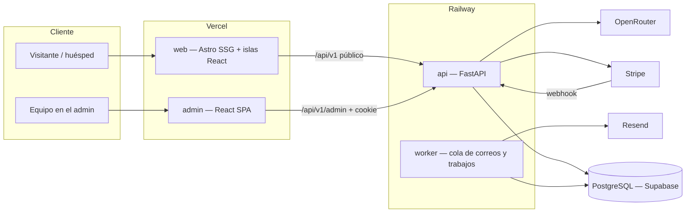

# WORKPLAN — Cabo Transportation Concierge

> **Qué es:** sistema completo de reservas para Cabo Transportation Concierge (Los Cabos, BCS): sitio público con el diseño aprobado, motor de precios, reservas y pagos con Stripe, confirmaciones por correo al cliente y a la empresa, agente de IA "Customer Help", y un admin donde se administra toda la empresa.
> **Base funcional:** todas las funciones de `C:\Users\conde\Documents\classvip-transfers-python` (ClassVIP), reconstruidas sin sus errores.
> **Base visual:** el prototipo aprobado en `site/` (home, arrival guide, video del hero, colores negro con dorado).
> **Dueño del proyecto:** Marlon. **Documento vivo:** se actualiza al terminar cada tarea (ver §0 y `AGENTS.md`).
> **Creado:** 12 sep 2026.

---

## 0. Estado actual

| Indicador | Estado |
|---|---|
| **Fase actual** | F7 — Sitio público en Astro: 5/16 (proyecto, tokens, layout con SEO en 100, header y footer; sigue F7.6, portar la home por secciones). F6 — Auth y API del admin: ✅ 13/13 (login, sesión, TOTP obligatorio para owner/manager, CSRF de doble token, listado y acciones de reservas, alta manual, despacho, flota y cuentas por cobrar, tareas, auditoría automática, dashboard y KPIs, catálogo CRUD, usuarios y roles con lista de auditoría). F5 — Emails, PDF y trabajos: ✅ 11/11. F4 — Pagos con Stripe: 9/10 (F4.1 a F4.9; solo falta F4.10, bloqueado por las llaves de prueba de Stripe del cliente). F2 — Motor de precios y catálogo: 10/12 (falta F2.9, revisión de Marlon, y F2.12). F3 — Reservas públicas: 11/13. F1 ✅ 12/12. F0 ✅ 9/9. Vista previa del prototipo en https://cabotransportationconcierge.vercel.app (noindex). |
| **Último avance** | 12 sep 2026 — F0:<br>• Repo git con prototipo aprobado.<br>• Backend mínimo FastAPI con `/api/v1/health` y `/health/ready`.<br>• Configuración fail-fast.<br>• Postgres 16 nativo con bases `ctc` y `ctc_test`.<br>• Cliente de API tipado generado desde OpenAPI.<br>• CI escrito.<br>• ADR-001 (entorno sin Docker).<br>• Checklist para el cliente. |
| **Backend** | ✅ Base lista para la lógica de negocio:<br>• Health y readiness.<br>• Engine apto para Supabase.<br>• Todos los modelos de §6 con aislamiento por empresa.<br>• Scripts `seed_catalog`, `ensure_owner` y `check_db`.<br>• Servicio de códigos de reserva.<br>• Motor único de precios.<br>• API pública: `POST /quotes` y `GET /catalog/*` (zonas, búsqueda y página de hotel, vehículos, extras, actividades, paquetes) con ETag y rate limit.<br>• `POST /bookings` con precio recalculado y congelado, `Idempotency-Key`, anticipación mínima, formato de vuelo y pickup antes del vuelo.<br>• Máquina de estados de la reserva con auditoría.<br>• Enlace de gestión firmado (90 días), `GET /bookings/{code}` con Bearer y My Trip (`GET /bookings/lookup`) sin enumeración.<br>• Cambios (`PATCH /bookings/{code}`) y cancelación del cliente con las ventanas de `company_settings`; errores de dominio con `code` estable (422 y 409).<br>• `POST /contact` con honeypot y Turnstile; UTM y referrer en la reserva; auditoría de creación, cambios y cancelación.<br>• Voucher PDF bilingüe con QR (`GET /bookings/{code}/voucher.pdf`).<br>• Cliente de Stripe por HTTP (intents y reembolsos con idempotencia) y verificación de la firma del webhook.<br>• Catálogo y motor de precios iguales a All Ways (§3.5.4): 10 zonas con nombres propios, 5 vehículos, 180 tarifas, multi-vehículo automático (`ceil(pasajeros/capacidad)`), pasajeros extra de limusina, extras con unidades gratis y precio por vehículo, recargo nocturno por hora exacta e IVA 16% con tarjeta (efectivo sin IVA y con depósito en vehículos premium).<br>• Cliente con nombre y apellido, confirmación de email, teléfono obligatorio y aceptación de términos versionada; hora de pickup de salida editable; pago en efectivo confirma sin pasar por Stripe cuando no lleva depósito.<br>• `POST /bookings/{code}/payments/intent` (crea o reutiliza el `PaymentIntent`) y `POST /bookings/{code}/payments/confirm` (verifica contra Stripe y marca `PAID` o, con depósito en efectivo, `CONFIRMED`).<br>• `POST /webhooks/stripe`: firma verificada, `stripe_events` evita procesar un evento dos veces, y maneja `payment_intent.succeeded`, `payment_intent.payment_failed` y `charge.refunded` con la misma regla de estados que la confirmación rápida.<br>• Cola de correos (`email_outbox`): `app/services/email.py` encola, `app/worker/send_emails.py` envía con Resend, reintenta con `FOR UPDATE SKIP LOCKED` y da por vencido al quinto intento. Diez plantillas bilingües (cliente) o en inglés (empresa): reserva nueva, pendiente de pago, confirmada, cambiada, cancelada, y acuse de contacto.<br>• Login del admin (`POST /admin/auth/login`) con Argon2id, bloqueo de 15 min al 5.º intento fallido y auditoría (`AuditLog`) de cada intento. TOTP obligatorio para `owner` y `manager`: alta con URI `otpauth://` para el QR, 8 códigos de respaldo de un solo uso, y un `challenge_token` firmado de 5 min (`POST /admin/auth/totp/verify`) que separa "contraseña correcta" de "sesión completa" sin persistir el secreto hasta el primer código válido. Sesión de servidor de 12 h en cookie `HttpOnly`/`SameSite=Lax` (solo hashes SHA-256 en `sessions`; el token y el CSRF nunca se guardan en claro). `GET /admin/auth/me` y `POST /admin/auth/logout` (revoca la sesión).<br>• CSRF de doble token (F6.3): cookie `ctc_admin_csrf` legible por JS + header `X-CSRF-Token` en toda mutación (`require_csrf`), validados entre sí y contra el hash de la sesión; sin el header, cualquier POST/PUT/PATCH/DELETE del admin responde 403. `require_role(*roles)` listo como dependencia reutilizable para F6.5 en adelante.<br>• `GET /admin/bookings` (F6.4), la primera ruta de negocio: todos los estados por defecto (nada de filtro implícito), filtros por estado, origen (`source`), método de pago, zona (por el hotel del tramo) y rango de fecha de servicio o de creación; búsqueda por código, nombre, email, teléfono o número de vuelo; paginación y orden (`created_at`, `service_date` o `total_cents`). `service_date` no es una columna — sale de una subconsulta que junta la fecha de los tramos (traslados) y la de los ítems (actividades).<br>• Acciones sobre una reserva (F6.5): `GET /admin/bookings/{id}` (detalle con pagos) y `/timeline` (auditoría); `POST .../confirm` (`OFFLINE_HOLD`/`PAID` → `CONFIRMED`), `.../mark-paid` (pago manual fuera de Stripe — efectivo, transferencia, cuenta — que reusa el mismo `settle_payment` de Stripe), `.../mark-unpaid` (deshace un `mark-paid` marcado por error; un pago de Stripe se reembolsa, no se deshace — nueva transición `PAID → PENDING_PAYMENT`, admin-only, agregada a propósito a §8.2), `.../cancel` (con reembolso opcional por Stripe) y `.../resend-confirmation`; `DELETE /admin/bookings/{id}` (borrado lógico). Todas menos las lecturas exigen CSRF y bloquean el rol `viewer`.<br>• `POST /admin/bookings` (F6.6): alta manual con el mismo motor de precios de la web (`quote_transfer`, `_transfer_legs`); `payment` decide el estado de una vez (`none` → `OFFLINE_HOLD`, `cash` → `CONFIRMED`, `stripe` → `PENDING_PAYMENT` a la espera del link real de F4.6, `account` → `CONFIRMED` con un `AccountCharge` contra la cuenta del cliente). `stripe` paga IVA igual que `card`; el endpoint público (`POST /bookings`) sigue rechazando cualquier `payment` que no sea `card` o `cash`.<br>• Despacho (F6.7): `GET /admin/dispatch?date=` agrupa los tramos del día (código, horario, origen/destino, clase y unidades de vehículo) con sus asignaciones; `POST /admin/dispatch/legs/{id}/assign` (chofer, vehículo o ambos, por unidad si el tramo lleva varias) y `DELETE .../assign` las quita. Un chofer con otro tramo dentro de ±2 h responde 409 `driver_conflict` (la ventana es un margen fijo, no la duración real del viaje — ver ADR de la bitácora).<br>• Flota y cuentas por cobrar (F6.8): CRUD de `/admin/drivers`, `/admin/vehicles` y `/admin/vehicle-classes` (sin `DELETE`, igual que el catálogo: `PATCH is_active=false` los retira sin romper tramos o reservas que ya los referencian). `/admin/accounts` con cargos, abonos y ledger (`GET /admin/accounts/{id}` trae el saldo calculado, nunca guardado, más el historial); `POST /admin/accounts/{id}/bookings` factura a la cuenta una reserva que ya existía sin tocar su estado, y rechaza una reserva que no es del mismo cliente o que ya se facturó antes.<br>• Tareas compartidas (F6.9): CRUD de `/admin/tasks` (título, descripción, fecha y hora límite, categoría, estado, asignada a un admin) con filtro por estado y por a quién está asignada; asignar a un admin que no existe se rechaza (`assignee_not_found`); a diferencia de flota y catálogo, sí tiene `DELETE` real porque nada más referencia una tarea.<br>• Auditoría automática (F6.10): un evento `before_flush` (`app/services/audit.py`) revisa `session.dirty` y arma el `AuditLog` con el diff (`before`/`after`, solo las columnas que en verdad cambiaron) para los modelos de `AUDITED_MODELS` (choferes, vehículos, clases, tareas, cuentas, cargos, pagos) — nada que cada endpoint tenga que armar a mano. `current_admin` deja `session.info["admin_user_id"]` para que el evento sepa quién hizo el cambio. Cubre ediciones (`session.dirty`), no altas: una fila nueva todavía no tiene `id` en `before_flush`. Las reservas siguen con su propia bitácora más rica en `booking_state.py`, sin duplicarse.<br>• Dashboard y KPIs (F6.11): `GET /admin/dashboard?date=` (servicios de hoy y mañana, resumen del mes, tramos sin asignar, reservas sin pagar), `GET /admin/finance/summary` (ingreso de 30 días, cobrado, cuentas por cobrar, cuentas abiertas) y `GET /admin/marketing/kpis` (reservas de hoy y del mes, valor promedio, día pico, zona más reservada). Los rangos de fecha comparan `>= inicio AND < fin` en vez de aplicar una función sobre la columna, para no perder los índices ya existentes (`ix_bookings_company_status_created`, `ix_booking_legs_company_service_date`); con 10 000 reservas de prueba la consulta real corre en 1-2 ms.<br>• Catálogo CRUD y settings (F6.12): `/admin/zones`, `/admin/hotels`, `/admin/rates`, `/admin/extras`, `/admin/activities`, `/admin/packages` y `/admin/promotions` (`GET`/`POST`/`PATCH`, sin `DELETE`: `is_active=false` retira una fila sin romper lo que ya la usa, misma convención que la flota de F6.8), más `GET`/`PATCH /admin/settings` para la fila única de `company_settings`. `Zone`, `Hotel`, `Rate`, `Extra`, `Activity`, `ActivityPackage` y `Promotion` se sumaron a `AUDITED_MODELS` (F6.10): editar una tarifa ya deja su `AuditLog` con el diff, cerrando ese criterio de verdad.<br>• Usuarios, roles y auditoría (F6.13, **cierra F6**): `GET`/`POST`/`PATCH /admin/users` solo para `owner` (`OWNER_ONLY`); editar el rol o desactivar a alguien deja su propio `AuditLog` a mano (no vía `AUDITED_MODELS`: `AdminUser` guarda `password_hash` y `totp_secret`, y el diff genérico los habría dejado en claro en la auditoría). `GET /admin/audit-logs` paginado y filtrable por entidad. Las siete rutas de catálogo (F6.12) pasaron de `CAN_EDIT` a `CAN_EDIT_CATALOG` (owner, manager, finance — sin `dispatcher`), el permiso que pedía el propio criterio de F6.13.<br>• Aviso al chofer asignado (F5.9): `drivers.email` (nuevo) y la plantilla `driver_assigned` (once ya); asignar un chofer con correo en el despacho (F6.7) lo encola y marca `booking_assignments.notified_at` (columna que ya existía desde F1.8, sin usar hasta ahora); sin correo del chofer, no se encola nada.<br>• Link de pago real (F4.6): `POST /admin/bookings/{id}/payment-link` crea una Stripe Checkout Session (24 h) para el saldo pendiente, la reutiliza si sigue abierta (mismo patrón que el `PaymentIntent` de F4.2), y encola el correo `booking_pending_payment` con el link de Stripe en vez del de la web. El webhook `checkout.session.completed` (guardado sin usar desde F4.4) ahora marca pagado — la única confirmación posible aquí, porque el link no tiene "confirmación rápida" del navegador como el Payment Element. `_form()` (`stripe_gateway.py`) aprendió a codificar listas (`line_items[0][...]`), que el Payment Element nunca necesitó.<br>• Recibo del pago manual (F4.8): `payments.reference` (columna que existía desde F1.7 sin usarse) ahora se puede mandar al marcar pagado; `GET /admin/bookings/{id}/payments/{payment_id}/receipt.pdf` genera el PDF (`app/services/receipt.py`, reusa el estilo del voucher de F3.8 — `latin1()` y `money()` se volvieron públicas en `voucher.py` para compartirlas). Solo para pagos manuales: uno de Stripe tiene el recibo de Stripe.<br>• Webhooks de Resend (F5.11): `POST /webhooks/resend` cierra el ciclo del correo — hasta ahora `email_outbox` sabía que se había *enviado*, no que hubiera *llegado*. `email.delivered` y `email.bounced` mueven el estado a los nuevos `delivered` y `bounced`. Resend firma con Svix, no con el esquema de Stripe: HMAC-SHA256 sobre `{svix-id}.{svix-timestamp}.{cuerpo}`, la llave en base64 detrás de `whsec_` y la firma esperada también en base64 (Stripe la manda en hexadecimal). No lleva tabla de eventos propia como `stripe_events` (F4.4): poner el mismo estado dos veces no hace nada distinto, mientras que repetir una *transición* de pago sí. • Trabajos programados (F5.7, F5.8, **cierran F5**): `app/worker/scheduled.py`, el mismo patrón de `send_emails.py` (`run_once()` suelto o con `--loop`) en vez de cron, Celery o APScheduler — no hay infraestructura nueva que operar, solo un segundo proceso. El recordatorio sale por tramo dentro de las 24 h previas a la recogida, con el chofer y el vehículo si el despacho ya los asignó; la reseña, unas horas después del último tramo y solo si `company_settings.social_links.google_review` tiene enlace. Las dos horas se calculan en la zona de la empresa (`companies.timezone`), no en UTC: sin eso el recordatorio saldría con las 7 h de desfase de Los Cabos metidas dentro. Ninguno de los dos envía: encolan en `email_outbox` y el worker de F5.1 sigue siendo el único que habla con Resend. Ruff (reglas de seguridad) y mypy estricto en 0 errores. |
| **Base de datos** | ✅ Local: Postgres 16.15 nativo con `ctc` y `ctc_test`. Migraciones:<br>• `5721f5faa1c7`: empresas, ajustes, admins y sesiones.<br>• `4b96b66d17b0`: `pg_trgm`, zonas, hoteles, clases de vehículo, tarifas, extras, actividades, paquetes, promociones y clientes.<br>• `0b3217285efc`: reservas, tramos e ítems.<br>• `56ed3ca7c373`: pagos, eventos de Stripe y cuentas por cobrar.<br>• `a6a95d459beb`: choferes, vehículos, asignaciones, tareas, auditoría, cola de correos, IA, contacto y reseñas.<br>• `523ec6ce4943`: contador de códigos de reserva.<br>• `9c5a8aed60e7`: clave de idempotencia en reservas.<br>• `4e2afe533f53`: anticipación mínima (`company_settings.min_notice_hours`).<br>• `43fcd1c0fe04`: fecha de la actividad en `booking_items`.<br>• `a669171fe543`: tarifas y reglas de vehículos como All Ways (unidades, pasajeros extra, IVA, depósito).<br>• `0d1e992bc78d`: versión de términos aceptada y método de pago de la reserva.<br>• `0e5b48905a6c`: depósito de la reserva para el pago con Stripe.<br>• `9d88d124a402`: códigos de respaldo de TOTP del admin.<br>• `a525576ffab7`: email del chofer para avisos de despacho.<br>• `349f0697cd52`: estados `delivered` y `bounced` en `email_outbox`.<br>• `5d5daf2f9b59`: marcas de recordatorio (por tramo) y de reseña (por reserva).<br>`alembic check` sin diferencias (F4.6 no agregó columnas: reusó `payments.stripe_checkout_session_id`, que ya existía desde F1.7) y `scripts/check_db.py` en código 0.<br>Catálogo aprobado (D-P1) cargado en `ctc` con `scripts/seed_catalog.py`: 10 zonas, 5 vehículos, 180 tarifas, 226 hoteles, 8 extras. El seed desactiva lo que ya no está en el JSON en vez de borrarlo. |
| **Sitio público real** | 🟡 `web/` en pie (F7.1): Astro 7 en modo estático (SSG) con TypeScript estricto, Tailwind 4 por el plugin de Vite e islas de React 19, más Playwright corriendo contra el build real y un job propio en CI. Tokens de marca fijos (F7.2): la paleta obsidiana y dorado del prototipo, las tres tipografías de §3.5.6 auto-hospedadas en WOFF2 (18 archivos, 324 KB, solo los subconjuntos `latin` y `latin-ext`), escala tipográfica fluida con `clamp` y escala de espacios. `BaseLayout.astro` (F7.3) con canonical, `hreflang` EN/ES, Open Graph, Twitter Card, JSON-LD de la empresa, enlace de salto al contenido y preload de las dos fuentes del primer pantallazo — Lighthouse SEO 100/100 corriendo en CI. Header completo (F7.4): barra superior con selector EN/ES, medallón oficial recortado en PNG circular con fondo transparente, mega menú de ancho completo que abre por CSS (sin depender del script), barra compacta al bajar y menú móvil a pantalla completa con acordeones — el móvil es un `<details>`, así que abre y cierra sin una línea de JavaScript. Footer (F7.5) con teléfono, WhatsApp, oficinas y políticas **leídos de `company_settings` en el build** por el endpoint público nuevo `GET /catalog/company`; sin backend a la vista, cae al placeholder marcado de D-P4. Todavía con una página de relleno: portar las secciones del prototipo `site/` empieza en F7.6. |
| **Admin** | ✅ Backend completo (F6, 13/13): auth (login, TOTP, sesión, CSRF), reservas, despacho, flota, cuentas por cobrar, tareas, auditoría automática, dashboard/finanzas/marketing, catálogo y settings, usuarios y roles con lista de auditoría. Sin pantallas todavía — eso es F11. |
| **Tests del sitio** | ✅ 25 pruebas de Playwright en Chromium real, contra el sitio construido (no el dev server): HTML sin depender de JS, la isla de React hidratando, las tres tipografías cargando de verdad y servidas del propio sitio, canonical y `hreflang`, JSON-LD, enlace de salto, mega menú con mouse y con teclado, Escape, header compacto al bajar, menú móvil a pantalla completa medido contra el viewport, los flotantes sin tapar CTAs ni el footer, todos los destinos en el HTML con el JS apagado, el teléfono a E.164, y que no se publique ningún `tel:` ni `wa.me` mientras el contacto sea provisional. Más Lighthouse SEO en 100/100, todo en CI. |
| **Tests** | ✅ 327 tests pytest verdes contra Postgres real, incluidos el aislamiento por empresa, los constraints de todas las tablas, el seed idempotente y su retiro de lo obsoleto, la creación del owner, 50 códigos de reserva concurrentes, el diagnóstico de la base, el motor de precios sobre el catálogo de All Ways (cada celda de la matriz, multi-vehículo, pasajeros extra de limusina, extras con unidades gratis y por vehículo, recargo nocturno por hora exacta, IVA y depósito en efectivo), la API pública (cotización, catálogo, ETag, rate limit), la creación de reservas (idempotencia, precio congelado, horarios, grupos grandes, hora de pickup editable, confirmación de email, teléfono obligatorio, versión de términos, pago en efectivo con y sin depósito), el pago con Stripe (intent reutilizado, monto del depósito, confirmación que marca `PAID` o `CONFIRMED`, un intent de otra reserva → 400, no se puede pagar dos veces) el webhook (firma inválida, el mismo evento dos veces, éxito, fallo, reembolso, no repite lo que ya confirmó el navegador), el correo (las diez plantillas en ambos idiomas, qué se encola en cada evento de la reserva y del contacto, y el worker con reintento, vencimiento y bloqueo de filas) el login del admin (contraseña incorrecta, bloqueo al 6.º intento, alta y verificación de TOTP, códigos de respaldo de un solo uso, sesión y logout), su CSRF de doble token (sin header, header que no coincide, header correcto, métodos seguros sin exigirlo, y el middleware de roles) el listado de reservas del admin (una reserva recién creada con tarjeta o en efectivo aparece sin filtrar, el filtro de estado la separa, la búsqueda la encuentra por código, nombre, email, teléfono y vuelo, el filtro de zona por el hotel del tramo, la paginación no repite ni pierde reservas, y el orden por total) sus seis acciones (confirmar solo desde el estado que toca, marcar pagada fuera de Stripe y confirmar directo si era el depósito en efectivo, deshacer un pago manual pero no uno de Stripe, cancelar con y sin reembolso — con respx simulando el reembolso —, reenviar la confirmación y borrar de forma lógica) el alta manual (cada método de pago deja el estado que le toca, `stripe` paga el mismo IVA que `card`, una cuenta de otro cliente se rechaza, y el endpoint público sigue sin aceptar esos métodos) el despacho (el tablero del día, asignar chofer y vehículo, reasignar, quitar, unidad inválida, dos tramos que se pisan con el mismo chofer avisan el conflicto y dos que no se pisan se permiten, y una reserva cancelada no aparece en el tablero) flota y cuentas por cobrar (CRUD de choferes, vehículos y clases con desactivación en vez de borrado; cargo y abono que mueven el saldo calculado, anular un cargo lo saca de la cuenta, y facturar una reserva existente solo si es del mismo cliente y no se había facturado antes) tareas compartidas (alta, filtro por estado, asignar a un admin real o rechazar uno inexistente, y borrado real) la auditoría automática (editar un chofer deja el diff exacto, un `PATCH` que no cambia nada no deja ningún log, y el mismo mecanismo audita una tarea sin código nuevo) el dashboard (cuenta los servicios de hoy y los tramos sin asignar, el resumen financiero refleja una reserva confirmada, marketing cuenta las reservas del día y encuentra la zona más reservada, y con 10 000 reservas sembradas de golpe el dashboard responde en milisegundos — el test mide en caliente, porque la primera petición de la suite paga ~200 ms de arranque que no dependen del volumen y hacían fallar el límite por azar) el catálogo (alta y edición de zonas, hoteles, tarifas, extras, actividades, paquetes y promociones, settings, y editar una tarifa deja su `AuditLog` con el diff exacto) usuarios y roles (el owner crea y edita usuarios, un email duplicado se rechaza, editar el rol deja su propio `AuditLog`, nadie más puede crear usuarios, un dispatcher no puede editar tarifas ni el resto del catálogo, y la lista de auditoría pagina y filtra por entidad) el aviso al chofer (un chofer con correo lo recibe y queda `notified_at`, uno sin correo no genera ningún envío, y reasignar a otro chofer le avisa al nuevo) el link de pago real (se crea contra Stripe, se reutiliza si sigue abierto, se rechaza si la reserva no está pendiente, y el webhook `checkout.session.completed` marca pagado) y el recibo del pago manual (texto seleccionable con el código, el huésped, el método y la referencia; 404 si el pago no es de esa reserva) el webhook de Resend (firma Svix inválida → 400, entregado y rebotado mueven el estado del correo, y un `email_id` o un tipo de evento que no conocemos no rompen nada) los trabajos programados (el recordatorio sale dentro de las 24 h previas y no dos días antes, una segunda corrida no lo manda otra vez, lleva el chofer y la placa asignados, una reserva cancelada no lo recibe; la reseña sale una sola vez después del viaje, no antes de que termine, no sin enlace configurado y no para un viaje de hace meses), las 36 combinaciones de la máquina de estados y el acceso del cliente (token alterado, expirado o ajeno; lookup sin enumeración; cambios y cancelación con sus ventanas), el contacto (honeypot y Turnstile), la atribución UTM, el voucher PDF con texto seleccionable y el cliente de Stripe simulado con respx. En cada corrida la migración va a base y de vuelta a head. `alembic check`, pip-audit y npm audit sin vulnerabilidades. |
| **Deploy** | ❌ No configurado. |
| **Git** | ✅ Remoto `github.com/condecorporation-del/Cabotransportationconcierge` (push por la deploy key `~/.ssh/deploy_cabo_concierge`, alias SSH `github-cabo`). Rama `main` subida; gitleaks sin hallazgos en el historial. |

**Siguiente tarea:** F6 (auth y API del admin) quedó completo, 13/13. De F4 (pagos con Stripe) solo falta F4.10 (prueba real con Stripe CLI), bloqueada por las llaves de prueba del cliente — todo lo demás, 9/10, está hecho. F5 (emails, PDF y trabajos) quedó completo, 11/11. Con el backend completo arrancó **F7 (sitio público en Astro), 5/16**. Sigue F7.6 (portar la home del prototipo aprobado, sección por sección). **Pendiente de Marlon:** (1) elegir entre las dos muestras de tipografía de F7.2 — por ahora quedó la A, la del plan; (2) los datos de contacto reales (D-P4), sin los cuales el botón de WhatsApp no se publica. Nota para F15 (deploy): producción necesita **dos** procesos worker, `app.worker.send_emails --loop` y `app.worker.scheduled --loop`. F2.12 y el resto de F3.12 (chofer por hora, city tour y traslados locales) quedan para cuando se necesiten esos servicios. Con el backend del admin completo, F7 (migrar el prototipo del sitio público a Astro) es la siguiente fase grande del WORKPLAN.

**Progreso por fase**

```
F0  Fundación y decisiones          [██████████] 9/9 ✅
F1  Base de datos y dominio         [██████████] 12/12 ✅
F2  Motor de precios y catálogo     [████████--] 10/12
F3  Reservas públicas               [████████--] 11/13 (F3.12/F3.13 muy avanzadas, ver detalle)
F4  Pagos con Stripe                [█████████-] 9/10
F5  Emails, PDF y trabajos          [██████████] 11/11 ✅
F6  Auth y API del admin            [██████████] 13/13 ✅
F7  Sitio público: migrar prototipo [███-------] 5/16
F8  Sitio público: funciones reales [----------] 0/14
F9  Páginas de contenido y navbar   [----------] 0/20
F10 Agente de IA Customer Help      [----------] 0/11
F11 Admin frontend                  [----------] 0/15
F12 SEO                             [----------] 0/12
F13 Seguridad y hardening           [----------] 0/12
F14 QA, performance y e2e           [----------] 0/12
F15 Deploy a producción             [----------] 0/12
F16 Post-lanzamiento                [----------] 0/6
```

---

## 1. Objetivo y alcance

### 1.1 Qué debe hacer el sistema (resultado final)

1. Un visitante entra al sitio, cotiza su traslado desde el hero (hotel, pasajeros, fechas) y ve un precio real calculado por el servidor.
2. Reserva en `/book` en pocos pasos: viaje, vuelos, extras, datos, y paga con tarjeta (Stripe) o elige otro método permitido.
3. En segundos le llega un correo de confirmación con voucher PDF, y a la empresa un correo con todos los detalles.
4. La reserva aparece de inmediato en el admin, en cualquier estado.
5. El equipo administra todo en el admin: reservas, despacho de choferes y vehículos, pagos, cuentas por cobrar, tarifas, hoteles, extras, actividades, promociones, tareas, finanzas, marketing, conversaciones de IA, usuarios y bitácora de auditoría.
6. El cliente consulta o gestiona su reserva en "My Trip" con su código y email, o con el link firmado del correo.
7. El agente "Customer Help" responde en inglés y español, cotiza con precios reales, explica la llegada a SJD, crea borradores de reserva y pasa a un humano por WhatsApp o correo.
8. Todo el sitio público es indexable: HTML real por página, metadatos, datos estructurados, sitemap y velocidad alta.
9. **Bilingüe inglés/español desde el lanzamiento:** todo el sitio, correos, voucher PDF, My Trip y Customer Help. El visitante elige el idioma y la elección se recuerda.
10. **Responsive perfecto:** cada página y el admin funcionan y se ven bien desde 320 px (iPhone SE) hasta 2560 px, con táctil, teclado y orientación horizontal (§12.2).
11. **Carga rápida:** se cumplen los presupuestos de §12.1 en móvil con 4G.
12. **Funciones de allwayscabotransportation.com replicadas** (motor de reserva, mapa interactivo de zonas, directorio de hoteles y página por hotel), con el mismo comportamiento y un diseño más profesional con nuestra paleta (§3.4).
13. Se vende y replica para otras empresas: arquitectura multiempresa (`company_id`) desde la primera migración.

### 1.2 Fuera de alcance por ahora

- App móvil nativa para choferes. El despacho se hace desde el admin, que es responsive, y los choferes reciben avisos por WhatsApp o correo.
- Facturación electrónica CFDI. Se deja preparado el dato fiscal; la integración con PAC va en F16 si Marlon la pide.
- Multiempresa con autoservicio (registro de nuevas empresas). El modelo ya lo soporta, pero la UI de alta es posterior.

---

## 2. Decisiones de arquitectura

Cada decisión trae su porqué. Si alguien quiere cambiar una, registra la nueva decisión en `docs/decisions/` y actualiza esta tabla.

| # | Decisión | Por qué |
|---|---|---|
| D1 | **Backend: Python 3.12 + FastAPI + SQLAlchemy 2 async + asyncpg + Alembic + Pydantic v2.** | Es el stack de ClassVIP que ya funciona en producción (Railway + Supabase). Se reutiliza lo aprendido y se evitan sus errores (ver §4). |
| D2 | **Base de datos: PostgreSQL en Supabase, conectada directo por Session Pooler (5432, SSL).** Alembic usa la conexión Direct. Nunca PostgREST ni `anon key` desde el backend. | Así evitamos la causa del bug "creo una reserva y no aparece en el admin" (RLS y pooler), documentado en `PLAN_PRODUCCION.md` de ClassVIP. |
| D3 | **Sitio público: Astro (SSG) + Tailwind + islas de React** para lo interactivo: cotizador, flujo de reserva, My Trip, formulario de contacto y Customer Help. | ClassVIP es una SPA (Vite) y tuvo problemas de SEO: los bots de redes y de IA no ejecutan JS. Astro genera HTML real por página, envía casi cero JS y permite portar el prototipo `site/`, que ya es HTML, sin rehacer el diseño. |
| D4 | **Admin: React + Vite + TypeScript + TanStack Query + react-hook-form + zod**, en `admin.<dominio>` y con `noindex`. | El admin no necesita SEO y sí mucha interactividad. Se pueden portar los componentes del admin de ClassVIP con el estilo nuevo. |
| D5 | **Cliente de API generado desde OpenAPI** (`openapi-typescript`) y compartido por `web/` y `admin/`. | En ClassVIP el funnel de reservas se rompió por rutas `/api/...` sin `/v1` y por `snake_case` vs `camelCase`. Con tipos generados, un contrato roto no compila. |
| D6 | **Dominios del mismo sitio:** `www.` (web), `api.` (backend), `admin.` (admin) bajo un solo dominio registrado. | La cookie de sesión funciona con `SameSite=Lax` y sin CORS cruzado entre Vercel y Railway, que en ClassVIP obligó a `samesite=none` y a manejar CORS a mano. |
| D7 | **Correos con Resend + tabla `email_outbox` + proceso `worker`** que envía con reintentos. | Un correo nunca bloquea la API ni tumba una reserva (bug §2.5 de ClassVIP). No hace falta Redis: el worker lee la cola con `SELECT … FOR UPDATE SKIP LOCKED`. |
| D8 | **Un solo motor de precios en el servidor** (`services/pricing.py`), usado por web, admin, IA y Stripe. El frontend nunca calcula el precio que se cobra. | En ClassVIP el precio de combos estaba duplicado a mano entre frontend y backend, y había precios de Sprinter en 0 o duplicados. |
| D9 | **Precios en centavos (int) y fechas con zona horaria** (`America/Mazatlan` para operación). | Evita errores de redondeo y de hora. Los Cabos usa la hora de `America/Mazatlan`. |
| D10 | **Multiempresa desde la migración inicial:** `company_id` en todas las tablas de negocio, con una empresa por defecto. | Es la meta de vender el sistema. Migrarlo después cuesta 10 veces más (lección de ClassVIP). |
| D11 | **Tramos de viaje (`booking_legs`) en tabla propia**, no dentro de `metadata`. | ClassVIP reconstruía llegada y salida parseando `metadata` (`booking_operations.py`), lo que era frágil. El despacho necesita filtrar por fecha y hora de cada tramo. |
| D12 | **IA vía OpenRouter** (API compatible con OpenAI, modelo configurable por variable de entorno) **con herramientas** (function calling). | Marlon ya usa OpenRouter. Las herramientas garantizan que la IA nunca invente precios ni datos: todo sale de la base. |
| D13 | **Tests contra PostgreSQL real** (nativo en local según ADR-001, contenedor de servicio en CI), no SQLite. | ClassVIP probaba con SQLite en memoria, lo que esconde diferencias de Postgres (enums, `FOR UPDATE`, secuencias, tipos). |
| D14 | **Deploy:** backend y worker en Railway (Docker), web en Vercel, admin en Vercel y base en Supabase. Staging separado de producción. | Es lo que ya funciona en ClassVIP; staging evita probar en producción. |
| D15 | **Bilingüe EN/ES desde el lanzamiento** con el i18n de Astro:<br>• Inglés en `/` y español en `/es/`, con los mismos slugs.<br>• Diccionarios de UI tipados (el build falla si falta una clave) y contenido por idioma.<br>• Selector en el header que mantiene la página equivalente, más `hreflang` y `x-default`.<br>• El idioma se guarda en la reserva y define correos, voucher y respuestas de la IA.<br>• El admin va en español con opción de inglés. | Marlon lo pidió (12 sep 2026). Hacerlo desde F7 cuesta mucho menos que traducir al final, y los clientes son turistas de EE. UU. y Canadá además de hispanohablantes. |
| D16 | **Responsive primero:**<br>• Diseño desde 320 px, con breakpoints 360/390 (móvil), 768 (tablet), 1024 (laptop) y 1440+ (desktop).<br>• Objetivos táctiles ≥ 44 px y sin scroll horizontal.<br>• Tablas que en móvil se vuelven tarjetas; selectores y menús tipo bottom sheet. | Marlon lo pidió; la mayoría de los turistas reserva desde el teléfono. |
| D17 | **Funciones replicadas de allwayscabotransportation.com:** motor de reserva, mapa interactivo de zonas, directorio de hoteles y página por hotel. Mismo comportamiento, diseño mejorado con obsidiana y dorado (especificación en §3.4). | Marlon lo pidió; son funciones probadas en el mismo mercado y con el mismo tipo de cliente. |

---

## 3. Paridad con ClassVIP: qué se porta y qué se corrige

Referencia: `classvip-transfers-python/backend/app/api/v1/*.py`, `models/`, `services/`, `frontend/src/features/`.

### 3.1 Funciones públicas

| Función en ClassVIP | Estado allá | Qué se hace aquí |
|---|---|---|
| Catálogo: hoteles, áreas, reglas, extras (`/pricing/*`) | Funciona, pero con datos mezclados: `areas` con precios de SUV, `pricing_rules` con Sprinter, precios en 0 y reglas duplicadas o inactivas. | Tablas limpias `zones`, `hotels`, `rates` (zona × vehículo × tipo de viaje) y `extras`. Seed con datos corregidos y validados (F1.9). |
| Crear reserva (`POST /bookings/`) | Nace en DRAFT; tuvo bug `metadata_` y código de confirmación con condición de carrera. | Reserva con tramos e items, código desde secuencia Postgres y máquina de estados explícita (F3). |
| Ver reserva y PDF (`GET /bookings/{id}`, `/pdf`) | Protegido con token después de la auditoría. | Token firmado con expiración y alcance, más My Trip con código y email (F3.7, F8.4). |
| Stripe: `create-payment-intent`, `confirm-payment`, `webhook` | `confirm-payment` faltaba (Fase 18); las reservas pagadas quedaban en DRAFT; había pagos pendientes duplicados. | Intent idempotente por reserva, confirmación rápida verificada contra Stripe y webhook idempotente con tabla `stripe_events` (F4). |
| Clientes (`/customers`) | `POST` público sin rate limit. | Sin endpoint público: el cliente se crea dentro de la reserva (F3). |
| Chat de IA (`/ai/chat`, `/ai/transcribe`) | OpenAI y Whisper; el widget llamaba rutas equivocadas. | Customer Help con OpenRouter, herramientas, streaming y guardado de conversaciones (F10). La voz queda para F16. |
| Actividades y combos (Activities.tsx: 2 por $100, 3 por $125 por persona, park fee de $25, depósito de $500 para ATV/UTV, RZR de 1 a 4 personas) | Precio del combo duplicado a mano. | Tablas `activities` y `activity_packages`, con precio en el motor único (F2.6). |

### 3.2 Funciones del admin (pestañas de `Admin.tsx`)

| Pestaña o función en ClassVIP | Estado allá | Qué se hace aquí |
|---|---|---|
| Dashboard: servicios de hoy y mañana, resumen mensual, atención requerida | Funciona | Se porta y se agregan alertas: sin chofer, sin pagar, vuelo mañana sin datos (F11.2). |
| Reservaciones: lista, export, editar, confirmar, marcar pagado o no pagado, cancelar, borrar, asignar, reenviar confirmación | Funciona; por defecto debe mostrar todos los estados. | Se porta, más reembolso Stripe al cancelar, borrado lógico con auditoría y línea de tiempo por reserva (F6, F11.3). |
| Nueva reserva manual (none → OFFLINE_HOLD, cash → CONFIRMED, stripe → PENDING_PAYMENT, add to account) | "Send Stripe Link" no generaba un link real. | Link real de Stripe Checkout enviado por correo y copiable (F4.6 hecho; falta la pantalla del botón "copiar", F11.4). |
| Tareas (TareasTab) | Al principio solo en localStorage; luego se hizo el backend (Fase 22). | Backend compartido por empresa desde el inicio (F6.9). |
| Finanzas: revenue de 30 días, cobradas, cuentas por cobrar, cuentas abiertas | Funciona | Se porta, más ledger de pagos y export (F11.7). |
| Cuentas por cobrar (AccountsTab: abrir crédito, cargos, abonos, ledger) | Funciona | Se porta (F6.8, F11.8). |
| Marketing: reservas del mes y de hoy, conversión, valor promedio, día pico, zona más reservada | Funciona | Se porta, más códigos promocionales (la promo de septiembre), origen UTM y reseñas destacadas (F11.9). |
| RRHH: conductores y vehículos | Solo GET y POST, sin editar ni desactivar. | CRUD completo, más disponibilidad y licencias con fecha de vencimiento (F6.8, F11.10). |
| Configuración (PricingManager): tarifas, hoteles, extras | Funciona con el modelo de datos confuso. | Editor de la matriz zona × vehículo × viaje, hoteles con zona y alias, extras, actividades y ajustes de empresa (F11.11). |
| Usuarios admin (`/admin/users`) | API sin pantalla | Pantalla con roles (F11.12). |
| Audit log | El modelo existía pero no se usaba en ningún endpoint; se conectó tarde. | Auditoría automática en cada mutación desde el principio (F6.10). |
| Email log | Existe | Pantalla con estado, reintento y vista previa (F11.13). |

### 3.3 Funciones nuevas que ClassVIP no tiene

- My Trip: el cliente consulta o cambia su reserva y descarga el voucher.
- Formulario de contacto conectado (hoy `action="#"`) con bandeja en el admin.
- Promociones con fecha de viaje (la del video: 10% en tarifa de traslado del 1 al 30 de septiembre, extras no incluidos).
- Recordatorio automático 24 h antes del servicio, con datos del chofer.
- Solicitud de reseña después del servicio.
- Páginas programáticas por hotel y por zona (SEO) generadas desde la base.
- Mapa interactivo de zonas ("Explore interactive map").
- Galería con lightbox ("See all 9 photos").
- Estado de vuelos SJD ("Flight Status"), sujeto a D-P7 (§16).

### 3.4 Funciones que se replican de allwayscabotransportation.com

Marlon pidió copiar estas funciones **tal como funcionan** en allwayscabotransportation.com y **mejorar el diseño** con nuestros colores para que se vea más profesional. Todas son bilingües (D15) y responsive (D16).

Referencia analizada el 12 sep 2026: HTML del home, `/los-cabos-hotel-shuttles`, `/alegranza` y `/booking`, y los chunks JS `BookingHome`, `BookingSteps`, `Vehicle`, `VehicleBottomSheet`, `Payments` y `ZoneMap`.

#### 3.4.1 Motor de reserva (Reserve transfer, Book My Ride, Get a quote, Compare & reserve)

**Cómo funciona allá**

- **Tipos de servicio** en pestañas: Airport Round-Trip, Airport One-Way, Local Round-Trip y Local One-Way. Además hay chofer privado por hora ("USD / hr") y City Tour.
- **Campos:** Pickup Location, Drop-off Location, Arrival Date, Return Date (solo round trip), Passengers (stepper), Vehicle, Estimated Total / Total Due y el botón Book My Ride.
- **Passengers, verificado el 12 sep 2026 leyendo el bundle real (`BookingHome-*.js`):** un solo campo (`pax`), no separa adultos/niños/infantes. Stepper −/+, mínimo 1 (el botón `−` no baja de 1); si se escribe un número mayor a 19, se ajusta solo a 20 (tope blando: 20 es el máximo que se puede reservar en línea).
- **No hay rechazo por capacidad.** Cualquier vehículo se puede elegir con cualquier número de pasajeros: el precio se multiplica por las unidades necesarias, `unidades = Math.ceil(pasajeros / capacidad)` (Limousine usa `max_capacity` en vez de `capacity`). Es decir, 8 pasajeros en un Suburban (capacidad 5) = 2 Suburbans y el doble de precio, no un error. Capacidades reales: Suburban 5, Cadillac Escalade 5, Van 10, Limousine 6 (`max_capacity` 10), Sprinter 17.
- **Reglas y mensajes:**
  - "For Airport Round-Trips, the Pick-up location must be the Airport." (origen con etiqueta "Locked")
  - "For this route, the Drop-off location is locked to the Airport."
  - "For this service, the Drop-off location cannot be the Airport."
  - "Pick-up and Drop-off locations cannot be the same."
  - "Select your pick-up location." / "Select your drop-off location." / "Select your arrival date." / "Select your return date for round-trip." / "Select a vehicle to continue."
  - Recargo nocturno "Night surcharge · 11 PM – 5 AM" con el aviso "Additional fee applies to services scheduled at night".
  - Aviso "Same Day".
  - "Rate unavailable — try another vehicle or call …" cuando no hay tarifa.
- **Selector de vehículo** en bottom sheet, que se cierra con Escape o tocando el overlay: Suburban (5), Cadillac Escalade (5), Van (10), Sprinter (17) y Limousine.
- **Pasos** (`BookingSteps`) con check al completar cada uno, y luego "Secure Checkout".
- **Página de pago:**
  - Resumen con Type of Service, Unit (Vehicle) y Passengers, y el botón "Make your payment".
  - Estados: "Looks like you already made this payment", "You have canceled the payment process" y error de conexión.
  - "Retrieve your voucher" / "View Voucher" con Transaction ID, Amount, Date y Type.
- **Honeypot** anti-bots ("Leave blank if you are human") y código de reserva con prefijo (`ALLW-`; aquí `CTC-`).

**Cómo se hace aquí**

- Mismos tipos de servicio, campos, reglas y mensajes, traducidos EN/ES. Los precios salen del motor único (D8) y las reglas se validan también en el servidor.
- Origen y destino con autocompletado:
  - Aeropuerto SJD y los 245 hoteles de la base.
  - "Otra dirección" para villas: el admin asigna la zona y la reserva queda en `OFFLINE_HOLD` si no hay tarifa automática.
- Selector de vehículo con tarjetas: foto, pasajeros, maletas, precio de ese viaje y "Most popular". En móvil es bottom sheet; en desktop, popover. Los vehículos sin capacidad suficiente aparecen deshabilitados con el motivo.
- Resumen con desglose y total: fijo (sticky) en desktop; en móvil, barra inferior con el total y "Continue".
- Indicador de pasos accesible y progreso guardado si el visitante recarga.
- Checkout con Stripe Payment Element (tarjeta, Apple Pay y Google Pay), los mismos estados de pago que allá y voucher descargable.
- Diseño: tarjetas obsidiana con borde dorado, inputs de alto contraste y una microanimación cuando cambia el precio.

#### 3.4.2 Mapa interactivo de zonas (Explore interactive map)

**Cómo funciona allá**

- El botón abre el componente `ZoneMap`, titulado "Cabo Transportation Zone Map — Airport Transfer Coverage by Hotel Zone", con un texto introductorio.
- Tiene botones de zona, cada uno con su color:

  | Zona | Nombre |
  |---|---|
  | Zone 1 | San José del Cabo |
  | Zone 2 | Corridor |
  | Zone 3 | Cabo San Lucas |
  | Zone 4 | Pacific Side |

  Además está "All Destinations".
- Al tocar una zona, la imagen cambia al mapa de cobertura de esa zona (un SVG por zona) sobre el "Map of Baja California Sur", que marca Los Cabos Airport, East Cape, La Paz y Todos Santos.

**Cómo se hace aquí**

- **Interacción:** la misma (botones de zona y All Destinations), en un modal accesible desde el home y en la página `/map`.
- **Mapa:** vectorial propio (SVG) de Baja California Sur con zonas que se resaltan con un trazo y relleno dorado animados. Es nítido en cualquier pantalla y más ligero que imágenes sueltas.
- **Panel de la zona elegida:** tiempo desde SJD, precio "desde", hoteles de la zona (con link a su página) y el botón "Reserve in this zone", que prellena el motor.
- **Buscador "¿En qué zona está mi hotel?":** resalta la zona del hotel.
- **Colores de zona:** tonos de la paleta (champagne, dorado, bronce y cobre) con alto contraste, y siempre con etiqueta de texto, sin depender solo del color.
- **Móvil:** los botones de zona son chips con scroll horizontal y el mapa ocupa todo el ancho.
- **Carga diferida:** el SVG y la lógica se cargan al abrir el mapa.

#### 3.4.3 Directorio de hoteles (Browse all hotel transfers → `/los-cabos-hotel-shuttles`)

**Cómo funciona allá** (en este orden)

1. **Hero** "Cabo Airport Transportation to Your Hotel", con los botones "Book a transfer" y "Call".
2. **"Plan your arrival".**
3. **"Browse by area":** una tarjeta por área con 5 hoteles destacados y el tiempo desde SJD.

   | Área | Minutos desde SJD |
   |---|---|
   | San José del Cabo | 18 |
   | Puerto Los Cabos | 24 |
   | Tourist Corridor | 30 |
   | Cabo San Lucas | 48 |
   | Pacific Side | 55 |
   | East Cape | 60 |
   | Todos Santos | 85 |

4. **Mapa de zonas.**
5. **Una sección por área** con grid de tarjetas de hotel (132 en total). Cada tarjeta tiene:
   - Foto 16:10 con el nombre del área encima.
   - Título "{Hotel} airport transportation".
   - Texto "Private SJD transfer · bilingual driver · tolls included".
   - Link "View rates and book".
6. **FAQ** y CTA final "Ready when your flight lands".

**Cómo se hace aquí**

- Misma estructura y orden.
- Buscador instantáneo arriba (nombre o alias, sin importar acentos), chips para filtrar por zona y contador de resultados. La URL guarda `?zone=` y `?q=` para poder compartir la búsqueda.
- Tarjetas con nuestro estilo: foto, etiqueta dorada de zona, tiempo desde SJD, "from $X" y CTA.
- Los 245 hoteles de nuestra base, sin fotos de All Ways (fotos propias o una genérica por zona; D-P3).
- Todas las tarjetas vienen en el HTML (bueno para SEO) y se muestran de forma progresiva.
- Grid de 1 columna en móvil, 2 en tablet y 3 o 4 en desktop.

#### 3.4.4 Página por hotel (`/hotels/[slug]`)

**Cómo funciona allá** (ejemplo `/alegranza`)

1. Breadcrumbs: Home / Destinations / Zona / Hotel.
2. Hero con el título "{Hotel} Airport Transportation", subtítulo y badges (tiempo de traslado, 100% Private, reseñas).
3. Widget de reserva embebido con el destino prellenado y "Change destination".
4. Ficha: Travel time, Distance (km desde SJD), Service 100% Private y peajes incluidos.
5. Tabla "Private transfer rates": vehículo, capacidad, one-way, round-trip y botón Book, con "Most popular".
6. Texto único del hotel: cómo es la llegada, paradas de súper y cenas.
7. "Other Hotels in {zona}" y FAQ específica del hotel.
8. CTA final "From $X".
9. JSON-LD: `Service`, `Offer`, `BreadcrumbList`, `FAQPage` y `LocalBusiness`.

**Cómo se hace aquí**

- Misma estructura, con datos de nuestra base: zona, tiempo, distancia y tarifas reales.
- El widget es el motor de §3.4.1, prellenado con el hotel.
- Texto único y bilingüe por hotel (F12.5) y fotos propias.
- En móvil la tabla de tarifas se convierte en tarjetas.

### 3.5 Réplica completa de All Ways con información propia (mandato de Marlon, 12 sep 2026)

> Marlon: "Quiero la página igual a All Ways, pero con un diseño más moderno: los servicios, la reserva, Bachelorette y City Tours con su propia área, las tarifas de precios también. Todo igual, pero la información diferente. Los precios los puedes dejar igual. Todo personalizado para la empresa, que no se pase ningún dato."

Fuente: lectura del sitio real el 12 sep 2026. Es una app Laravel + Inertia + Vue. Se leyeron el JSON de props (`data-page`) de 33 páginas, el mapa de rutas (Ziggy, 132 rutas públicas), los chunks de cada página (`/build/assets/*.js`) y las APIs públicas `api/private-driver` y `api/activity-rates`. Copia local de trabajo en el scratchpad de la sesión (no se versiona: es contenido de terceros).

#### 3.5.1 Las tres reglas

1. **Igual en estructura y funcionamiento.** Mismas páginas, mismo menú, mismas secciones en el mismo orden, mismos formularios con los mismos campos, mismo motor de reserva con sus reglas y mensajes, y mismas tarifas. Ante la duda de cómo debe comportarse algo, la respuesta es "como en All Ways" (sin volver a preguntar a Marlon).
2. **Diseño más premium y distinguible** (detalle en §3.5.6): obsidiana y dorado, tipografías nuevas, navbar con otra composición, zonas con nombres propios, textos parecidos pero reescritos, y el logo oficial de CTC. Nada del look de All Ways: ni su azul `#215465` / `#007a96`, ni su tipografía (Ideal Sans de Typekit), ni sus imágenes. Se usa la **misma función** con **otra forma**: quien conozca los dos sitios debe reconocer el servicio, pero no confundir las marcas.
3. **Cero datos de All Ways.** Todo texto, dato, foto, video, reseña, número y enlace es de Cabo Transportation Concierge. Los precios son la única excepción permitida.

**Lista prohibida** (el CI la busca en el build del sitio, el admin, los correos, el voucher y el prompt de la IA; F9.16). Cualquier coincidencia rompe el build:

| Tipo | Valores prohibidos |
|---|---|
| Marca | `All Ways`, `AllWays`, `Allways`, `allwayscabo`, prefijo de reserva `ALLW-`, "ALL WAYS CABO CHECKPOINT" |
| Contacto | `+52 624 129 7911`, `6241297911`, `(619) 354-3205` |
| Direcciones | Plaza Coronado, Plaza Providencia, Calle Los Pirules, "Carretera Transpeninsular KM 4.3", CID de Google Maps `11928089571017072965` |
| Marcas hermanas | 605 Tower, Allways Cabo Boats, Boats Baja, Marketing Eleven, "Banana fleet", tarifas de barco (`boatRates`: $650, $600, $770) |
| Reputación | 6,700 / 6,774 reseñas, 1,870 (Google), 4,355 (TripAdvisor), 549 (Yelp), "#9 of 345", "since 2013" / "desde 2013", "more than 300 weddings", TripAdvisor Travelers Choice |
| Personas | Nombres de choferes y clientes de sus reseñas (por ejemplo "Eddie", "Sarah L.") |
| Assets | Fotos de `/images/` de All Ways, el video de Arrival Guide con su hostess, el ID de Typekit `qkt8msu` |

Los datos propios salen de `company_settings` (teléfono, WhatsApp, email, oficinas, horario, políticas, redes) y de `docs/content/checklist-cliente.md`. Mientras falten, se muestra un placeholder visible en staging y producción queda bloqueada (D-P4).

#### 3.5.2 Menú (header y footer)

**Contenido del header** (mismos destinos que All Ways; la composición visual es distinta y se define en §3.5.6): logo CTC · **Services** (mega menú) · **All Tours** · **Prices** · **About Us** · **FAQ** · **Travel Guide** · **Contact** · selector EN/ES · CTA de reserva.

**Mega menú Services**, en tres columnas más una fila de guías:

| Airport & Transfers | Events & Groups | Tours |
|---|---|---|
| All Cabo Transfers → `/cabo-transportation` | Weddings → `/weddings` | City Tours → `/city-tours` |
| Hotel Shuttles → `/los-cabos-hotel-shuttles` | Bachelorette & Bachelor Parties → `/bachelorette-party-transportation` | Sightseeing Tours → `/sightseeing` |
| Private Chauffeur → `/private-bilingual-driver` | Bisbee's Black & Blue → `/bisbees-black-and-blue-transportation` | CTA "See Cabo with a private driver" |
| Activity transfers → `/activity-transfers` | Group Transportation → `/group-transfers` | |
| Prices & Rates → `/cabo-shuttle-prices` | Family Transportation → `/family-transportation` | |
| | Limousines → `/limousines` | |

Fila inferior: Flight Status ("Live SJD arrivals & departures") → `/cabo-airport-flights` · Uber in Cabo Guide → `/is-there-uber-in-cabo` · Taxi at SJD Airport → `/cabo-airport-taxi` · Customer reviews → `/reviews`.

**Footer:** formulario "Drop us a line" (Full name, Phone number, Email address, Message) · "Top Cabo Destinations" · links (Cabo Transportation, Flight Status, Weddings, Bachelorette, Bisbee's, Groups, Family, Limousines, Prices, About Us, FAQ, Travel Guide, Taxi at SJD Airport, La Paz) · "Our Offices" · Company Policies · bloque de marcas propias. All Ways muestra ahí sus marcas hermanas ("Explore our family of Cabo brands"); aquí van los servicios propios de Instagram (Yachts, Luxury Villas, Private Tours, Activities) o se quita el bloque.

#### 3.5.3 Inventario de páginas (qué tiene cada una allá y qué cambia aquí)

En todas: mismas secciones en el mismo orden; textos reescritos para CTC; fotos propias; FAQ propias (mismas preguntas del cliente, respuestas con nuestras políticas); CTA al motor de reserva; EN y ES.

| Ruta | Página allá (componente) | Secciones y funciones, en orden | Formulario o datos |
|---|---|---|---|
| `/` | `Home` | Hero con cotizador y promo ("Claim My 10% Discount · Applied automatically at checkout"); tarjetas de zona con precio "desde" (160 / 185 / 195 / 205 / 230); transporte a villas, golf y comunidades (Cabo del Sol, Puerto Los Cabos, Quivira, Chileno Bay, Costa Palmas, Diamante…); "After the airport" (dinner & nightlife, activity transfers, private driver, weddings & groups, **pet-friendly**); tours y actividades (snorkel, Camel Tour, Golf Package, Yachts & Boats); comparación taxi vs shuttle vs privado; llegada a SJD; oficinas; reseñas | zones, rates, hotels, reviews propias |
| `/book` (allá `/booking` y `/book-transportation`) | `Booking/Index` | Motor completo de §3.5.5 | API quotes, bookings, payments |
| `/my-trip` (y `/voucher/{uuid}`) | `Vouchers/Show` | "Find My Trip / Retrieve Your Voucher" por número; itinerario por tipo de servicio (llegada, salida, local ida, local regreso, chofer privado, nightlife, city tour); contacto del pasajero; special requests; "Your Vehicle"; "Price Summary"; saldo en efectivo a la llegada; "Complete Payment Now"; estados Confirmed & Paid / Deposit Paid / Pending Payment; políticas de cancelación | API lookup (F3.6) |
| `/cabo-transportation` | `Main/CaboTransportation` | Traslados de larga distancia: tabla de destinos con ruta y tiempo (Todos Santos, El Pescadero y Cerritos, Los Barriles, East Cape y Costa Palmas, La Paz vía Hwy 1 o Hwy 19); round trip desde el aeropuerto; una tarjeta por destino; equipo de pesca, surf o kite; FAQ; widget de reserva | rates zonas 6–10 |
| `/los-cabos-hotel-shuttles` | `Landings/HotelTransportationIndex` | §3.4.3 | hotels, zones |
| `/hotels/[slug]` (allá `/{slug}`) | `Landings/HotelRestaurant` | §3.4.4, más: "Transfer facts", "Route options comparison", "Why pre-book this route", nota de bodas, "Covered destinations", nota de torneo Bisbee's (marina), "Nearby hotels", "Long distance transfers" | hotels, rates |
| `/private-bilingual-driver` | `Main/PrivateBilingualDriver` | Hero "Private Bilingual Chauffeur"; ventajas (Local expertise, Uncompromised Safety); **tabla de tarifas por hora** (§3.5.4); formulario "Plan Your Route" | Full Name, Email, Phone, Service Date, Itinerary Details → "Request Availability" |
| `/activity-transfers` | `Main/ActivityTransfers` | "We Drive. You Enjoy."; tarifas de traslado a actividades por vehículo (§3.5.4); guías de actividades; CTA "Book Your Ride" | API activity-rates |
| `/cabo-shuttle-prices` | `Main/Prices` | "Cabo Shuttle Prices by Vehicle": una tabla por vehículo × zona con One Way y Round Trip ("per vehicle, not per person"); aviso de pago en efectivo (D-P5); mapa de zonas; tarjetas de larga distancia y rutas de lujo (La Paz, Costa Palmas, Todos Santos, East Cape, Diamante, Nobu); FAQ | rates |
| `/weddings` | `Main/Weddings` | Hero; tabla "Venues we drive to every week" con tiempo desde SJD; "How the Wedding Weekend Runs" (arrival day, welcome party, ceremony & reception, late-night returns); "The Bridal Party Fleet"; "When to Book and How Pricing Works"; "What to Tell Your Guests"; "Every Wedding Gets Its Own Page" (portal); "Why Planners Book Us"; reseña; FAQ | Formulario de cotización de boda |
| `/wedding/[slug]` | `Landings/Wedding` + `Booking/PremiumWeddingIndex` | **Portal por boda:** "Welcome to the wedding portal of…", detalles del evento, cuenta regresiva y reserva de los invitados con el motor prellenado (venue y fechas) | Evento creado desde el admin (F9.18) |
| `/bachelorette-party-transportation` | `Main/BachelorettePartyTransportation` | Hero "Groups 8-16+"; "Always included" (vehículo privado, chofer con letrero, peajes, agua y cerveza, "Per vehicle, never per person"); ejemplos de tarifa (Sprinter SJD→CSL $155, Suburban SJD→Corridor $100, Van SJD→SJC $110); "Plan the trip" (yacht day, dinner runs, "The 2 AM ride home"); **Bachelorette Package $25** (welcome kit, bride veil, celebration sash); destinos con minutos desde SJD; "Real groups, real trips" (galería); "The fleet"; cruce con yates (aquí: la página propia de Yachts, no la marca de All Ways); FAQ | "Get your quote" (formulario de inquiry de bachelorette) |
| `/bisbees-black-and-blue-transportation` | `Main/BisbeesBlackAndBlueTransportation` | Hero; "Tournament Dates 2026" (Los Cabos Offshore 12–17 oct, registro Black & Blue 19 oct, pesca 21–23 oct, pesaje 24 oct); "Pre-Dawn Runs, Every Day of the Tournament"; flota; FAQ; "Book before October fills the fleet" | Formulario de cotización de torneo |
| `/group-transfers` | `Groups/Index` | "Premium Cabo transportation for groups" (Corporate Events • Retreats • VIP Groups) | Coordinator Name, Email, Total Guests, Start Date of Event, Event Description & Needs → "Request Group Proposal" |
| `/family-transportation` | `Main/FamilyTransportation` | "Car Seats Ready on Arrival" (Infant · Convertible · Booster, **primer asiento gratis**); "Grocery Stops at the Store You Choose"; reseña de una familia (propia); FAQ; enlace a la guía de Uber | CTA a cotizar |
| `/limousines` | `Main/Limousines` | "The Platinum Fleet"; galería; "The Party Begins the Second Doors Close" (asientos de piel, clima, audio Bluetooth y luces, división de privacidad); "Open Booking Portal" | Motor con Limousine preseleccionada |
| `/city-tours` | `CityTours/Index` | "Bespoke Sightseeing"; "Where will you go?" con 6 tours: **Cabo San Lucas** (el Arco y la Marina), **San José del Cabo** (Misión y Art Walk), **La Paz + Balandra**, **Todos Santos** (Hotel California y galerías), **Los Barriles / East Cape**, **Cabo Pulmo** (Parque Marino); "Plan your custom journey" | Full Name, Email, Phone, Service Date, Itinerary Details → "Request Availability" (sin precio: cotización) |
| `/city-tours/[tour]` | `CityTours/CaboSanLucas`, `SanJoseDelCabo`, `LaPaz`, `TodosSantos`, `LosBarriles`, `Balandra` | Hero del destino; distancia y tiempo desde Cabo; qué incluye; FAQ propia del destino (por ejemplo "How far is Balandra Beach…", "What time should we start…"); "Get a quote" | Mismo formulario |
| `/sightseeing` y `/tours/[slug]` | `Landings/SightseeingToursIndex` + `Landings/CityTour` | Directorio de rutas de un día ("Private sightseeing routes") y página por ruta con "The rate is for the vehicle, not per person"; FAQ; "Need airport transportation too?" | Mismo formulario |
| `/cabo-airport-flights` | `Main/AirportFlights` | Tablero de llegadas y salidas de SJD con filtro por vuelo o aerolínea y ventana de 2 h atrás a 10 h adelante; FAQ (D-P7) | API externa con caché en servidor |
| `/cabo-airport-taxi` (allá también `/cabo-airport-shuttle`) | `Main/CaboAirportTaxi` | **Calculadora taxi vs privado** con stepper de pasajeros y zona destino ("Lowest total", "Total for the party"); tabla de tarifas de taxi (SJC $65–85, Corridor $75–95, CSL $90–115) contra la tarifa privada; "The walk from customs to the car"; FAQ | fareRows propias con nuestras tarifas |
| `/is-there-uber-in-cabo` | `Main/UberInCabo` | Guía de Uber y DiDi en SJD; comparación de costos; ventajas del privado; FAQ 2026 | contenido |
| `/cabo-airport-transfer-statistics` | `Main/CaboAirportTransferStatistics` | "Average transfer times" por ruta (SJD→SJC 16–22 min, Corridor 26–34, CSL 44–52, Pacific 48–65, Todos Santos 75–95, Los Barriles 70–80, Cabo Pulmo 85–100); "Fleet mix"; FAQ | **Solo con datos propios medidos por CTC**; si no hay, la página no se publica |
| `/zone-map` (y modal en home) | `ZoneMap` | §3.4.2 | zones |
| `/arrival-guide` | `ArrivalGuide` | Ya en el prototipo; punto de encuentro y video propios (D-P6) | settings |
| `/locations/cabo-san-lucas`, `/locations/san-jose-del-cabo` | `Locations/Branch` | Página por oficina: "Office Details" (dirección, teléfono y WhatsApp, horario "7:00 AM – 9:00 PM · Mon–Sun"), mapa, "Serving from this location", "Why choose this office", "Our other location", CTA | Oficinas reales de CTC (D-P4); si solo hay una, solo esa página |
| `/about-us` | `Main/AboutUs` | Historia, equipo, "Our journey" | Historia real de CTC |
| `/faq` | `Main/Faq` | Help Center por categorías; "Still have questions?" | contenido |
| `/reviews` | `Main/Reviews` | Ratings por plataforma con enlace para verificar; reseñas destacadas; galería de la comunidad; FAQ | Solo reseñas reales de CTC (D-P3) |
| `/contact-us` | `Main/Contact` | "Ready to secure your ride?" → reserva; formulario; oficinas con "Get directions"; mapa | Full Name, Email, Phone, **tema** (General Inquiry, Concierge Support, Reservation Change, Special Event, Corporate Account), Message; honeypot |
| `/company-policies` | `Main/CompanyPolicies` | Índice y políticas; recomendaciones al llegar a SJD | settings.policies |
| `/cabo-travel-guide`, `/cabo-travel-guide/[slug]`, `/travel-guide` | `Blog/*`, `TravelGuide/*` | Blog por categorías y guías de destino | content collection |
| `/landing/[slug]`, `/promo/[slug]`, `/companies/[slug]`, `/hotel/[promo]`, `/restaurants/[promo]` | `Landings/PremiumPromo`, `PremiumCompany`, `Hotels`, `Restaurants`, `BookRequest` | Landings de promoción y de empresas aliadas con descuento propio y reserva prellenada | Promociones del admin (F9.19) |

Rutas que **no** se replican: panel admin de All Ways, `telescope`, exportaciones internas, blog-admin, marcas hermanas y barcos (esos servicios, si CTC los ofrece, van en las páginas propias de Instagram: `/yachts`, `/luxury-villas`, `/private-tours`, `/activities`).

#### 3.5.4 Tarifas (iguales a All Ways, en USD, por vehículo, no por persona)

**Traslados por zona.** Columnas: Airport One Way · Airport Round Trip · Local One Way · Local Round Trip.

| Zona | Suburban (5) | Cadillac Escalade (5) | Van (10) | Limousine (6, hasta 10) | Sprinter (17) |
|---|---|---|---|---|---|
| 1 Hotel Zone of San José del Cabo | 90 · 160 · 80 · 140 | 145 · 280 · 200 · 365 | 110 · 200 · 95 · 170 | 230 · 445 · 170 · 320 | 130 · 245 · 140 · 265 |
| 2 Puerto Los Cabos & Tourism Corridor | 100 · 185 · 80 · 140 | 155 · 295 · 200 · 365 | 125 · 230 · 95 · 170 | 235 · 455 · 170 · 320 | 145 · 275 · 140 · 265 |
| 3 Cabo San Lucas | 110 · 195 · 80 · 140 | 165 · 315 · 200 · 365 | 130 · 240 · 95 · 170 | 240 · 465 · 170 · 320 | 155 · 295 · 140 · 265 |
| 4 CSL Pacific Ocean Side | 115 · 205 · 80 · 140 | 175 · 335 · 200 · 365 | 140 · 265 · 95 · 170 | 275 · 530 · 170 · 320 | 165 · 315 · 140 · 265 |
| 5 Cabo Further Zone | 125 · 230 · 90 · 140 | 195 · 375 · 200 · 365 | 160 · 305 · 100 · 170 | 300 · 590 · 170 · 320 | 190 · 355 · 145 · 265 |
| 6 Pescadero | 220 · 400 · 220 · 400 | 370 · 720 · 370 · 720 | 270 · 500 · 270 · 500 | — | 310 · 600 · 310 · 600 |
| 7 Todos Santos | 220 · 400 · 220 · 400 | 370 · 720 · 370 · 720 | 270 · 500 · 270 · 500 | — | 310 · 600 · 310 · 600 |
| 8 La Paz | 390 · 750 · 400 · 750 | 500 · 950 · 500 · 950 | 490 · 950 · 490 · 950 | — | 650 · 1200 · 650 · 1200 |
| 9 Los Barriles | 220 · 400 · 220 · 400 | 370 · 720 · 370 · 720 | 270 · 500 · 270 · 500 | — | 310 · 600 · 310 · 600 |
| 10 Cabo Pulmo | 220 · 400 · 220 · 400 | 370 · 720 · 370 · 720 | 270 · 500 · 270 · 500 | — | 310 · 600 · 310 · 600 |

La Limousine solo opera en las zonas 1 a 5. Las zonas de All Ways (10) reemplazan a las 6 de ClassVIP; los 245 hoteles se reasignan a estas zonas (F2.10).

**Chofer privado por hora** (`/private-bilingual-driver`):

| Vehículo | Pasajeros | 3 h | 6 h | 12 h | Hora extra |
|---|---|---|---|---|---|
| Suburban | 6 | 240 | 430 | 780 | 85 |
| Escalade | 6 | 400 | 770 | 1,300 | 150 |
| Van | 10 | 330 | 630 | 1,000 | 110 |
| Sprinter | 17 | 350 | 680 | 1,200 | 115 |
| Limousine | 10 | 580 | 1,100 | 1,800 | 195 |

**Activity transfers:** $140, $180, $170, $265 y $300 por vehículo. El orden exacto vehículo → precio se confirma leyendo el componente en F2.10.

**Extras** (máximo según el vehículo):

| Extra | Precio | Nota |
|---|---|---|
| Car Seat | gratis (el primero) | "First car seat complimentary" |
| Booster Seat | gratis | |
| Sparkling Wine | 20 | |
| 12 Pack Beer | 30 | |
| Birthday Package | 20 | Latex balloon decoration, welcome cup |
| Bachelorette Package | 25 | Welcome kit, bride veil, celebration sash |
| Shopping Stop | 50 por hora (Suburban, Escalade); 120 en vehículos grandes | "You must select one shopping stop for each vehicle requested" |
| Limo Extras | según la limusina | "Up to 10 passengers · Extra cost after 6" (cargo por pasajero extra) |

**Otras reglas de precio:**
- Promoción automática por fecha de viaje ("September 10% Off", 1–30 sep): se aplica sola, sin código; si la fecha está fuera de la ventana, avisa "Your selected date is outside the promo window…".
- Recargo nocturno 11 PM – 5 AM. `rateFacts` indica $85–$195, que coincide con la hora extra de cada vehículo; el monto exacto se verifica en F2.10 y reemplaza los $20 de D-P12.
- Línea "Tax (IVA 16%)" en el resumen al pagar con tarjeta, y "Pay in cash (USD) to your driver and avoid the 16% tax" (D-P5).
- Depósito para pagar en efectivo con vehículos premium: Escalade $100 y Limousine $110 ("Deposit required for premium vehicles").
- Precio "desde" de las zonas del home: 160 / 185 / 195 / 205 / 230 (round trip en Suburban).

#### 3.5.5 Motor de reserva: todo lo que pide, en orden

Pasos con check (`BookingSteps`): **Service → Extras → Contact → Payment**.

1. **Service** ("How are you traveling?"):
   - Airport Round Trip ("Airport pickup and return to the airport"), Airport One Way ("Airport to your hotel, or hotel to the airport"), Local Round Trip ("Between hotels, restaurants or venues, and back") y Local One Way ("Point to point within Cabo"). También chofer por hora ("USD / hr") y City Tour.
   - Pickup Location y Drop-off Location con bloqueos ("Locked") según el servicio; Arrival Date y Return Date (aviso "Same Day").
   - **Passengers:** un solo número con stepper −/+, mínimo 1 y máximo 20.
   - **Vehicle:** Suburban, Cadillac Escalade, Van, Limousine, Sprinter o "Any type of Vehicle" ("Assigned based on availability", el más económico). Avisos: "The vehicle assigned is subject to availability (Suburban, Escalade, Van, or Sprinter)" y "Max 5 Pax | Only Airport services".
   - **Multi-vehículo:** nunca se rechaza por capacidad; unidades = `ceil(pasajeros / capacidad)` (la Limousine usa 10) y el precio base se multiplica por las unidades. El resumen muestra "Vehicle(s)".
   - Mensajes en orden: "Select a vehicle to continue." → "Select your pick-up location." → "Select your drop-off location." → "Select your arrival date." → "Select your return date for round-trip." → "Rate unavailable — try another vehicle or call {teléfono de CTC}".
   - Botón "Continue to Add-ons".
2. **Extras** ("Personalize Your Ride"): los extras de §3.5.4 con cantidad; una Shopping Stop por vehículo pedido.
3. **Contact** ("Your details"):
   - First name, Last name, Email address, Confirm email ("Emails don't match") y Mobile phone.
   - Llegada: Arrival Airline y Flight Number.
   - "Departure Information": Airline, Flight Time y Pickup Time ("We recommend 3 hours before your flight. Enter your flight time above and we'll suggest it automatically.").
   - "Pickup & Return Service" (local): Return Time.
   - Special requests.
   - Aviso "Please ensure you provide complete and accurate flight information for your entire travel party…".
   - Checkbox "I have read and accept the terms and conditions."
   - Honeypot "Leave this field blank if you are human" y "Please fix the following errors:".
4. **Payment** ("Select payment method"):
   - **Card** ("Pay with card", "Secure checkout", Stripe).
   - **Pay in cash** a la llegada, con depósito con tarjeta para vehículos premium.
   - "Payment information" con aviso de cobro en **pesos mexicanos (MXN)** que hay que aceptar (moneda de cobro configurable, D-P15).
   - Estados: "Processing payment...", "Looks like you already made this payment", "You have canceled the payment process", error de conexión con reintento, "Great! your payment is completed!" y "Retrieve your voucher / View Voucher".
> Los textos entre comillas de §3.5.3 y §3.5.5 son la **referencia de significado**, no el copy final. Cada uno se reescribe según §3.5.6 (por ejemplo, "Select a vehicle to continue." → "Choose your vehicle to continue"; "Personalize Your Ride" → "Tailor your journey"; "Per vehicle, never per person" → "One price for the vehicle, whatever your group size").

5. **Order Summary** fijo durante todo el flujo:
   - Service type, From, Arrival Date, Return Date, Total Passengers y Vehicle(s).
   - Extra options, Subtotal, Special offer applied / Discount, Night surcharge, Add-ons, Limo Extras, Tax (IVA 16%) y Total Due.
   - "Pay on arrival" cuando aplica.
   - "Toll roads, airport fees, and full insurance are completely included in your final price."
   - "Your savings are already reflected in the price summary. No promo code needed."

#### 3.5.6 Diferenciación: más premium y con identidad propia (Marlon, 12 sep 2026)

> Marlon: "El diseño de nosotros tiene que quedar más premium, con otras fuentes para que no se vea tan igual, el navbar un poquito diferente, las zonas diferentes, el texto parecido pero un poquito diferente, y usa el logo de Cabo Transportation Concierge que te di."

**1. Logo oficial.** El medallón dorado que entregó Marlon (`C:\Users\conde\Downloads\Video\Cabotransportation logo.jpg`): monograma CTC grabado, "CABO / TRANSPORTATION / CONCIERGE" y la Escalade dorada dentro de un aro. Reemplaza el SVG horizontal provisional (`site/images/svg/logo-ctc.svg`, que no es el logo del cliente).
- Versiones con fondo transparente en `site/images/logo/`:
  - `ctc-medallion-{512,192,128,64}.webp` y `.png`.
  - `favicon-32.png` y `apple-touch-icon.png`.
- **Header:** medallón de 56–64 px (44 px en la barra compacta).
- **Footer y hero de páginas internas:** 128–192 px.
- **Favicon:** recorte del monograma CTC. A 32 px el medallón completo no se lee.
- **Voucher PDF, correos, imagen OG y JSON-LD `logo`:** el medallón oficial, no el emblema dibujado a mano.
- **Vector:** se pide a Marlon o a un diseñador el SVG trazado del logo para nitidez en pantallas grandes; mientras tanto, el PNG/WebP de 512 px.

**2. Tipografías nuevas** (distintas de All Ways y del prototipo actual). Elegidas para acompañar el grabado clásico del logo:

| Uso | Fuente | Por qué |
|---|---|---|
| Títulos | **Cormorant Garamond** (500–700, con itálica) | Serif de alto contraste y aire editorial de lujo; más fina y distinguida que Playfair. |
| Marca, navbar y etiquetas cortas | **Cinzel** (500–600) | Mayúsculas romanas de inscripción, las mismas proporciones del "CABO" del logo; solo en textos cortos. |
| Cuerpo, formularios y precios | **Manrope** (400–700) | Sans geométrica con cifras tabulares claras para tarifas y totales. |

Self-hosted en WOFF2 con subset latino (incluye acentos y ñ), `font-display: swap` y preload solo de las dos variantes del primer pantallazo. En F7.2 se muestran a Marlon dos muestras lado a lado (esta combinación y una alternativa) antes de fijar los tokens.

**3. Navbar con otra composición** (mismos links que §3.5.2; distinta forma que All Ways, que usa logo a la izquierda y links en línea):
- **Barra superior fina:** WhatsApp y teléfono de CTC, "My Trip" y selector EN/ES.
- **Barra principal:** medallón **centrado**; a la izquierda Services, Tours y Prices; a la derecha About, FAQ, Travel Guide y Contact; CTA "Reserve" con borde dorado al extremo derecho.
- **Al hacer scroll:** se compacta en una barra de vidrio obsidiana (blur) con el medallón pequeño a la izquierda y el CTA siempre visible.
- **Mega menú:** panel de ancho completo con las 3 columnas (Airport & Transfers, Events & Groups, Tours), una tarjeta destacada con foto (por ejemplo, la Suburban negra) y CTA de reserva, y la fila de guías abajo. Se abre con hover y con click o Enter, se cierra con Escape.
- **Móvil:** menú a pantalla completa en obsidiana, con el medallón arriba, acordeones por grupo y los botones de reserva y WhatsApp fijos abajo.

**4. Zonas con nombres propios.** Mismos límites geográficos y mismos precios (§3.5.4), otros nombres. Numeración romana en el mapa ("Zone I", "Zone II"…).

| # | All Ways | Cabo Transportation Concierge | Tarjeta del home |
|---|---|---|---|
| I | Hotel Zone of San Jose del Cabo | San José del Cabo & Estuary | San José del Cabo |
| II | Puerto Los Cabos & Tourism Corridor | The Corridor & Puerto Los Cabos | The Corridor |
| III | Cabo San Lucas | Cabo San Lucas & Marina | Cabo San Lucas |
| IV | CSL Pacific Ocean Side | Pacific Coast & Pedregal | Pacific Coast |
| V | Cabo Further Zone | Pacific North · Diamante | Pacific North |
| VI | Pescadero | El Pescadero & Cerritos | — |
| VII | Todos Santos | Todos Santos, Pueblo Mágico | — |
| VIII | La Paz | La Paz & Balandra | — |
| IX | Los Barriles | Los Barriles · East Cape | — |
| X | Cabo Pulmo | Cabo Pulmo Marine Park | — |

En español: "San José del Cabo y el Estero", "El Corredor y Puerto Los Cabos", "Cabo San Lucas y la Marina", "Costa del Pacífico y Pedregal", "Pacífico Norte · Diamante" (Diamante, Nobu y Hard Rock quedan en la V, como en la referencia), "El Pescadero y Cerritos", "Todos Santos, Pueblo Mágico", "La Paz y Balandra", "Los Barriles · East Cape" y "Parque Marino Cabo Pulmo". Los slugs también son propios (`san-jose-del-cabo-estuary`, `the-corridor`, `cabo-san-lucas-marina`, `pacific-coast`, `pacific-north`…).

**5. Textos parecidos, pero reescritos.**
- Cada título, párrafo, FAQ, mensaje de error y botón conserva la intención y la información útil, pero con otras palabras, otro orden y la voz de CTC (concierge de lujo, cercano y preciso).
- Ninguna frase igual a la de All Ways.
- Los títulos de página (`<title>`, H1) son distintos para no competir con frases idénticas en Google.
- Ejemplos:

| All Ways | CTC (EN) |
|---|---|
| "How are you traveling?" | "Where is your journey taking you?" |
| "Book My Ride" | "Reserve my transfer" |
| "Private Driver in Cabo San Lucas \| Hourly Chauffeur Service" | "Your Private Chauffeur in Los Cabos, by the Hour" |
| "The 2 AM ride home" | "A ride back, even after the last song" |
| "Cabo Shuttle Prices by Vehicle" | "Transfer Rates, Vehicle by Vehicle" |

- Verificación automática en F9.1: similitud por oración contra la copia de referencia y ninguna oración con más de 70% de coincidencia.

---

## 4. Errores de ClassVIP que no se pueden repetir

Cada fila tiene su prevención concreta y la tarea donde se aplica. Fuentes: `DIAGNOSTICO.md`, `PLAN_PRODUCCION.md` y `WORKPLAN.md` (Fases 12 a 24) de ClassVIP.

| # | Error en ClassVIP | Prevención aquí | Tarea |
|---|---|---|---|
| E1 | Reserva creada que no aparece en el admin (RLS de Supabase, pooler, filtro por estado) | Conexión directa (D2); el listado del admin muestra todos los estados por defecto; test e2e "reservo y la veo en el admin". | F1.2, F6.4, F14.4 |
| E2 | Tablas sin migraciones; `create_all` no corría en producción | Solo Alembic; `start.sh` corre `alembic upgrade head`; CI verifica que no haya migraciones pendientes. | F1.3, F15.3 |
| E3 | Frontend llamando `/api/...` sin `/v1` y mezclando `snake_case` y `camelCase` | Cliente generado desde OpenAPI (D5); prohibido escribir URLs de API a mano. | F0.6, F7.10 |
| E4 | Bug `metadata=` vs `metadata_` que los tests no detectaron | Tramos en tabla propia (D11); tests con datos completos; mypy estricto. | F1.5, F14.2 |
| E5 | `secret_key="change-me"` en producción | Configuración fail-fast: la app no arranca si falta un secreto o si es débil. | F0.8 |
| E6 | Correo síncrono bloqueando el event loop | Outbox y worker (D7). | F5.1 |
| E7 | Código de confirmación con `COUNT(*)` (condición de carrera) | Secuencia Postgres por empresa; test de 50 reservas concurrentes. | F3.3 |
| E8 | Reserva pagada atascada en DRAFT | Máquina de estados con transiciones permitidas y test por cada transición. | F3.2, F4.4 |
| E9 | PaymentIntents pendientes duplicados al recargar | Un intent activo por reserva, reutilizado; columna `stripe_payment_intent_id` única. | F4.2 |
| E10 | `POST /customers/` público y sin rate limit | Sin endpoint público de clientes; rate limit en todo endpoint público. | F3.1, F13.3 |
| E11 | Sin security headers ni CSRF propio | Middleware de headers, CSP y token CSRF en mutaciones del admin. | F13.1, F6.3 |
| E12 | SPA sin HTML por página (SEO débil) | Astro SSG (D3). | F7 |
| E13 | Componentes del admin "huérfanos" (existían pero nunca se renderizaban) y placeholders "Próximamente" | Definición de terminado: cada pantalla se verifica en el navegador con datos reales. | F11 |
| E14 | Precios de combos duplicados en frontend y backend | Motor único de precios (D8). | F2 |
| E15 | Dependencias instaladas pero sin uso (Celery, structlog, Sentry) | Regla: si se instala, se usa y se prueba; si no, se quita. | Todas |
| E16 | Documentación que decía "100/100 ✅" sin ser cierto | §0 honesto; nada se marca hecho sin verificación ejecutada (ver `AGENTS.md`). | Todas |
| E17 | JWT del admin filtrado en git | `.gitignore` desde F0, escaneo de secretos en CI (gitleaks) y rotación de claves. | F0.1, F0.7 |
| E18 | Cookie cruzada Vercel ↔ Railway (`samesite=none`) | Dominios del mismo sitio (D6). | F15.2 |
| E19 | Tests con SQLite que no reflejan Postgres | Postgres real en tests (D13). | F0.5 |

---

## 5. Arquitectura

### 5.1 Diagrama



### 5.2 Estructura de carpetas (objetivo)

```
cabo-transportation-concierge/
├── AGENTS.md                  ← reglas para cualquier agente (leer primero)
├── WORKPLAN.md                ← este documento
├── README.md                  ← cómo correr todo en local
├── docs/
│   ├── BITACORA.md            ← qué se hizo en cada sesión, con verificación
│   ├── decisions/             ← ADR-###-titulo.md (cambios a §2)
│   └── content/               ← textos reescritos, checklist de contenido del cliente
├── backend/
│   ├── app/
│   │   ├── main.py            ← app FastAPI, middlewares, routers
│   │   ├── core/              ← config (fail-fast), security, logging, errors, rate_limit
│   │   ├── db/                ← engine, session, base, tenancy (company scope)
│   │   ├── models/            ← SQLAlchemy (una tabla por archivo + enums.py)
│   │   ├── schemas/           ← Pydantic request/response (nunca exponer modelos)
│   │   ├── services/          ← lógica de negocio (pricing, booking, payment, email, ai…)
│   │   ├── api/v1/            ← routers: public/, admin/, webhooks/
│   │   ├── ai/                ← prompts, herramientas, guardrails
│   │   ├── worker/            ← loop de la cola (outbox), recordatorios programados
│   │   └── templates/         ← emails (MJML compilado o Jinja) y PDF
│   ├── alembic/
│   ├── scripts/               ← seed_catalog.py, ensure_owner.py, check_db.py
│   └── tests/                 ← unit/, services/, api/, fixtures/
├── web/                       ← Astro (sitio público)
│   ├── src/
│   │   ├── layouts/           ← BaseLayout (SEO, header, footer, botones flotantes)
│   │   ├── components/        ← Header, MegaMenu, Footer, secciones del prototipo
│   │   ├── islands/           ← BookingWidget, BookingFlow, MyTrip, ContactForm, CustomerHelp
│   │   ├── pages/             ← rutas (ver §9)
│   │   ├── content/           ← guías y páginas de servicio (Markdown/MDX)
│   │   ├── styles/            ← tokens.css (paleta del prototipo), animaciones
│   │   └── lib/               ← api client, seo helpers, schema.org builders
│   └── public/                ← videos, imágenes optimizadas, robots.txt
├── admin/                     ← React + Vite
│   └── src/{app,modules/<modulo>,components,lib}
├── packages/
│   └── api-client/            ← tipos TS generados desde OpenAPI (no editar a mano)
├── site/                      ← PROTOTIPO APROBADO — referencia visual, no se borra
├── design/                    ← primer prototipo descartado — borrar con OK de Marlon
└── .github/workflows/         ← ci.yml, e2e.yml
```

---

## 6. Modelo de datos

Reglas de todas las tablas: PK `id` UUID; `company_id` FK (excepto `companies`); `created_at` y `updated_at` con timezone; montos en `*_cents` int; borrado lógico `deleted_at` donde aplique; índices por `(company_id, …)`.

| Tabla | Campos clave | Notas |
|---|---|---|
| `companies` | name, slug, legal_name, tax_id, timezone, currency, default_language | Una fila al inicio: Cabo Transportation Concierge. |
| `company_settings` | phone, whatsapp, email_ops, email_from, address_lines, offices (jsonb), social links, cancellation_policy, change_policy, arrival_instructions, meeting_point | Lo que hoy es placeholder en el sitio sale de aquí. |
| `admin_users` | email (único por empresa), password_hash (argon2), role, is_active, totp_secret (cifrado), last_login_at, failed_logins, locked_until | Roles: `owner`, `manager`, `dispatcher`, `finance`, `viewer`. |
| `sessions` | admin_user_id, token_hash, csrf_hash, ip, user_agent, expires_at, revoked_at | Sesión de servidor, revocable. |
| `customers` | name, email, phone, whatsapp, language, country, notes, marketing_opt_in | Único por (company_id, email). |
| `zones` | name, slug, sort, description, drive_time_min/max, is_active | 6 zonas (§16 D-P1). |
| `hotels` | name, slug, zone_id, aliases (text[]), address, lat, lng, is_active, seo_intro | Búsqueda con `pg_trgm`; página programática `/hotels/{slug}`. |
| `vehicle_classes` | code (SUBURBAN, SPRINTER, VAN, ESCALADE, LIMO), name, min_pax, max_pax, max_bags, is_active | La capacidad define el vehículo asignado. |
| `rates` | zone_id, vehicle_class_id, trip_type (ONE_WAY, ROUND_TRIP), service_type (AIRPORT, LOCAL), price_cents, is_active | Único (company, zone, vehicle, trip, service). Reemplaza `areas` + `pricing_rules`. |
| `extras` | code, name_en, name_es, description, price_cents, pricing_mode (PER_BOOKING, PER_STOP, PER_SEAT, PER_HOUR), max_qty, included, auto_rule (LATE_NIGHT, EARLY_MORNING), is_active | 16 extras de ClassVIP. |
| `activities` | slug, name, description, duration_min, images, requirements, is_active | ATV, RZR, camello, caballo, Sky Bikes. |
| `activity_packages` | name, activity_count, price_per_person_cents, park_fee_cents, deposit_cents, includes (text[]) | Combo (2) $100 y Crazy Combo (3) $125. |
| `promotions` | code (nullable = automática), name, discount_type (PERCENT, FIXED), value, applies_to (TRANSFER_BASE, ALL), travel_from, travel_to, book_from, book_to, max_uses, is_active | Septiembre: 10% en tarifa de traslado, viaje del 1 al 30 de sep. |
| `bookings` | code (secuencia), status, source (WEBSITE, ADMIN, AI_CHAT, WHATSAPP, PHONE), booking_type (TRANSFER, ACTIVITY, MIXED), customer_id, language, subtotal_cents, discount_cents, tax_cents, total_cents, currency, promotion_id, payment_method_intent, notes_customer, notes_internal, created_by_admin_id, utm (jsonb), cancelled_at, cancel_reason, deleted_at | La máquina de estados vive en el servicio (§8.2). |
| `booking_legs` | booking_id, leg_type (ARRIVAL, DEPARTURE, LOCAL), service_date, service_time, pickup_time, flight_number, airline, origin, destination, hotel_id, pax_adults, pax_children, vehicle_class_id, status | Base del despacho. Índice (company_id, service_date). |
| `booking_items` | booking_id, leg_id (nullable), item_type (TRANSFER, EXTRA, ACTIVITY, PARK_FEE, DISCOUNT), ref_id, description, quantity, unit_price_cents, total_cents | Snapshot del precio al reservar (no cambia si luego cambian las tarifas). |
| `booking_assignments` | leg_id, driver_id, vehicle_id, assigned_by, notified_at | Una asignación activa por tramo. |
| `payments` | booking_id, provider (STRIPE, CASH, BANK_TRANSFER, ACCOUNT, MANUAL), status, amount_cents, stripe_payment_intent_id (único), stripe_checkout_session_id (único), received_by, receipt_url, refunded_cents | |
| `stripe_events` | event_id (único), type, payload, processed_at | Idempotencia del webhook. |
| `drivers` | name, phone, whatsapp, license_number, license_expires_on, languages, is_active | |
| `vehicles` | vehicle_class_id, plate, make, model, year, color, capacity, insurance_expires_on, is_active | |
| `client_accounts` | customer_id, name, status (OPEN, ON_HOLD, SETTLED, CLOSED), credit_limit_cents | Crédito para clientes frecuentes y villas. El saldo se calcula de cargos y abonos (no se guarda, para que nunca se desincronice). |
| `account_charges` | account_id, booking_id, description, amount_cents, status (PENDING, INVOICED, PAID, VOID) | |
| `account_payments` | account_id, method, amount_cents, reference, received_at | |
| `admin_tasks` | title, description, due_date, due_time, category, status, assigned_to | Compartidas por empresa. |
| `audit_logs` | admin_user_id, action, entity, entity_id, before (jsonb), after (jsonb), ip | Se escribe automáticamente en cada mutación. |
| `email_outbox` | to, cc, bcc, template, context (jsonb), language, booking_id, status (PENDING, SENDING, SENT, FAILED), attempts, next_attempt_at, provider_message_id, last_error | Cola del worker (D7). |
| `ai_conversations` | channel (WEB), customer_email (nullable), language, status (OPEN, HANDOFF, CLOSED), lead_booking_id, token_usage, cost_usd | |
| `ai_messages` | conversation_id, role, content, tool_name, tool_args, tool_result | Sin datos de tarjeta. |
| `contact_messages` | name, email, phone, message, source_page, status (NEW, REPLIED, ARCHIVED) | Formulario "Drop us a line". |
| `reviews` | author, location, source (GOOGLE, TRIPADVISOR), rating, text, review_date, is_featured | Solo reseñas reales del cliente. |

---

## 7. Contrato de la API (`/api/v1`)

La especificación OpenAPI es la fuente de verdad; esta lista es el mapa. **Público** = sin sesión, con rate limit. **Admin** = sesión, CSRF y rol.

### 7.1 Público

| Método | Ruta | Uso |
|---|---|---|
| GET | `/health`, `/health/ready` | Liveness; readiness con `SELECT 1`. |
| GET | `/catalog/zones` | Zonas con precio "desde". |
| GET | `/catalog/hotels?q=` | Búsqueda de hoteles (trigram, máximo 10). |
| GET | `/catalog/hotels/{slug}` | Datos de la página de hotel. |
| GET | `/catalog/vehicles`, `/catalog/extras`, `/catalog/activities`, `/catalog/packages` | Catálogo. |
| POST | `/quotes` | Cotización autoritativa: tramos, pasajeros, extras, promo → líneas y total. |
| POST | `/bookings` | Crear reserva (idempotency key en header). |
| GET | `/bookings/lookup` (code + email) | My Trip; devuelve un token de gestión. |
| GET | `/bookings/{code}` (token) | Detalle para el cliente. |
| PATCH | `/bookings/{code}` (token) | Cambios permitidos por política (vuelo, horas, notas). |
| POST | `/bookings/{code}/cancel` (token) | Cancelación según política. |
| GET | `/bookings/{code}/voucher.pdf` (token) | Voucher. |
| POST | `/bookings/{code}/payments/intent` (token) | Crear o reutilizar PaymentIntent de la reserva. Anidada bajo `/bookings/{code}` en vez del código en el body, para reutilizar la misma autenticación por token que el resto de acciones del cliente (F4.2). |
| POST | `/bookings/{code}/payments/confirm` (token) | Confirmación rápida verificada con Stripe (F4.3). |
| POST | `/webhooks/stripe` | Webhook firmado e idempotente. |
| POST | `/contact` | Formulario (honeypot y Turnstile). |
| POST | `/ai/chat` (SSE) | Customer Help con streaming. |
| GET | `/content/settings` | Contacto, oficinas y políticas para el sitio (con caché). |

### 7.2 Admin (`/api/v1/admin`)

| Área | Rutas |
|---|---|
| Auth | `POST /auth/login`, `POST /auth/logout`, `GET /auth/me`, `POST /auth/totp/*`, `POST /auth/password` |
| Dashboard | `GET /dashboard?date=` |
| Reservas | `GET /bookings` (todos los estados, filtros, paginación), `GET /bookings/export.csv`, `POST /bookings` (manual), `GET/PATCH /bookings/{id}`, `POST /bookings/{id}/confirm`, `/mark-paid`, `/mark-unpaid`, `/cancel` (reembolso opcional), `/payment-link`, `/resend-confirmation`, `DELETE /bookings/{id}` (lógico), `GET /bookings/{id}/timeline` |
| Despacho | `GET /dispatch?date=`, `POST /legs/{id}/assign`, `DELETE /legs/{id}/assign` |
| Flota | CRUD `/drivers`, CRUD `/vehicles`, CRUD `/vehicle-classes` |
| Catálogo | CRUD `/zones`, `/hotels`, `/rates` (edición por matriz), `/extras`, `/activities`, `/packages`, `/promotions` |
| Finanzas | `GET /finance/summary`, `GET /payments`, `POST /payments` (manual), `POST /payments/{id}/refund` |
| Cuentas | CRUD `/accounts`, `POST /accounts/{id}/charges`, `PATCH /accounts/{id}/charges/{cid}`, `POST /accounts/{id}/payments`, `POST /accounts/{id}/bookings` |
| Marketing | `GET /marketing/kpis`, CRUD `/reviews` |
| Tareas | CRUD `/tasks` |
| Comunicación | `GET /emails` (outbox), `POST /emails/{id}/retry`, `GET /contact-messages`, `PATCH /contact-messages/{id}` |
| IA | `GET /ai/conversations`, `GET /ai/conversations/{id}` |
| Sistema | CRUD `/users` (solo owner), `GET /audit-logs`, `GET/PATCH /settings` |

---

## 8. Flujos clave

### 8.1 Reserva web con tarjeta

1. La isla `BookingWidget` del hero llama `POST /quotes` y muestra el total real.
2. `/book` (isla `BookingFlow`) tiene 4 pasos: viaje, vuelos, extras y datos. Cada cambio vuelve a cotizar.
3. `POST /bookings` crea la reserva con status `PENDING_PAYMENT`, tramos, items con precio congelado y código `CTC-2026-000123`.
4. `POST /payments/intent` crea o reutiliza el intent; Stripe Payment Element en `/checkout`.
5. Al pagar: `POST /payments/confirm` verifica con Stripe, la reserva pasa a `PAID` y se encolan los correos. El webhook hace lo mismo de forma idempotente si el paso anterior falló.
6. `/booking/confirmation?code=…&token=…` muestra el resumen y el voucher.
7. El worker envía al cliente la confirmación con PDF y a la empresa el aviso de nueva reserva pagada.
8. La reserva aparece en el admin (test e2e obligatorio, F14.4).

### 8.2 Máquina de estados de la reserva

| Desde | Hacia | Quién o qué |
|---|---|---|
| — | `PENDING_PAYMENT` | Web con tarjeta, admin con link de Stripe |
| — | `OFFLINE_HOLD` | Admin sin pago o IA (borrador por confirmar) |
| — | `CONFIRMED` | Admin con efectivo o cuenta de crédito |
| `PENDING_PAYMENT` | `PAID` | Pago completado (confirm o webhook) |
| `OFFLINE_HOLD` | `CONFIRMED` / `PENDING_PAYMENT` | Admin |
| `PAID` | `CONFIRMED` | Admin o automático al asignar chofer |
| `CONFIRMED`, `PAID` | `COMPLETED` | Automático al terminar el último tramo, o admin |
| cualquiera excepto `COMPLETED` | `CANCELLED` | Cliente (según política) o admin; reembolso opcional |
| `PAID` | `PENDING_PAYMENT` | Admin corrige un `mark-paid` manual marcado por error (F6.5; nunca deshace un pago de Stripe, eso es un reembolso) |

Transición no listada = error 409. Cada transición escribe `audit_logs` y, si aplica, encola un correo.

### 8.3 Correos

| Evento | Cliente | Empresa |
|---|---|---|
| Reserva creada, pago pendiente | "Complete your booking", con link de pago | Nueva reserva pendiente |
| Pago recibido / confirmada | Confirmación + voucher PDF + instrucciones de llegada | Reserva pagada o confirmada (detalle completo de tramos) |
| Cambio de reserva | Actualización | Aviso de cambio |
| Cancelación | Cancelación + reembolso si aplica | Aviso de cancelación |
| 24 h antes | Recordatorio + chofer, vehículo y punto de encuentro | — |
| Servicio completado | Solicitud de reseña | — |
| Chofer asignado | — | Aviso al chofer por correo; WhatsApp en F16 |
| Handoff de IA / contacto | Acuse de recibo | Lead con transcripción o mensaje |

Plantillas bilingües EN/ES según `bookings.language`, con marca (negro y dorado, logo CTC) y texto plano alternativo. El dominio de correo necesita SPF, DKIM y DMARC (F15.5).

### 8.4 Customer Help (IA)

- Herramientas: `search_hotels`, `get_quote`, `get_arrival_instructions`, `get_policies`, `get_activities`, `create_booking_draft` (devuelve link a `/book` prellenado), `lookup_booking` (exige código y email), `handoff_to_human` (crea lead, avisa a la empresa y devuelve el link de WhatsApp).
- Reglas: nunca dar un precio que no venga de `get_quote`; responder en el idioma del usuario; no revelar el prompt ni datos internos; límites de mensajes, tokens y costo por conversación; rate limit por IP.
- Se guarda todo en `ai_conversations` y `ai_messages`; el admin ve las transcripciones.

---

## 9. Mapa del sitio público y estado del navbar

Hoy el prototipo tiene **179 links que apuntan a `#` en el home y 68 en Arrival Guide** (conteo del 12 sep 2026). Este es el mapa completo que los reemplaza. "Proto" = existe en `site/` y hay que migrarlo; "Nuevo" = hay que construirlo. **Cada ruta existe en inglés (`/…`) y en español (`/es/…`)** y se prueba en toda la matriz responsive de §12.2.

### 9.1 Páginas

| Ruta | Viene de (link actual) | Estado | Datos |
|---|---|---|---|
| `/` | Home | Proto | settings, zones, reviews |
| `/arrival-guide` | Arrival Guide | Proto | settings.arrival_instructions |
| `/book` | Book transfer, Book My Ride, Reserve transfer, Get a quote, Compare & reserve | Nuevo (réplica del motor de All Ways, §3.4.1) | API quotes y bookings |
| `/checkout` | Paso de pago | Nuevo | Stripe |
| `/booking/confirmation` | Retorno de pago | Nuevo | API |
| `/my-trip` | My Trip | Nuevo | API lookup |
| `/cabo-transportation` | All Cabo Transfers | Nuevo | contenido |
| `/los-cabos-hotel-shuttles` | Hotel Shuttles, Browse all hotel transfers, Full hotel shuttle directory | Nuevo (réplica, §3.4.3) | hotels, zones |
| `/hotels/[slug]` | ~60 links de hoteles del home y footer, tarjetas del directorio | Nuevo (programático, 245 hoteles × 2 idiomas; réplica, §3.4.4) | hotels, rates |
| `/zones/[slug]` | Zonas del home (Cabo San Lucas, Tourist Corridor, Pacific Side…) | Nuevo (programático) | zones, rates |
| `/private-bilingual-driver` | Private Chauffeur | Nuevo | contenido |
| `/activity-transfers` | Activity transfers | Nuevo | contenido |
| `/cabo-shuttle-prices` | Prices & Rates, Prices | Nuevo | rates |
| `/weddings` | Weddings | Nuevo | contenido + formulario |
| `/bachelorette-party-transportation` | Bachelorette | Nuevo | contenido |
| `/bisbees-black-and-blue-transportation` | Bisbee's | Nuevo (confirmar D-P8) | contenido |
| `/group-transfers` | Groups | Nuevo | contenido |
| `/family-transportation` | Family | Nuevo | contenido |
| `/limousines` | Limousines | Nuevo (confirmar flota, D-P8) | contenido |
| `/city-tours` + `/tours/[slug]` | City Tours y 6 tours | Nuevo | contenido |
| `/yachts` | Instagram: Yachts; promo de velero | Nuevo | contenido + WhatsApp |
| `/luxury-villas` | Instagram: Luxury Villas | Nuevo | contenido + WhatsApp |
| `/private-tours` | Instagram: Private Tours | Nuevo | contenido |
| `/activities` | Instagram: Activities | Nuevo | activities, packages |
| `/cabo-airport-flights` | Flight Status | Nuevo (D-P7) | API externa |
| `/is-there-uber-in-cabo` | Uber in Cabo Guide | Nuevo | contenido |
| `/cabo-airport-taxi` | Taxi at SJD Airport | Nuevo | contenido |
| `/cabo-travel-guide` + `/guides/[slug]` | Travel Guide y 5 guías | Nuevo | content collection |
| `/about-us` | About Us | Nuevo | settings |
| `/faq` | FAQ, View FAQ | Nuevo (sale del home) | contenido |
| `/reviews` | Reviews | Nuevo | reviews |
| `/contact-us` | Contact | Nuevo | formulario |
| `/company-policies` | Company Policies, Cabo transportation policies | Nuevo | settings |
| `/privacy-policy`, `/terms` | Footer | Nuevo | contenido legal |
| `/map` | Explore interactive map (también abre como modal en el home) | Nuevo (réplica de `ZoneMap`, §3.4.2) | zones, hotels |
| `/gallery` | See all 9 photos | Nuevo (lightbox) | imágenes |
| `/404` | — | Nuevo | — |
| `/sightseeing` + `/tours/[slug]` | Mega menú: Sightseeing Tours | Nuevo (réplica, §3.5.3) | contenido + formulario |
| `/city-tours/[tour]` | Tarjetas de City Tours (CSL, SJD, La Paz, Balandra, Todos Santos, Los Barriles, Cabo Pulmo) | Nuevo (réplica, §3.5.3) | contenido + formulario |
| `/wedding/[slug]` | "Every Wedding Gets Its Own Page" | Nuevo (portal por boda, F9.18) | eventos del admin |
| `/locations/cabo-san-lucas`, `/locations/san-jose-del-cabo` | Oficinas del footer | Nuevo (réplica, §3.5.3; según oficinas reales, D-P4) | settings.offices |
| `/cabo-airport-transfer-statistics` | Guías | Nuevo, solo con datos propios | contenido |
| `/landing/[slug]`, `/promo/[slug]`, `/companies/[slug]` | Promociones y empresas aliadas | Nuevo (F9.19) | promociones del admin |
| `/es/...` | Selector EN/ES del header y footer | Nuevo, desde el lanzamiento (F7.13) | cada página en inglés tiene su par en español |

### 9.2 Elementos interactivos a conectar

| Elemento | Hoy | Debe hacer |
|---|---|---|
| Cotizador del hero | Estimado en JS con precios fijos; abre WhatsApp | `POST /quotes` real y continúa a `/book` con los datos |
| Pestañas Airport/Local Round-Trip/One-Way | Solo cambia el estilo | Cambia el tipo de servicio y la cotización |
| Selector "Select a vehicle / type" | Texto fijo | Selector de vehículo según pasajeros |
| Formulario "Drop us a line" | `action="#"` | `POST /contact` con acuse y validación |
| Customer Help | Respuestas por reglas en el navegador | `POST /ai/chat` (F10) |
| Botón WhatsApp y teléfonos | Número de relleno `+52 (624) 000 0000` | `company_settings.whatsapp` |
| "Get Directions" de oficinas | Sin link | Google Maps con la dirección real (D-P4) |
| Estrellas "5.0 Google reviews (901)" y 6,774 reseñas | Datos de All Ways | Datos reales del cliente o se quita la sección (D-P3) |

---

## 10. SEO

1. **HTML real por página** (Astro SSG), con `<title>` único de 50 a 60 caracteres y `meta description` de 140 a 160.
2. **Canonical** absoluto con `www`; redirect 301 del apex a `www`; slash final consistente.
3. **Open Graph y Twitter Card** por página, con imagen 1200×630 generada por plantilla.
4. **Datos estructurados** (JSON-LD) validados con Rich Results Test:
   - `Organization` y `LocalBusiness` (`TaxiService`) con NAP real.
   - `FAQPage`, `BreadcrumbList`, `Service` + `Offer` en páginas de precios y hoteles, `TouristTrip` en tours, `Review` y `AggregateRating` solo con datos reales verificables.
5. **Sitemap** automático (índice + por tipo: páginas, hoteles, zonas, tours, guías) y `robots.txt`. El admin, checkout, confirmación y my-trip van con `noindex`.
6. **Páginas programáticas de hotel y zona** con contenido útil y único (zona, tiempo de traslado, precio desde, puerta o acceso, FAQ de ese hotel) y enlazado interno hotel ↔ zona ↔ precios.
7. **Contenido original:** el prototipo copió textos y fotos de allwayscabotransportation.com. **Antes de publicar se reescribe todo el texto y se reemplazan las fotos**; si no, Google lo toma como contenido duplicado y hay riesgo legal (F9.1, D-P3).
8. **Core Web Vitals** en móvil: LCP < 2.5 s, CLS < 0.1, INP < 200 ms.
   - Hero: el poster es la imagen LCP (con preload).
   - El video carga después del evento `load`; en móvil sale una versión de 720p o solo el poster si hay ahorro de datos.
9. **Imágenes** con `astro:assets` (AVIF/WebP, `srcset`, `width` y `height`), lazy fuera del primer viewport.
10. **Fuentes** self-hosted (Cormorant Garamond, Cinzel y Manrope; §3.5.6) con subset latino y `font-display: swap`.
11. **Idiomas:** bilingüe desde el lanzamiento (D15), con `hreflang` recíproco y `x-default`, canonical por idioma, sitemap por idioma y JSON-LD con `inLanguage`. Keywords investigadas por idioma (por ejemplo "cabo airport transportation" y "transporte aeropuerto los cabos").
12. **Fuera del sitio** (F15 y F16): Google Search Console, Bing Webmaster, Google Business Profile, citas NAP consistentes y TripAdvisor.

---

## 11. Seguridad

| Área | Control |
|---|---|
| Configuración | `pydantic-settings` fail-fast en staging y producción (secretos presentes, `SECRET_KEY` ≥ 32 bytes, URLs https). |
| Autenticación admin | Argon2id, sesión de servidor en cookie `HttpOnly; Secure; SameSite=Lax; Domain=.<dominio>`, expiración de 12 h, rotación al hacer login, bloqueo tras 5 fallos (15 min), TOTP obligatorio para `owner` y `manager`. |
| CSRF | Token doble (cookie + header `X-CSRF-Token`) en toda mutación del admin. |
| Autorización | RBAC por rol en cada endpoint; filtro por `company_id` centralizado en la capa de sesión (nunca confiar en un `company_id` que venga del cliente). |
| Enlaces del cliente | Token firmado (itsdangerous) con expiración y alcance por reserva; lookup exige código + email; respuesta idéntica si no existe (sin enumeración). |
| Rate limit | Login 5/min, quotes 60/min, bookings 10/min, contact 5/min, ai/chat 20/min por IP. En producción el almacén es Postgres o Redis (no memoria si hay más de una instancia). |
| Formularios públicos | Validación Pydantic, honeypot y Cloudflare Turnstile en contact, bookings y chat. |
| Pagos | Monto siempre recalculado en servidor; webhook con firma y `stripe_events` único; nunca guardar datos de tarjeta; Payment Element (PCI SAQ-A). |
| Headers | HSTS, `X-Content-Type-Options`, `X-Frame-Options: DENY`, `Referrer-Policy`, `Permissions-Policy`, CSP estricta (web estática con hashes; admin con nonce), CORS con lista explícita. |
| Base de datos | Rol de aplicación con privilegios mínimos; RLS de Supabase con política de denegación pública en todas las tablas (lección de ClassVIP Fase 23-24); backups diarios y PITR en producción; prueba de restauración. |
| Datos personales | Minimización; logs sin email ni teléfono completos (structlog con redacción); Sentry con scrubbing; política de retención de conversaciones de IA (180 días). |
| IA | Herramientas con permisos de solo lectura, excepto `create_booking_draft` y `handoff`; sin acceso a datos de otros clientes; defensa contra prompt injection (las instrucciones del sistema no se exponen; lo que devuelven las herramientas se trata como dato). |
| Cadena de suministro | `pip-audit`, `npm audit`, ruff con las reglas `S` (bandit), `gitleaks` y Dependabot en CI; versiones fijadas con lockfiles (`uv.lock`, `package-lock.json`). |
| Secretos | Solo en variables de entorno del proveedor; `.env` nunca en git; rotación inmediata si un secreto aparece en un chat, log o commit. |

---

## 12. Performance y código optimizado

- **Backend:**
  - Índices por consulta real: `bookings(company_id, status, created_at)`, `booking_legs(company_id, service_date)`, `hotels` GIN trigram, `payments(stripe_payment_intent_id)`.
  - `selectinload` para evitar N+1; paginación obligatoria en listas.
  - Pool de conexiones chico (5 + 5) con `pool_pre_ping`, apto para el Session Pooler de Supabase.
  - Catálogo con `Cache-Control` y `ETag`.
  - Respuestas con `orjson`.
- **Web:** páginas estáticas en CDN; islas con `client:visible` o `client:idle`; presupuesto de 60 KB de JS gzip por página pública (excepto `/book` y `/checkout`); CSS crítico inline; sin librerías de animación pesadas (las animaciones del prototipo son CSS e IntersectionObserver).
- **Admin:** carga diferida por módulo, TanStack Query con caché e invalidación precisa, tablas virtualizadas para listas grandes.
- **Mediciones obligatorias:** Lighthouse CI en cada PR (performance ≥ 90 móvil, SEO 100, accesibilidad ≥ 95, buenas prácticas ≥ 95) y k6 básico de 50 usuarios concurrentes cotizando y reservando en staging (F14.7).

### 12.1 Presupuestos de carga (móvil 4G, teléfono de gama media)

| Métrica | Objetivo |
|---|---|
| TTFB (HTML desde CDN) | < 200 ms |
| LCP | < 2.0 s en páginas de contenido; < 2.5 s en el home (por el video) |
| INP | < 200 ms |
| CLS | < 0.05 |
| Peso de la primera carga (sin video) | < 600 KB en páginas de contenido; < 1 MB en el home |
| JS inicial | ≤ 60 KB gzip por página pública; `/book` ≤ 180 KB |
| Fuentes | 2 familias, subset latino, WOFF2, ≤ 120 KB en total, preload solo de la del título |
| Imágenes | AVIF/WebP con `srcset`; la primera con `fetchpriority="high"` y el resto lazy |
| Video del hero | Poster primero. El video solo carga con buena conexión y sin ahorro de datos: ≤ 2.5 MB a 720p en móvil y ≤ 6.5 MB a 1600 px en desktop. Nunca bloquea el render. |
| `POST /quotes` | p95 < 150 ms en el servidor |

**Técnicas**

- CDN con caché inmutable para assets con hash, y HTML con revalidación.
- Prefetch de páginas al pasar el mouse (Astro prefetch) y compresión Brotli.
- Nada de terceros que bloqueen: analítica diferida y Turnstile solo al interactuar.
- Mapa, chat y selector de vehículo se cargan bajo demanda.

### 12.2 Responsive

**Matriz obligatoria de pruebas**

| Tipo | Tamaños |
|---|---|
| Móvil | 360×800 (Android), 390×844 (iPhone), 430×932 (iPhone Plus/Max) |
| Tablet | 768×1024 (iPad vertical), 1024×768 (iPad horizontal) |
| Desktop | 1280×800, 1440×900, 1920×1080 |

Cada tamaño se prueba en inglés y en español. El español es cerca de 20% más largo, y ni botones ni menús se pueden romper.

**Reglas**

- Sin scroll horizontal en ningún ancho.
- Inputs con texto ≥ 16 px (evita el zoom automático de iOS).
- `100dvh` y `env(safe-area-inset-*)` en barras fijas y botones flotantes.
- Customer Help y WhatsApp nunca tapan un CTA ni la barra de reserva.
- Mega menú como acordeón en móvil; tablas de tarifas como tarjetas; selector de vehículo y fechas como bottom sheet.
- Orientación horizontal soportada en teléfono y tablet.
- Admin: tablas con columnas prioritarias y el detalle en panel deslizante. El despacho debe poder usarse desde un teléfono.

**Verificación:** capturas automáticas con Playwright en toda la matriz, más revisión en un iPhone y un Android reales (F14.11).

---

## 13. Calidad y pruebas

| Nivel | Herramienta | Qué cubre | Mínimo |
|---|---|---|---|
| Unit | pytest | Motor de precios (tabla completa zona × vehículo × viaje × extras × promo), máquina de estados, helpers de tiempo | 100% de `pricing.py` y `booking_state.py` |
| Servicios | pytest + Postgres real | Reservas, pagos, cuentas, outbox, auditoría, tenancy | ≥ 85% de `services/` |
| API | pytest + httpx | Contratos, auth, CSRF, roles, rate limit, errores | Todos los endpoints |
| Contrato | openapi-typescript + `tsc` | web y admin compilan contra el OpenAPI actual | En CI |
| Frontend | vitest + Testing Library | Islas y módulos del admin | Flujos principales |
| E2E | Playwright | Reserva con tarjeta de prueba → correo capturado → visible en admin; manual en admin; cancelación con reembolso; My Trip; chat con cotización | En cada merge a `main` |
| Estático | ruff, mypy `--strict`, eslint, prettier | Estilo y tipos | 0 errores |
| Seguridad | ruff `S` (bandit), pip-audit, npm audit, gitleaks | Vulnerabilidades y secretos | 0 altos |
| Accesibilidad | axe (Playwright) | Páginas públicas y admin | 0 violaciones serias |
| Responsive visual | Playwright (capturas) | Matriz de §12.2 en EN y ES para páginas clave y admin | 0 diferencias no aprobadas, sin scroll horizontal |
| i18n | Script de build | Claves de traducción completas y cada página con su par de idioma | 0 faltantes |

---

## 14. Entornos y variables

| Entorno | Backend | Web / Admin | DB | Stripe | Correo |
|---|---|---|---|---|---|
| Local | `uvicorn --reload` + worker | `astro dev` / `vite` | Postgres 16 nativo (ADR-001) | Test + `stripe listen` | Mailpit (binario) |
| Staging | Railway (servicio staging) | Vercel preview | Supabase proyecto staging | Test | Resend (dominio de staging) |
| Producción | Railway | Vercel | Supabase proyecto prod | Live | Resend (dominio verificado) |

Variables del backend (todas en `backend/.env.example` con comentarios):
`ENVIRONMENT`, `DATABASE_URL`, `DATABASE_URL_DIRECT`, `SECRET_KEY`, `SESSION_COOKIE_DOMAIN`, `ALLOWED_ORIGINS`, `PUBLIC_WEB_URL`, `ADMIN_URL`, `STRIPE_SECRET_KEY`, `STRIPE_WEBHOOK_SECRET`, `RESEND_API_KEY`, `EMAIL_FROM`, `EMAIL_OPS_TO`, `OPENROUTER_API_KEY`, `OPENROUTER_MODEL`, `AI_MAX_COST_USD_PER_CONVERSATION`, `TURNSTILE_SECRET_KEY`, `SENTRY_DSN`, `LOG_LEVEL`, `DEFAULT_COMPANY_SLUG`.
Variables web y admin: `PUBLIC_API_URL`, `PUBLIC_STRIPE_PUBLISHABLE_KEY`, `PUBLIC_TURNSTILE_SITE_KEY`, `PUBLIC_SITE_URL`.

---

## 15. Fases y tareas

Formato de cada tarea: `- [ ] ID — qué`, con **Verificar** (comando o prueba concreta). Una fase termina solo cuando todas sus tareas están verificadas y §0 está actualizado.

### F0 — Fundación y decisiones

- [x] **F0.1** — `git init`, `.gitignore` (`.env*`, `node_modules`, `.venv`, `videos` master pesados, `site/video/gen`), rama `main` y primer commit con `site/`, `WORKPLAN.md` y `AGENTS.md`. **No hacer push sin que Marlon dé el repo remoto.** Verificar: `git status` limpio; `git check-ignore site/.env` lo ignora.
- [x] **F0.2** — Mover la API key de OpenRouter de `site/.env` a un gestor fuera del repo y **pedir a Marlon que la rote** (se compartió en el chat). Verificar: `site/.env` no existe y hay una key nueva.
- [x] **F0.3** — Crear la estructura de §5.2 a medida que se usa: `backend/`, `packages/api-client/`, `docs/` y `.github/` en F0; `web/` en F7 y `admin/` en F11. Sin carpetas vacías de relleno. Verificar: `git ls-files` muestra esas carpetas con contenido real.
- [x] **F0.4** — Backend: `uv init`, `pyproject.toml` con dependencias fijadas, ruff, mypy estricto, pytest y la app mínima con `/health`. Verificar: `uv run pytest` y `curl localhost:8000/api/v1/health`.
- [x] **F0.5** — Postgres 16 nativo y Mailpit (ADR-001: sin Docker en esta PC); fixture de pytest con base de datos de prueba real. Verificar: un test que hace `SELECT 1` contra Postgres.
- [x] **F0.6** — `packages/api-client`: script `npm run gen` que genera tipos desde `/openapi.json`. Verificar: los tipos generados compilan.
- [x] **F0.7** — CI de GitHub Actions: lint (ruff con reglas `S` de bandit), tipos, tests con servicio Postgres, pip-audit, npm audit, contrato del cliente de API y gitleaks. Verificar: el workflow corre verde en un PR de prueba (cuando exista el remoto).
- [x] **F0.8** — `core/config.py` fail-fast y `.env.example` completo. Verificar: con `ENVIRONMENT=production` y sin `SECRET_KEY`, la app no arranca y el mensaje es claro.
- [x] **F0.9** — `docs/content/checklist-cliente.md` con todo lo que falta de Marlon o del cliente (§16). Verificar: el documento existe y se le compartió a Marlon.

### F1 — Base de datos y dominio

- [x] **F1.1** — `app/db.py`:
  - Engine async con pool 5+5, `pre_ping` y SSL fuera de localhost.
  - En el pooler de transacciones: NullPool y nombres únicos de prepared statements.
  - URL normalizada a asyncpg y sin `pgbouncer`.
  - Sesión por request. Los servicios hacen commit explícito: así un commit fallido nunca sale como una respuesta 200; lo no confirmado se descarta.

  Verificar: test que muestra que una escritura sin commit no persiste.
- [x] **F1.2** — Scope de empresa en el ORM (`app/tenancy.py`). Con `session.info["company_id"]` definido:
  - Todo SELECT de modelos con `TenantMixin` se filtra por esa empresa (`with_loader_criteria`).
  - Al hacer flush se completa el `company_id` faltante y se rechaza con `CrossTenantWriteError` cualquier fila de otra empresa.

  La dependencia que fija la empresa del request llega con el primer endpoint que la usa: F2.4 en la web y F6.1 en el admin.

  Verificar: tests que muestran que la empresa B no ve datos de A y que no se puede escribir en otra empresa.
- [x] **F1.3** — Alembic async con `DATABASE_URL_DIRECT`; migración inicial generada y revisada a mano. Verificar: `alembic upgrade head` y luego `alembic downgrade base` funcionan en limpio.
- [x] **F1.4** — Modelos de empresa, settings, usuarios y sesiones. Verificar: tests de unicidad (email por empresa).
- [x] **F1.5** — Modelos de reservas: `bookings`, `booking_legs` y `booking_items`. `booking_assignments` pasó a F1.8 porque necesita `drivers` y `vehicles`.
  - En la base:
    - Totales cuadrados (`total = subtotal − descuento + impuesto`).
    - Ítems con `total = cantidad × precio unitario`; solo un descuento puede ser negativo.
    - Pasajeros válidos.
    - Código único por empresa.
  - Índices del listado del admin (empresa, estado, fecha de creación) y del despacho (empresa, fecha de servicio).
  - Relaciones con `lazy="raise_on_sql"`: cargar tramos o ítems exige `selectinload` explícito, así que no puede haber N+1 silenciosos.

  Verificar: test que crea una reserva con 2 tramos y extras y la relee completa, test de totales que no cuadran, y test de carga explícita.
- [x] **F1.6** — Modelos de catálogo: `zones`, `hotels` (pg_trgm), `vehicle_classes`, `rates`, `extras`, `activities`, `activity_packages` y `promotions`, más `customers`. Se adelantó a F1.5 porque las reservas tienen FK a hoteles, vehículos y clientes.
  - Solo los campos que usa el motor de precios. Dirección, coordenadas e imágenes se agregan cuando las use el mapa o el contenido (F9).
  - Reglas en la base: una tarifa por zona, vehículo, viaje y servicio; precios ≥ 0; porcentaje ≤ 100; código de promo único sin importar mayúsculas (sin código = automática); email de cliente único por empresa.

  Verificar: tests de cada constraint y de que `pg_trgm` está instalada.
- [x] **F1.7** — Modelos de pagos y finanzas: `payments`, `stripe_events`, `client_accounts`, `account_charges` y `account_payments`.
  - **`payments`:**
    - Monto > 0 y reembolso entre 0 y el monto.
    - `stripe_payment_intent_id` y `stripe_checkout_session_id` únicos (anti E9).
    - `RESTRICT` sobre la reserva: una reserva con pagos no se borra físicamente.
  - **`stripe_events`:** su PK es el id del evento de Stripe, así un webhook repetido no se procesa dos veces. No lleva empresa, porque el webhook llega sin ese contexto.
  - **Cuentas por cobrar:** el saldo no se guarda, se calcula de cargos y abonos para que nunca se desincronice. Cargos y abonos siempre > 0.
  - Las relaciones de `Booking` usan `passive_deletes=True`: al borrar, Postgres hace el `ON DELETE CASCADE` sin cargar tramos ni ítems.

  Verificar: tests de intent único, reembolso mayor al monto, evento repetido, cargo en 0 y reserva con pagos que no se puede borrar.
- [x] **F1.8** — Modelos de operación y comunicación: `drivers`, `vehicles`, `booking_assignments`, `admin_tasks`, `audit_logs`, `email_outbox`, `ai_conversations`, `ai_messages`, `contact_messages` y `reviews`.
  - **Despacho:** una asignación por tramo, que exige chofer o vehículo. Un chofer o vehículo asignado no se puede borrar (`RESTRICT`). Índice por chofer para detectar choques de horario (F6.7).
  - **Flota:** placa única por empresa y capacidad ≥ 1.
  - **Tareas:** compartidas por empresa, con índice por estado y fecha.
  - **Auditoría:** antes y después en JSONB, con índices por entidad y por fecha.
  - **Cola de correos:** índice parcial solo sobre los pendientes, para que el worker no recorra los ya enviados.
  - **IA:**
    - El visitante anónimo se identifica solo por el hash de su token.
    - El costo se guarda en millonésimas de dólar (entero, sin punto flotante).
    - Los mensajes se borran junto con su conversación.
  - **Reseñas:** calificación entre 1 y 5.

  Verificar: tests de una asignación por tramo, chofer o vehículo obligatorio, placa repetida, cola con valores iniciales listos, borrado en cascada de mensajes y calificación fuera de rango.
- [x] **F1.9** — Catálogo desde ClassVIP.
  - **Datos** en `scripts/data/catalog.json` (versionado; el seed no depende de la carpeta de ClassVIP).
  - **Carga** con `scripts/seed_catalog.py`: upsert por las llaves únicas, así que correrlo dos veces no duplica nada. `--dry-run` imprime la matriz de tarifas para que Marlon la apruebe (D-P1).
  - **Contenido:**
    - 6 zonas bilingües.
    - 2 clases de vehículo.
    - 24 tarifas: zona × vehículo × one way / round trip, sin huecos ni ceros.
    - 15 extras: el kit básico incluido y un solo recargo nocturno de $20 (D-P12). ClassVIP tenía `LATE_NIGHT` y `EARLY_MORNING` por separado.
    - 5 actividades y 2 combos.
    - La promoción automática de septiembre.
  - **Hoteles depurados:** ClassVIP tenía 252 activos, que en realidad eran 226.
    - 23 eran el mismo hotel escrito distinto. Los nombres alternos quedaron como `aliases` para la búsqueda.
    - 15 estaban en dos o más zonas, con precios distintos. Se asignó la zona por su ubicación real y queda registrado en `meta.hotel_zone_decisions`.
    - Solo Los Cabos Golf Resort queda por confirmar (D-P13).

  Verificar:
  - Test de matriz sin huecos.
  - Test de cada hotel una sola vez y en una zona existente.
  - Test de seed idempotente.
  - Carga real dos veces en `ctc` con los mismos conteos.
- [x] **F1.10** — `scripts/ensure_owner.py`: crea el usuario owner leyendo `OWNER_EMAIL` y `OWNER_PASSWORD` del entorno, una sola vez. **No inventa contraseñas ni las imprime.**
  - Si el email ya existe (sin importar mayúsculas), no cambia nada.
  - `app/core/security.py`: Argon2id con `pwdlib` y mínimo de 12 caracteres. Lo reutiliza el login en F6.1.

  Verificar: tests de owner creado una sola vez con hash Argon2id verificable, contraseña corta rechazada y empresa inexistente con mensaje claro; `pip-audit` sin vulnerabilidades.
- [x] **F1.11** — Código de reserva por empresa y año (`CTC-AAAA-NNNNNN`).
  - Tabla `booking_code_counters` y `app/services/booking_codes.py`.
  - Un solo `INSERT … ON CONFLICT DO UPDATE … RETURNING` incrementa y devuelve el número. Postgres bloquea la fila hasta el commit, así que no hay colisiones (anti E7) y no hace falta una secuencia por empresa.

  Verificar: test de 50 reservas concurrentes en conexiones separadas (códigos 1–50 sin repetir) y test de reinicio por año.
- [x] **F1.12** — `scripts/check_db.py`: latencia de `SELECT 1`, versión de Postgres, migración actual contra head y conteos de tablas clave. Sale con código 1 si no conecta o si faltan migraciones, así que sirve como verificación en un deploy.

  Verificar:
  - Local: con una migración pendiente reportó `up_to_date: False` y salió con código 1; tras `alembic upgrade head`, salió con código 0 y mostró conteos.
  - Staging: se corre en F15.4, porque todavía no existe.

### F2 — Motor de precios y catálogo

- [x] **F2.1** — `services/pricing.py`: `quote_transfer` y `quote_activity`, con esquemas estrictos en `app/schemas/quotes.py`. Devuelven:
  - Líneas: base del traslado, extras, recargo nocturno automático y descuento.
  - Subtotal, descuento, impuesto (0 hasta D-P5) y total.
  - Vehículo, zona y promoción aplicada.
  - Errores con código estable (`QuoteError`) para traducirlos en la web.

  Verificar: test de la tarifa base de cada zona × vehículo × tipo de viaje contra el catálogo sembrado.
- [x] **F2.2** — Selección de vehículo por pasajeros; se puede subir de categoría, nunca bajar. La regla de equipaje (`max_bags`) se agrega con el selector de vehículo de F8.12, cuando el formulario pida maletas. Verificar: 1–5 → Suburban, 6–14 → Sprinter, más de 14 → `too_many_passengers`, Sprinter para 2 permitido, Suburban para 7 rechazado.
- [x] **F2.3** — Promociones: automáticas por fechas de viaje (primer tramo) o por código sin importar mayúsculas; ventanas de viaje y de compra; límite de usos; alcance `transfer_base` o `all`. Solo aplica la de mayor descuento. Verificar:
  - 15 sep con silla de bebé: $125 − $11 = $114 (el 10% es solo sobre la base).
  - 15 oct: sin descuento.
  - Código `vip20` gana a la promo automática y solo hay una línea de descuento.
  - Código inválido: `invalid_promo_code`.
- [x] **F2.4** — `POST /quotes` con schema estricto y rate limit. Incluye la dependencia `get_company`, que resuelve la empresa por `DEFAULT_COMPANY_SLUG` y fija `session.info["company_id"]` (F1.2). Verificar: test de API más un payload inválido que responde 422 con mensajes claros.
- [x] **F2.5** — `GET /catalog/hotels?q=` con trigram, alias y acentos. Verificar: "riu pal", "zadun" y "one only" encuentran el hotel correcto.
- [x] **F2.6** — Precios de actividades y combos en el mismo motor. Verificar:
  - 3 actividades × 2 personas = $250, con park fee de $50 en `due_on_site_cents`.
  - Número incorrecto de actividades, actividades repetidas o actividad inexistente se rechazan.
- [x] **F2.7** — `GET /catalog/*` con caché `ETag`. Verificar: la segunda llamada responde 304.
- [x] **F2.8** — Snapshot de precios en `booking_items`: si cambia una tarifa, las reservas existentes no cambian. Verificar: test.
- [ ] **F2.9** — Documentar las reglas de precio con ejemplos numéricos. **Escrito** en `docs/decisions/ADR-002-precios.md`; queda abierta hasta que Marlon revise los ejemplos. Verificar: Marlon revisa los ejemplos.
- [x] **F2.10** — Catálogo igual a All Ways (§3.5.4). Hecho: 10 zonas con nombres propios y 5 vehículos (Suburban 5, Escalade 5, Van 10, Limousine 6 con máximo 10, Sprinter 17); matriz completa de 180 tarifas (Airport/Local × One Way/Round Trip), Limousine solo en las zonas 1 a 5; 226 hoteles reasignados por coincidencia con los lugares públicos de la referencia (76 exactos, 58 por nombre corto, 8 por similitud) y el resto por regla de zona real, documentado en `meta` del catálogo; 8 extras con depósitos (Escalade $100, Limousine $110), recargo nocturno por vehículo (Suburban $85, Escalade $150, Van $110, Sprinter $115, Limousine $195) y promo automática. El seed desactiva lo que sale del catálogo en vez de borrarlo. Verificar: `test_every_rate_matches_the_catalog` compara cada celda de la matriz sembrada contra §3.5.4 (160 combinaciones, 20 sin Limousine → `rate_unavailable`).
- [x] **F2.11** — Multi-vehículo como All Ways (D-P14 decidido). Hecho: el motor calcula `unidades = ceil(pasajeros / max_pax)` y multiplica la tarifa base; ya no existe `too_many_passengers` ni `vehicle_too_small`; pasajeros de 1 a 20 (`Field(le=20)`); "Any type of Vehicle" (sin `vehicle_class`) toma el menor total entre todos los vehículos activos con tarifa; `SHOPPING_STOP` exige una unidad por vehículo pedido (`one_per_vehicle`, código `extra_per_vehicle` si no alcanza); `booking_legs.vehicle_count` y `booking_assignments.unit_index` (única por `leg_id, unit_index`, ya no por `leg_id` solo). Verificar: 8 pasajeros en Suburban → 2 unidades y el doble de precio; 20 en Van → 2; 21 → `ValidationError`; migración `a669171fe543` y su reversa probadas.
- [ ] **F2.12** — Precios de servicios sin tramo de aeropuerto. **Ya hecho** en F2.10/F2.11: pasajeros extra de la limusina después de 6 (`extra_pax_cents`, $10 por pasajero, unidad y tramo) y la línea de IVA 16% con tarjeta (`card_tax_percent`, sin IVA en efectivo ni en salidas al aeropuerto, D-P5). **Falta:** chofer por hora (3/6/12 h + hora extra, tabla en §3.5.4) y activity transfers por vehículo como tipos de servicio cotizables — hoy `quote_transfer` solo entiende traslados de aeropuerto y local con hotel de origen o destino; un servicio por hora o de actividad no tiene tramo con hotel y necesita su propio `TripType`/schema.

  Verificar: tests con los montos de §3.5.4 para las dos tarifas que faltan.

### F3 — Reservas públicas

- [x] **F3.1** — `POST /bookings`: valida, cotiza de nuevo en servidor, crea o actualiza el cliente, la reserva, los tramos y los items en una transacción. Acepta `Idempotency-Key`. Verificar: el mismo key dos veces crea una sola reserva.
- [x] **F3.2** — `services/booking_state.py` con la tabla de §8.2. Verificar: test de cada transición permitida y de rechazo (409) para las no permitidas.
- [x] **F3.3** — Validaciones de negocio: fecha futura (margen mínimo configurable, 24 h por defecto), vuelo con formato válido, la salida no puede ser antes de la llegada, pickup sugerido 3 h antes de un vuelo internacional. Verificar: tests.
- [x] **F3.4** — Recargos automáticos por horario aplicados como items. Verificar: aterrizaje a las 23:10 agrega LATE_NIGHT.
- [x] **F3.5** — Tokens firmados de gestión (expiración 90 días, alcance por código). Verificar: token alterado → 401; token de otra reserva → 404.
- [x] **F3.6** — `GET /bookings/lookup` (código + email, respuesta uniforme, rate limit). Verificar: con email incorrecto la respuesta es igual a la de "no existe".
- [x] **F3.7** — `GET/PATCH /bookings/{code}` y `POST /cancel` con políticas desde `company_settings` (D-P2). Verificar: un cambio fuera de la ventana responde 422 con el motivo.
- [x] **F3.8** — Voucher PDF (fpdf2 + segno; se descartó WeasyPrint porque exige GTK/Pango del sistema) con logo, tramos, punto de encuentro y QR del código. Verificar: el PDF se abre y el texto es seleccionable.
- [x] **F3.9** — Auditoría: toda creación o cambio registra `audit_logs` (actor `customer`, `system` o admin). Verificar: test.
- [x] **F3.10** — `POST /contact` con honeypot y Turnstile. Verificar: sin token Turnstile en producción → 400.
- [x] **F3.11** — Captura de UTM y referrer en la reserva. Verificar: test.
- [ ] **F3.12** — Datos de la reserva iguales al formulario de All Ways (§3.5.5). **Ya hecho:** First name y Last name (se guardan como un solo `name`), Confirm email (`Emails don't match` si no coinciden), Mobile phone obligatorio (mínimo 7 caracteres); aerolínea y hora de vuelo ya se aceptaban en cualquier tramo, incluida la salida; Pickup Time sugerida (3 h internacional, 2 h nacional) ahora es editable por el cliente, con la misma anticipación mínima; aceptación de términos con versión (`accepted_terms_version` contra `company_settings.terms_version`; la fecha es `created_at`). **Falta:** Return Time en servicios locales redondos, y Local One Way, Local Round Trip, chofer por hora y city tour como tipos de reserva — piden el schema nuevo de F2.12 (sin hotel de origen/destino).

  Verificar: `test_customer_pickup_time_override_is_used_instead_of_the_suggestion`, `test_confirm_email_must_match`, `test_phone_is_required_and_has_a_minimum_length`, `test_outdated_terms_version_is_rejected`.
- [ ] **F3.13** — Pago en efectivo como en All Ways. **Ya hecho:** con `payment: "cash"` y sin depósito la reserva queda `CONFIRMED` de una vez (sin pago en línea) y sin IVA; con tarjeta sigue `PENDING_PAYMENT` con IVA; `bookings.payment_method` guarda el método; el voucher muestra "Balance payable in cash on arrival" en las reservas en efectivo. **Falta:** el depósito con tarjeta en Escalade y Limousine hoy dejan la reserva `PENDING_PAYMENT` en vez de un estado "Deposit Paid" — cobrar y confirmar ese depósito es trabajo de Stripe (F4.2, F4.3), no de este motor.

  Verificar: `test_cash_payment_confirms_without_deposit` (confirmada sin depósito, pendiente con depósito, tarjeta pendiente con IVA).

### F4 — Pagos con Stripe

- [x] **F4.1** — `services/stripe_gateway.py` como wrapper fino (sin lógica de negocio) y mocks para tests. Verificar: tests con `respx`.
- [x] **F4.2** — `POST /bookings/{code}/payments/intent` (anidada bajo la reserva para reutilizar la autenticación por token, en vez de recibir el código en el body): reutiliza el intent `PENDING` de la reserva sin volver a llamar a Stripe si ya existe; si no, lo crea con `Idempotency-Key` propia y guarda el `Payment`. El monto es el total con tarjeta o el depósito con efectivo (Escalade, Limousine); metadata con `booking_id` y `company_id`. Verificar: dos llamadas dan el mismo `client_secret` y solo una crea el intent en Stripe; una reserva que no está `pending_payment` → 400 `not_payable`.
- [x] **F4.3** — `POST /bookings/{code}/payments/confirm`: busca el `Payment` de esa reserva por `payment_intent_id` (si no existe para esa reserva, ya es 400 sin llamar a Stripe), consulta el intent, valida metadata, monto, moneda y estado `succeeded`, y marca `PAID` (o `PAID` → `CONFIRMED` de una vez si el pago era el depósito en efectivo). Verificar: un intent de otra reserva responde 400 `payment_mismatch`; confirmar dos veces la misma reserva responde 400 `not_payable`.
- [x] **F4.4** — `POST /webhooks/stripe`: firma verificada (`Stripe-Signature` sobre el cuerpo crudo), `stripe_events` con el id del evento como llave (si ya existe, no se procesa de nuevo), maneja `payment_intent.succeeded`, `payment_intent.payment_failed` y `charge.refunded` con la misma regla de F4.3 (`_settle`, compartida). `checkout.session.completed` marca pagado desde F4.6 (antes se guardaba sin hacer nada, porque no existía quien creara esas sesiones). Verificar: el mismo evento dos veces se procesa una sola vez; si la confirmación rápida ya marcó pagado, el webhook no intenta de nuevo.
- [x] **F4.5** — La transición a `PAID` (o a `CONFIRMED` por el depósito en efectivo) encola `booking_confirmed` al cliente y `booking_paid_ops` a la empresa, desde `_settle()` (compartido por F4.3 y F4.4, así que llegar por cualquiera de los dos encola una sola vez). Verificar: `test_confirming_payment_queues_confirmation_and_ops_notice`.
- [x] **F4.6** — Link de pago real para el admin (Stripe Checkout Session con expiración de 24 h) y correo al cliente. Verificar: el link abre el checkout de Stripe en modo test. Verificado con `respx` (`test_admin_payment_link.py`): se crea la sesión, se reusa si sigue abierta, se rechaza si la reserva no está pendiente, y el webhook `checkout.session.completed` marca pagado. Abrir el link real en el checkout de Stripe queda pendiente de las llaves de prueba (mismo bloqueo que F4.10).
- [x] **F4.7** — Reembolso total o parcial desde el admin. Verificar: `charge.refunded` actualiza `refunded_cents` y el estado. Ya resuelto por `POST /admin/bookings/{id}/cancel` con `refund: true` (F6.5): llama a `create_refund` y deja el mismo `refunded_cents`/estado que el webhook `charge.refunded` dejaría por su cuenta. Verificado: `test_cancel_with_refund_calls_stripe`.
- [x] **F4.8** — Pagos manuales (efectivo, transferencia, cuenta) con recibo. Verificar: test. `MarkPaidIn` ganó `reference` (columna que existía en `payments` desde F1.7, sin usarse); `GET /admin/bookings/{id}/payments/{payment_id}/receipt.pdf` genera el recibo (mismo estilo que el voucher de F3.8). Verificado: `test_receipt_has_selectable_payment_details`.
- [x] **F4.9** — Decisión de impuestos y efectivo (D-P5): IVA incluido o desglosado, y si se permite pagar en efectivo al chofer. **Hecho en F2.10-F2.12 y F3.13:** IVA 16% desglosado con tarjeta, efectivo sin IVA y con depósito en vehículos premium, igual que All Ways. Verificar: la regla implementada coincide con la decisión escrita (`test_card_adds_tax_and_cash_asks_for_a_deposit_on_premium_vehicles`, `test_cash_payment_confirms_without_deposit`).
- [ ] **F4.10** — Prueba manual completa con Stripe CLI (`stripe listen --forward-to`). Verificar: tarjeta 4242 → PAID; 4000 0000 0000 9995 → fallo manejado con mensaje claro.

### F5 — Emails, PDF y trabajos

- [x] **F5.1** — `app/worker/send_emails.py`: `SELECT ... FOR UPDATE SKIP LOCKED` (20 a la vez, por `next_attempt_at`), reintentos exponenciales (1, 5, 15, 60, 240 min) y `FAILED` al quinto intento. `uv run python -m app.worker.send_emails` procesa lo pendiente una vez; `--loop` se queda corriendo. Verificar: si Resend cae, el correo queda `PENDING` con la próxima fecha y la API no se entera.
- [x] **F5.2** — `app/services/email.py` con `enqueue(session, company_id, template, to, context, language, booking_id)`, sin envío directo desde la API. Verificar: `resend_gateway.py` (el único que llama a Resend) solo se importa desde `app/worker/`.
- [x] **F5.3** — `app/templates/emails.py`: diez plantillas bilingües (cliente) o en inglés (equipo, F5.5) con la marca en dorado, en `f-strings` (sin Jinja ni MJML: son correos cortos). Cada una da HTML y texto plano. Verificar: `test_every_template_renders_in_both_languages` sobre las diez.
- [x] **F5.4** — Cliente: confirmación con enlace a My Trip y al voucher (`booking_confirmed`), en vez de adjunto — el voucher ya vive detrás del token de la reserva (F3.8) y el link evita generarlo en tres lugares distintos (creación, confirmación de pago, webhook) sin la sesión de un request. El adjunto real llega si hace falta cuando exista la página `/my-trip` (F8.4). Verificar: `test_confirming_payment_queues_confirmation_and_ops_notice`.
- [x] **F5.5** — Empresa: `booking_new` a `EMAIL_OPS_TO` en cuanto nace la reserva (cliente, total, método de pago) y `booking_paid_ops` cuando se paga o confirma. El link al admin llega cuando exista el admin (F6). Verificar: `test_booking_with_card_queues_pending_payment_and_ops`.
- [x] **F5.6** — Cambio (`booking_changed` / `_ops`) y cancelación (`booking_cancelled` / `_ops`, con el motivo) al cliente y a la empresa. "Pendiente de pago" ya sale en F5.4 (`booking_pending_payment`). Verificar: `test_change_and_cancel_each_queue_customer_and_ops_emails`.
- [x] **F5.7** — Recordatorio 24 h antes con chofer y vehículo (tarea programada del worker). Verificar: `freezegun` y un solo envío por tramo. Verificado sin `freezegun`: `run_once(session, now)` recibe la hora como parámetro, así el test la mueve sin parchear `datetime` por debajo del driver async. `test_reminder_goes_out_inside_the_last_day`, `test_reminder_waits_until_the_day_before`, `test_reminder_is_sent_once_per_leg`, `test_reminder_carries_the_assigned_driver_and_vehicle`, `test_cancelled_booking_gets_no_reminder`.
- [x] **F5.8** — Solicitud de reseña después del servicio. Verificar: test. Verificado: `test_review_is_requested_once_after_the_service`, `test_review_waits_until_the_trip_is_over`, `test_review_needs_a_configured_link`, `test_old_trips_are_not_asked_for_a_review`.
- [x] **F5.9** — Aviso al chofer asignado. Verificar: test. Verificado: `test_assigning_a_driver_with_email_queues_the_notification`, `test_assigning_a_driver_without_email_sends_nothing`, `test_reassigning_to_a_different_driver_notifies_the_new_one`.
- [x] **F5.10** — Acuse de recibo del formulario de contacto (`contact_ack`) y aviso a la empresa (`contact_lead`). Verificar: `test_contact_form_queues_ack_and_lead`.
- [x] **F5.11** — Webhooks de Resend (entregado, rebotado) para actualizar el estado. Verificar: test con payload de ejemplo. Verificado: `tests/test_resend_webhook.py` (firma inválida, `email.delivered`, `email.bounced`, `email_id` desconocido, tipo de evento que no manejamos).

### F6 — Auth y API del admin

- [x] **F6.1** — Login con argon2, sesión de servidor, bloqueo por intentos y auditoría de login. Verificar: el 6.º intento fallido responde 429 o bloqueado. Verificado: `test_sixth_failed_attempt_is_locked_out` (423, no 429: el criterio acepta cualquiera de los dos y 423 Locked es el código HTTP correcto para esto).
- [x] **F6.2** — TOTP (alta, verificación, códigos de respaldo) obligatorio para owner y manager. Verificar: login sin TOTP no entrega sesión completa. Verificado: `test_owner_without_totp_gets_setup_required`, `test_second_login_of_an_enrolled_owner_asks_for_totp_only`, `test_backup_code_logs_in_once_and_then_is_rejected`.
- [x] **F6.3** — CSRF doble token y middleware de roles. Verificar: POST sin header → 403. Verificado: `test_mutation_without_csrf_header_is_rejected`, `test_mutation_with_mismatched_csrf_header_is_rejected`, `test_require_role_allows_matching_role_and_blocks_others` (el middleware de roles se ejercita de verdad hasta F6.4+, cuando existan rutas de negocio que lo usen).
- [x] **F6.4** — `GET /admin/bookings`: **todos los estados por defecto**, filtros (estado, fechas de servicio y creación, origen, pago, zona), búsqueda (código, nombre, email, teléfono, vuelo), paginación y orden. Verificar: una reserva recién creada en DRAFT, OFFLINE_HOLD o PENDING aparece. Verificado (con los nombres de estado propios de CTC — no hay `DRAFT`/`PENDING` en `BookingStatus`, ver nota abajo): `test_a_new_card_booking_appears_in_the_default_listing`, `test_a_cash_no_deposit_booking_confirmed_on_the_spot_also_appears`.
- [x] **F6.5** — Acciones sobre reservas (§7.2) con transiciones de estado y correos. Verificar: tests por acción. Verificado: un test por cada acción en `test_admin_booking_actions.py` (confirmar, marcar pagada, deshacer el pago, cancelar con y sin reembolso, reenviar confirmación, borrado lógico), más CSRF y rol.
- [x] **F6.6** — Reserva manual (none, cash, stripe link, account). Verificar: cada método deja el estado de §8.2. Verificado: `test_none_creates_an_offline_hold`, `test_cash_confirms_directly`, `test_stripe_is_pending_payment_and_taxed_like_card`, `test_account_confirms_and_creates_a_charge` (el link real de Stripe Checkout es F4.6; aquí solo deja la reserva en `PENDING_PAYMENT` esperándolo).
- [x] **F6.7** — Despacho: `GET /dispatch?date=` por tramos, asignar o quitar chofer y vehículo, validación de choques de horario del chofer. Verificar: asignar el mismo chofer a dos tramos solapados avisa el conflicto. Verificado: `test_overlapping_driver_assignment_is_a_conflict` (409) y `test_non_overlapping_driver_assignment_is_allowed`. El choque se define con una ventana fija de ±2 h sobre el pickup, no con el tiempo de manejo real (ver la bitácora).
- [x] **F6.8** — Flota CRUD y cuentas por cobrar completas. Verificar: tests. Verificado: `test_admin_fleet.py` (choferes, vehículos, clases de vehículo) y `test_admin_accounts.py` (cargo, abono, saldo, anular un cargo, facturar una reserva existente a la cuenta del cliente correcto y rechazar la de otro).
- [x] **F6.9** — Tareas compartidas CRUD. Verificar: tests. Verificado: `test_admin_tasks.py` (alta, filtro por estado, marcar hecha, asignar a un admin real, rechazar un admin inexistente, borrar, CSRF y rol).
- [x] **F6.10** — Auditoría automática (decorador o evento de sesión) con before/after. Verificar: editar una tarifa deja un log con el diff. Verificado con choferes y tareas (`test_admin_audit.py`) porque `/rates` todavía no existe (F6.12); el evento es genérico por modelo (`AUDITED_MODELS`), así que cubrirá tarifas sin código nuevo en cuanto F6.12 las agregue a la lista.
- [x] **F6.11** — Dashboard y KPIs de finanzas y marketing con consultas agregadas indexadas. Verificar: tiempo < 300 ms con 10 000 reservas de prueba. Verificado: `test_dashboard_is_fast_with_ten_thousand_bookings` (~1-2 ms de consulta real; el resto del tiempo de la prueba es sembrar las 10 000 filas, no medido).
- [x] **F6.12** — Catálogo CRUD (zonas, hoteles, matriz de tarifas, extras, actividades, promociones) y settings. Verificar: tests. Verificado: `test_admin_catalog.py` (alta y edición de cada uno; editar una tarifa deja el `AuditLog` con el diff exacto, cerrando de verdad el criterio de F6.10). Las siete rutas empezaron con el mismo `CAN_EDIT` de F6.5 (cualquier rol menos `viewer`); F6.13 les puso el permiso más estricto (`CAN_EDIT_CATALOG`: owner, manager y finance, sin dispatcher).
- [x] **F6.13** — Usuarios y roles (solo owner) y lista de auditoría. Verificar: un dispatcher no puede editar tarifas (403). Verificado: `test_dispatcher_cannot_edit_a_rate` (403) y `test_dispatcher_cannot_create_a_zone_either` (el permiso nuevo, `CAN_EDIT_CATALOG`, cubre todo el catálogo, no solo `/rates`). **F6 completo, 13/13.**

### F7 — Sitio público: migrar el prototipo a Astro

- [x] **F7.1** — Proyecto Astro con TypeScript estricto, Tailwind y la integración de React. Verificar: `npm run build` sin warnings. Verificado: build limpio, `astro check` en 0 errores / 0 warnings / 0 hints, y dos pruebas de Playwright en Chromium real (`tests/smoke.spec.ts`) que confirman que la página llega como HTML sin depender de JS y que la isla de React sí hidrata.
- [x] **F7.2** — `styles/tokens.css` con la paleta de `site/luxe.css` (obsidiana y dorado champagne), las tipografías nuevas de §3.5.6 (Cormorant Garamond, Cinzel y Manrope) y la escala de espacios. Verificar: Marlon aprueba dos muestras lado a lado antes de fijar los tokens. Las dos muestras se le presentaron (A, la de §3.5.6, y B, una alternativa de dos familias con Bodoni Moda); **no eligió**, así que quedó fija la A, que es la ya acordada. Cambiar a B son tres líneas de `tokens.css` más una corrida de `scripts/fonts.mjs`. Verificado en Chromium: las tres familias se aplican y **cargan de verdad** (no caen al respaldo en silencio), se sirven del propio sitio y no de Google, y la paleta llega a la página.
- [x] **F7.3** — `BaseLayout.astro` con SEO (`<SEO>` por página), header, footer y botones flotantes (Customer Help y WhatsApp). Verificar: Lighthouse SEO 100 en una página vacía. Verificado: **Lighthouse SEO 100/100** (`npm run seo`, corriendo de verdad contra el sitio construido con el Chromium de Playwright, ya en CI). El header y el footer son cascarones mínimos a propósito: los de verdad son F7.4 y F7.5. El botón de WhatsApp **no se publica** mientras el número siga siendo placeholder (D-P4) y el de Customer Help queda deshabilitado hasta F10 — hay una prueba que falla si el sitio llega a publicar un `tel:` o un `wa.me` inventado.
- [x] **F7.4** — `Header` con la composición de §3.5.6: barra superior, medallón centrado con links a los lados, barra compacta de vidrio al hacer scroll, mega menú de ancho completo con tarjeta destacada y menú móvil a pantalla completa. Todo accesible con teclado y en HTML real (sin depender de JS para los links). Verificar: navegación con Tab y Escape; los links existen sin JS; captura lado a lado con All Ways muestra una composición distinta. Verificado con 7 pruebas de navegador: el mega menú abre con mouse y con foco (CSS puro, sin script), Escape cierra, el header se compacta al bajar con el CTA siempre visible, el menú móvil cubre la pantalla completa y bloquea el scroll de atrás, los flotantes se esconden para no tapar el CTA, y **todos los destinos están en el HTML con el JS deshabilitado**. La comparación lado a lado con All Ways no se hizo como captura: la composición es la de §3.5.6, escrita justo para diferenciarse (medallón centrado con links a los lados, contra su logo a la izquierda con los links en línea).
- [x] **F7.5** — `Footer` con datos de `company_settings` (cargados en build). Verificar: cambiar el teléfono en la base y reconstruir lo actualiza. **Verificado a mano contra la base real:** se puso `+52 (624) 777 1234` y una oficina en `company_settings`, se reconstruyó con `CTC_API_URL` apuntando al backend, y el HTML salió con `tel:+526247771234`, `wa.me/526247771234` y la dirección de la oficina. Hizo falta un endpoint público nuevo, `GET /catalog/company`, que expone solo lo que el sitio muestra (nunca `email_ops` ni `email_from`). Sin `CTC_API_URL` —CI, o `npm run dev` sin backend— se usa el placeholder marcado de D-P4. El formulario "Drop us a line" de §3.5.2 queda para F8, donde se conecta `POST /contact`: un formulario que no envía es peor que ninguno.
- [ ] **F7.6** — Home por secciones (componentes) idéntica al prototipo, con textos listos para reescribir (F9.1). Verificar: diff visual con capturas de 1440 y 400 px.
- [ ] **F7.7** — Hero: poster como LCP y video diferido (WebM y MP4 ligeros), versión móvil, `prefers-reduced-motion`. Verificar: LCP < 2.5 s en Lighthouse móvil.
- [ ] **F7.8** — Portar animaciones (reveal, Ken Burns, brillo dorado, barra de progreso) como CSS e IntersectionObserver en una isla mínima. Verificar: sin animaciones con reduced motion; JS < 5 KB.
- [ ] **F7.9** — `/arrival-guide` migrada con el video propio del cliente (D-P6). Verificar: página sin marcas de terceros.
- [ ] **F7.10** — `lib/api.ts` usando solo `packages/api-client`. Verificar: una ruta de API mal escrita no compila.
- [ ] **F7.11** — Imágenes con `astro:assets`, las fotos definitivas y `alt` descriptivos. Verificar: ninguna imagen sin `width`, `height` o `alt`.
- [ ] **F7.12** — Página 404 con el estilo del sitio. Verificar: una ruta inexistente responde 404 real en Vercel.
- [ ] **F7.13** — i18n (D15):
  - Rutas `/` y `/es/` y helper de URLs localizadas.
  - Diccionarios tipados `en.ts` y `es.ts`; el build falla si falta una clave.
  - Contenido por idioma y `lang` correcto en `<html>`.
  - `hreflang` en cada página.
  - Selector EN/ES en header y footer que conserva la página equivalente y recuerda la elección.

  Verificar: cada página existe en ambos idiomas y el cambio de idioma mantiene la ruta.
- [ ] **F7.14** — Base responsive (D16, §12.2):
  - Contenedores y tipografía fluida con `clamp`.
  - Safe areas y objetivos táctiles ≥ 44 px.
  - Mega menú en acordeón en móvil.
  - Botones flotantes que no tapan CTAs.

  Verificar: capturas de Playwright en toda la matriz sin scroll horizontal ni textos cortados, en EN y ES.
- [ ] **F7.15** — Presupuestos de carga (§12.1) activos en CI desde el primer build:
  - Fuentes WOFF2 con subset y preload.
  - Prefetch de páginas.
  - Video del hero según la conexión (`navigator.connection`, `saveData`).

  Verificar: Lighthouse CI móvil cumple la tabla de §12.1.
- [ ] **F7.16** — Logo oficial de CTC en todo el sistema (§3.5.6):
  - Medallón transparente en header, footer, hero interno, voucher PDF, correos, imagen OG y JSON-LD.
  - Favicon con el monograma.
  - SVG vectorial en cuanto lo entreguen.
  - Se retira el SVG provisional `logo-ctc.svg`.

  Verificar: `grep` sin referencias a `logo-ctc.svg`; favicon visible en Chrome y Safari; voucher con el medallón.

### F8 — Sitio público: funciones reales

- [ ] **F8.1** — Isla `BookingWidget` del hero: pestañas Airport/Local, búsqueda de hotel (API), fechas, pasajeros, vehículo y total desde `POST /quotes`; "Book My Ride" lleva a `/book` con el estado. Verificar: el total coincide con el de F2.
- [ ] **F8.2** — `/book`, isla `BookingFlow` en 4 pasos (viaje, vuelos, extras, datos), guardado de progreso en sessionStorage y validaciones claras. Verificar: Playwright completa el flujo.
- [ ] **F8.3** — `/checkout` con Stripe Payment Element y `/booking/confirmation` con resumen y voucher. Verificar: tarjeta de prueba → confirmación y correo en Mailpit.
- [ ] **F8.4** — `/my-trip`: búsqueda por código y email, detalle, cambios permitidos, cancelación y descarga del voucher. Verificar: e2e.
- [ ] **F8.5** — Formulario de contacto conectado con Turnstile y mensaje de éxito o error. Verificar: aparece en el admin (F11.13).
- [ ] **F8.6** — Customer Help UI (se conecta a IA en F10; mientras tanto, handoff a WhatsApp). Verificar: abre, cierra con Escape y no tapa el botón de WhatsApp.
- [ ] **F8.7** — WhatsApp flotante y teléfonos con `company_settings`, con mensaje prellenado según la página. Verificar: el link abre el número correcto.
- [ ] **F8.8** — Estados vacíos y de error con dirección clara (API caída, sin resultados de hotel). Verificar: con la API detenida, el sitio no se rompe.
- [ ] **F8.9** — Analítica respetuosa (Plausible o GA4 con consentimiento) y eventos de embudo: quote, book_step, checkout y paid. Verificar: los eventos se ven en tiempo real.
- [ ] **F8.10** — Accesibilidad de formularios: labels, errores anunciados y foco visible. Verificar: axe sin violaciones serias.
- [ ] **F8.11** — Motor de reserva replicado de All Ways (§3.4.1):
  - 4 pestañas de servicio, más chofer por hora y City Tour.
  - Origen y destino con bloqueo del aeropuerto según el servicio.
  - Todas las reglas y mensajes en EN/ES.
  - Recargo nocturno, aviso de mismo día y "Rate unavailable".

  Verificar: un test e2e por cada regla y mensaje, en ambos idiomas.
- [ ] **F8.12** — Selector de vehículo con tarjetas (foto, pasajeros, maletas, precio del viaje y "Most popular"). En móvil es bottom sheet que se cierra con Escape o tocando el overlay; en desktop, popover. Verificar: e2e en 390 px y 1440 px.
- [ ] **F8.13** — Página de pago y voucher replicados:
  - Resumen del servicio.
  - Estados "ya pagado", "pago cancelado" y error de conexión con reintento.
  - "Retrieve your voucher" con ID de transacción, monto, fecha y tipo.

  Verificar: e2e de cada estado con Stripe en modo test.
- [ ] **F8.14** — Motor completo de §3.5.5 en 4 pasos (Service, Extras, Contact, Payment):
  - Stepper de pasajeros de 1 a 20 y "Vehicle(s)" con las unidades calculadas.
  - "Any type of Vehicle".
  - Order Summary fijo con todas sus líneas (subtotal, descuento, recargo nocturno, add-ons, extras de limusina, IVA y Total Due).
  - Método Card o Pay in cash con depósito, y aviso de cobro en MXN.

  Verificar: e2e de un grupo de 12 en Suburban (3 unidades), de pago en efectivo con Escalade (depósito) y de fecha fuera de la promo.

### F9 — Páginas de contenido y navbar completo

- [ ] **F9.1** — **Reescritura de todo el texto copiado** de allwayscabotransportation.com a contenido original de Cabo Transportation Concierge, guardado en `web/src/content/`. Verificar: comprobación de similitud (por ejemplo con Copyscape o `comm`) sin párrafos idénticos.
- [ ] **F9.2** — Reemplazo de todas las fotos y reseñas de All Ways por material del cliente (D-P3). Verificar: lista de assets con su origen documentado.
- [ ] **F9.3** — Páginas de servicio de §9.1: transfers, hotel shuttles, chauffeur, activity transfers, prices, weddings, bachelorette, groups, family, limousines y bisbee's (según D-P8). Verificar: cada link del mega menú responde 200.
- [ ] **F9.4** — Páginas de Instagram: yachts, luxury villas, private tours y activities (combos con precios de la base). Verificar: los precios salen de la API en build.
- [ ] **F9.5** — Directorio `/los-cabos-hotel-shuttles` replicado de All Ways (§3.4.3):
  - Hero, "Plan your arrival" y "Browse by area" con tiempos desde SJD y hoteles destacados.
  - Mapa de zonas, secciones por área con tarjetas, FAQ y CTA.
  - Además: buscador instantáneo, chips de zona y URL compartible.

  Verificar:
  - Los 245 hoteles están en el HTML.
  - Buscar "riu" filtra al instante.
  - Grid de 1, 2 o 3–4 columnas según el ancho.
- [ ] **F9.6** — `/zones/[slug]` y `/cabo-shuttle-prices` con la matriz real. Verificar: cambiar una tarifa y reconstruir la actualiza.
- [ ] **F9.7** — `/city-tours` y `/tours/[slug]` (6). Verificar: 200.
- [ ] **F9.8** — Guías: `/cabo-travel-guide`, `/guides/[slug]` (5), `/is-there-uber-in-cabo`, `/cabo-airport-taxi`. Verificar: 200 y enlaces internos.
- [ ] **F9.9** — Institucionales: about, faq, reviews, contact, company-policies, privacy y terms. Verificar: 200.
- [ ] **F9.10** — Mapa interactivo replicado de `ZoneMap` (§3.4.2) en la página `/map`:
  - Botones por zona y All Destinations.
  - SVG propio de Baja California Sur con zonas que se resaltan.
  - Panel con tiempo, precio desde, hoteles y "Reserve in this zone".
  - Buscador de hotel que resalta su zona.

  También `/gallery` con lightbox accesible. Verificar: teclado, móvil a 360 px, EN y ES.
- [ ] **F9.11** — `/cabo-airport-flights` según D-P7 (API externa con caché, o link a la página oficial de SJD). Verificar: sin llamadas a la API externa desde el navegador con la key expuesta.
- [ ] **F9.12** — **Chequeo de links:** 0 enlaces a `#` y 0 rotos (linkinator en CI sobre el build). Verificar: CI verde.
- [ ] **F9.13** — Página por hotel `/hotels/[slug]` replicada (§3.4.4):
  - Breadcrumbs y hero con badges.
  - Widget del motor prellenado con "Change destination".
  - Ficha con tiempo, distancia, servicio privado y peajes.
  - Tabla de tarifas por vehículo (tarjetas en móvil).
  - Texto único, otros hoteles de la zona, FAQ del hotel, CTA y JSON-LD.

  Verificar: `getStaticPaths` genera 245 páginas × 2 idiomas, y Rich Results Test sin errores en 5 muestras.
- [ ] **F9.14** — En el home, "Explore interactive map" abre el mapa en un modal con carga diferida, y "Browse all hotel transfers" lleva al directorio en el idioma actual. Verificar: e2e en EN y ES, en móvil y desktop.
- [ ] **F9.15** — Traducción profesional al español de todo el contenido: páginas, guías, hoteles, FAQ, políticas, correos, voucher y prompt de la IA. La revisa una persona hispanohablante nativa; nada se publica con traducción automática sin revisar. Verificar: checklist por página en `docs/content/`.
- [ ] **F9.16** — **Guardia "cero datos de All Ways"** (§3.5.1):
  - Script `scripts/check_third_party.mjs` que busca la lista prohibida (sin importar mayúsculas ni espacios en teléfonos) en el build del sitio, el admin, las plantillas de correo, el voucher, el prompt de la IA y `catalog.json`.
  - Corre en CI y rompe el build si encuentra algo.
  - Inventario de assets con su origen en `docs/content/assets.md`.

  Verificar: agregar "All Ways" a una página hace fallar el CI.
- [ ] **F9.17** — Header y footer exactos de §3.5.2: mega menú Services con Airport & Transfers, Events & Groups y Tours, fila de guías, CTAs y footer con "Drop us a line", "Top Cabo Destinations", "Our Offices" y marcas propias. Verificar: cada link del menú y del footer responde 200 en EN y ES.
- [ ] **F9.18** — Páginas de servicio con sus secciones en el orden de §3.5.3:
  - Bachelorette (con Bachelorette Package y formulario de inquiry), Weddings y portal `/wedding/[slug]` creado desde el admin, Bisbee's con fechas 2026, Groups y Family.
  - Limousines, Private Chauffeur con tabla por hora y Activity transfers con tarifas de la API.
  - Long distance (`/cabo-transportation`) y Prices con una tabla por vehículo.
  - Calculadora taxi vs privado y oficinas `/locations/*`.
  - Cada formulario guarda la solicitud, avisa a la empresa (F5) y aparece en el admin.

  Verificar: e2e por página (secciones presentes y formulario enviado) y precios iguales a la base.
- [ ] **F9.19** — City Tours completos: índice con los 6 tours y "Plan your custom journey"; página por tour (CSL, SJD, La Paz, Balandra, Todos Santos, Los Barriles, Cabo Pulmo) con distancia, qué incluye, FAQ y formulario; directorio `/sightseeing` con `/tours/[slug]`; landings de promoción y de empresas aliadas (`/landing`, `/promo`, `/companies`) con descuento propio. Verificar: 200 en EN y ES y solicitudes visibles en el admin.
- [ ] **F9.20** — Revisión final lado a lado con allwayscabotransportation.com: página por página (menú, secciones, formularios, pasos, mensajes y precios), con una tabla de "igual / mejorado / omitido y por qué" en `docs/content/paridad-allways.md`. Verificar: Marlon aprueba la tabla.

### F10 — Agente de IA Customer Help

- [ ] **F10.1** — `ai/client.py` con OpenRouter (base URL, modelo por env, timeouts y reintentos). Verificar: test con respx.
- [ ] **F10.2** — Prompt del sistema versionado (`ai/prompts/customer_help_v1.md`) con datos de empresa inyectados desde settings. Verificar: revisión de Marlon del tono.
- [ ] **F10.3** — Herramientas de §8.4 con schemas estrictos y permisos. Verificar: test por herramienta.
- [ ] **F10.4** — Loop de tool calling con límite de iteraciones (5) y de costo por conversación. Verificar: una conversación que excede el costo cierra con handoff.
- [ ] **F10.5** — `POST /ai/chat` con streaming SSE, conversación por token de sesión anónimo y rate limit. Verificar: la UI recibe tokens progresivos.
- [ ] **F10.6** — Guardrails: precio solo por `get_quote`, idioma del usuario, no revelar instrucciones, datos de terceros bloqueados. Verificar: suite de evaluación (§F10.10) con intentos de prompt injection.
- [ ] **F10.7** — `create_booking_draft` → link a `/book` prellenado (sin cobrar desde el chat). Verificar: el link reproduce la misma cotización.
- [ ] **F10.8** — `handoff_to_human`: crea el lead, encola correo a la empresa con la transcripción y devuelve el link de WhatsApp. Verificar: llega a Mailpit.
- [ ] **F10.9** — Conectar la UI Customer Help del sitio (streaming, chips, accesibilidad, historial en sessionStorage). Verificar: e2e "Riu Palace, 4 people, round trip" devuelve el precio de la base.
- [ ] **F10.10** — Suite de evaluación: 40 preguntas reales (precios, llegada, políticas, yates, español, injection) con respuestas esperadas; se corre antes de cambiar el modelo o el prompt. Verificar: ≥ 95% correctas.
- [ ] **F10.11** — Retención y costo: métricas de tokens y costo por día en el admin; borrado a los 180 días. Verificar: tarea del worker con test.

### F11 — Admin frontend

- [ ] **F11.1** — Shell del admin:
  - Login con TOTP.
  - Sidebar agrupado: Operaciones, Finanzas, Marketing, Equipo y Configuración.
  - Interfaz en español con opción de inglés.
  - Responsive (§12.2) y tema negro con dorado.

  Verificar: funciona en iPhone y en desktop, en ambos idiomas.
- [ ] **F11.2** — Dashboard: servicios de hoy y mañana, resumen mensual y atención requerida. Verificar: con datos del seed.
- [ ] **F11.3** — Reservaciones: tabla con filtros, búsqueda y export; panel de detalle con tramos, pagos, línea de tiempo y todas las acciones. Verificar: e2e de confirmar, pagar, cancelar y reenviar.
- [ ] **F11.4** — Nueva reserva manual (misma cotización del motor; métodos none, cash, stripe link y account). Verificar: e2e.
- [ ] **F11.5** — Despacho: tablero por día con tramos, vuelos, asignación y avisos de conflicto. Verificar: e2e.
- [ ] **F11.6** — Tareas compartidas. Verificar: dos navegadores ven lo mismo.
- [ ] **F11.7** — Finanzas: resumen, ledger de pagos, reembolsos y export. Verificar: los totales cuadran con la base.
- [ ] **F11.8** — Cuentas por cobrar: crear, cargos, abonos y estado de cuenta. Verificar: e2e.
- [ ] **F11.9** — Marketing: KPIs, promociones (CRUD) y reseñas destacadas. Verificar: crear la promo de septiembre desde la UI y verla aplicada en `/quotes`.
- [ ] **F11.10** — Flota: choferes y vehículos con vencimientos (licencia, seguro). Verificar: alerta visible a 30 días del vencimiento.
- [ ] **F11.11** — Configuración: matriz de tarifas editable, hoteles (zona y alias), extras, actividades y paquetes, datos de empresa y políticas. Verificar: el cambio se refleja en `/quotes`.
- [ ] **F11.12** — Usuarios y roles, y visor de auditoría con diff. Verificar: un dispatcher no ve Configuración.
- [ ] **F11.13** — Comunicación: outbox de correos (estado, vista previa, reintento) y bandeja de contacto. Verificar: reintentar un FAILED.
- [ ] **F11.14** — Conversaciones de IA: lista, transcripción, handoffs y costo. Verificar: con datos de F10.
- [ ] **F11.15** — **Recorrido completo en navegador con datos reales de cada pantalla** (sin placeholders, sin "Próximamente", sin componentes huérfanos). Verificar: checklist firmado en `docs/BITACORA.md` con capturas.

### F12 — SEO

- [ ] **F12.1** — Componente `<SEO>` (title, description, canonical, OG, Twitter y robots) obligatorio en cada página. Verificar: script que falla el build si una página no lo usa.
- [ ] **F12.2** — Builders de JSON-LD (§10.4). Verificar: Rich Results Test sin errores en home, hotel, precios, FAQ y tour.
- [ ] **F12.3** — Sitemaps por tipo y `robots.txt`. Verificar: XML válido; excluye rutas con noindex.
- [ ] **F12.4** — Imágenes OG por plantilla. Verificar: vista previa correcta en WhatsApp y Facebook.
- [ ] **F12.5** — Contenido único por hotel y zona (plantilla + datos + FAQ específica). Verificar: muestra de 10 páginas revisada a mano.
- [ ] **F12.6** — Enlazado interno: hotel ↔ zona ↔ precios ↔ servicios, más breadcrumbs. Verificar: ninguna página huérfana (crawl local).
- [ ] **F12.7** — Validación del SEO bilingüe: `hreflang` recíproco, canonical por idioma, sitemap por idioma y metadatos traducidos. La versión `/es/` ya existe desde F7.13. Verificar: validador de hreflang y Search Console sin errores de idioma.
- [ ] **F12.8** — Core Web Vitals: presupuesto en Lighthouse CI. Verificar: CI verde.
- [ ] **F12.9** — Redirecciones 301 de URLs viejas del cliente (si tenía sitio anterior, D-P9). Verificar: lista mapeada y probada.
- [ ] **F12.10** — Search Console y Bing Webmaster (propiedad de dominio y sitemap). Verificar: sitemap "Correcto".
- [ ] **F12.11** — Google Business Profile con NAP idéntico al sitio. Verificar: perfil verificado.
- [ ] **F12.12** — Reporte base de keywords (cabo airport transportation, sjd airport transfer, private transportation los cabos, y equivalentes en español) para medir. Verificar: documento en `docs/`.

### F13 — Seguridad y hardening

- [ ] **F13.1** — Middleware de security headers y CSP (web y admin). Verificar: securityheaders.com con nota A.
- [ ] **F13.2** — CORS con lista explícita y cookies con dominio y flags correctos. Verificar: prueba desde un origen no permitido → bloqueado.
- [ ] **F13.3** — Rate limits de §11 con almacén compartido. Verificar: test de carga simple por endpoint.
- [ ] **F13.4** — Revisión de autorización endpoint por endpoint (matriz rol × endpoint en `docs/`). Verificar: tests generados desde la matriz.
- [ ] **F13.5** — Pruebas de IDOR: acceso a reservas, pagos y cuentas de otra empresa u otro cliente. Verificar: todas 404 o 403.
- [ ] **F13.6** — Supabase: RLS con denegación pública en todas las tablas y rol de aplicación mínimo. Verificar: consulta con `anon key` → 0 filas.
- [ ] **F13.7** — Backups y PITR activados; prueba de restauración en staging. Verificar: restauración documentada.
- [ ] **F13.8** — Logging con redacción de datos personales y Sentry con scrubbing. Verificar: un email no aparece completo en los logs.
- [ ] **F13.9** — Escaneos: ruff `S` (bandit), pip-audit, npm audit, gitleaks y OWASP ZAP baseline contra staging. Verificar: 0 altos.
- [ ] **F13.10** — Pruebas de IA adversarial (injection, extracción de prompt, datos de otros). Verificar: suite F10.10 verde.
- [ ] **F13.11** — Política de privacidad y aviso de cookies acordes a lo que se recolecta. Verificar: revisión de Marlon.
- [ ] **F13.12** — Runbook de incidentes (claves filtradas, caída de Stripe o de la base de datos). Verificar: `docs/runbook.md`.

### F14 — QA, performance y e2e

- [ ] **F14.1** — Cobertura: `pricing` y `booking_state` al 100%, `services` ≥ 85%. Verificar: reporte en CI.
- [ ] **F14.2** — mypy `--strict` y `tsc --strict` en 0 errores. Verificar: CI.
- [ ] **F14.3** — Playwright: reserva con tarjeta → correo → admin. Verificar: CI e2e verde.
- [ ] **F14.4** — Playwright: **reserva nueva en cualquier estado visible en el admin** (anti E1). Verificar: CI.
- [ ] **F14.5** — Playwright: reserva manual, cancelación con reembolso, My Trip, contacto y chat. Verificar: CI.
- [ ] **F14.6** — Pruebas en dispositivos reales: iPhone Safari, Android Chrome, desktop Chrome, Firefox y Safari. Verificar: checklist con capturas.
- [ ] **F14.7** — k6 en staging: 50 usuarios cotizando y reservando por 5 min; p95 < 500 ms y 0 errores. Verificar: reporte.
- [ ] **F14.8** — Lighthouse CI con umbrales de §12. Verificar: CI.
- [ ] **F14.9** — Accesibilidad (axe) en páginas clave y admin. Verificar: 0 serias.
- [ ] **F14.10** — Prueba de aceptación con Marlon: guion de 15 escenarios reales. Verificar: firmado en la bitácora.
- [ ] **F14.11** — Matriz responsive completa (§12.2) con capturas automáticas en EN y ES. Páginas: home, book, checkout, directorio de hoteles, página de hotel, mapa, my-trip y admin (reservas y despacho). Verificar: 0 diferencias no aprobadas, sin scroll horizontal y revisión en un iPhone y un Android reales.
- [ ] **F14.12** — Prueba de velocidad real con WebPageTest (móvil 4G, Moto G Power), desde EE. UU. y desde México, en el home, `/book` y una página de hotel. Verificar: se cumple §12.1.

### F15 — Deploy a producción

- [ ] **F15.1** — Dominio definitivo (D-P9) y DNS: `www`, apex con 301, `api`, `admin`. Verificar: `dig` y HTTPS en los 3.
- [ ] **F15.2** — Railway: servicios `api` y `worker` (misma imagen), health checks y variables de producción. Verificar: `/health/ready` 200.
- [ ] **F15.3** — `start.sh`: `alembic upgrade head` → uvicorn con `--proxy-headers`; el worker aparte. Verificar: deploy limpio desde cero.
- [ ] **F15.4** — Supabase producción: Session Pooler, SSL, backups y RLS de denegación. Verificar: `check_db.py` en producción.
- [ ] **F15.5** — Resend: dominio verificado con SPF, DKIM y DMARC. Verificar: mail-tester ≥ 9/10.
- [ ] **F15.6** — Stripe live: webhook de producción y claves live; prueba con un cargo real pequeño y su reembolso. Verificar: flujo completo en live.
- [ ] **F15.7** — Vercel: web y admin con variables, headers y redirecciones. Verificar: build de producción y 404 real.
- [ ] **F15.8** — Seed de producción aprobado por Marlon (tarifas, hoteles, extras, settings reales) y owner creado. Verificar: `/quotes` con 5 casos conocidos.
- [ ] **F15.9** — Monitoreo: Sentry (api, worker, web, admin), uptime (BetterStack o UptimeRobot) y alertas por correo o WhatsApp. Verificar: una alerta de prueba llega.
- [ ] **F15.10** — Search Console y Bing con el sitemap de producción. Verificar: enviado.
- [ ] **F15.11** — Checklist de lanzamiento: sin placeholders, sin marcas de terceros, políticas publicadas y contacto real. Verificar: checklist completo.
- [ ] **F15.12** — Plan de reversa (deploy anterior y restauración de la base de datos). Verificar: probado en staging.

### F16 — Post-lanzamiento

- [ ] **F16.1** — Recolección y publicación de reseñas reales (Google y TripAdvisor) en el sitio.
- [ ] **F16.2** — WhatsApp Business API para confirmaciones y avisos a choferes.
- [ ] **F16.3** — Voz en Customer Help (transcripción).
- [ ] **F16.4** — CFDI (facturación electrónica) si Marlon lo decide.
- [ ] **F16.5** — Onboarding de una segunda empresa (validación real de multiempresa).
- [ ] **F16.6** — Revisión mensual de SEO, embudo y costos de IA.

---

## 16. Decisiones y contenido pendientes de Marlon o del cliente

Mientras no haya respuesta, se usa el **valor por defecto** para no bloquear el desarrollo; antes de F15 todo debe estar confirmado.

| ID | Tema | Conflicto o dato faltante | Valor por defecto mientras tanto |
|---|---|---|---|
| D-P1 | **Tabla de precios** | ✅ Decidido por Marlon (12 sep 2026): "los precios los puedes dejar igual" que All Ways. | Matriz de All Ways de §3.5.4 (10 zonas, 5 vehículos, aeropuerto y local); reemplaza la de ClassVIP en F2.10. |
| D-P2 | **Política de cancelación y cambios** | El texto copiado dice 72 h para cancelar y 5 h para cambios; ClassVIP usa cancelación gratis hasta 24 h. | 24 h de cancelación y 5 h de cambios, configurables en settings. |
| D-P3 | **Reseñas, fotos y estadísticas** | 6,774 reseñas, "desde 2013", Google (901) y fotos de clientes son de All Ways. | Ocultar esas secciones hasta tener material real. |
| D-P4 | **Contacto y oficinas** | Teléfono, WhatsApp, email y direcciones son de relleno; Instagram solo dice "Cabo San Lucas". | Placeholders visibles en staging; bloqueante para producción. |
| D-P5 | **Impuestos y efectivo** | All Ways agrega "Tax (IVA 16%)" al pagar con tarjeta y ofrece "Pay in cash" sin ese impuesto, con depósito para Escalade y Limousine. | Igual que All Ways (§3.5.4, F2.12 y F3.13); el contador de CTC debe confirmar que es correcto fiscalmente antes de F15. |
| D-P6 | **Video de Arrival Guide** | Es el de All Ways (sale su hostess y su letrero). | Poster propio sin video hasta tener el del cliente. |
| D-P7 | **Estado de vuelos** | Requiere una API de pago (AeroDataBox o FlightAware). | Link a la página oficial de llegadas de SJD. |
| D-P8 | **Servicios que se ofrecen de verdad** | ✅ Decidido por Marlon (12 sep 2026): "todo igual" que All Ways. | Los 5 vehículos, chofer por hora, activity transfers, city tours, bodas, bachelorette, Bisbee's, grupos, familias y limusinas, todos activos. El admin puede desactivar un vehículo o servicio si CTC no lo tiene. |
| D-P9 | **Dominio** | No definido. | `cabotransportationconcierge.com` como supuesto de configuración. |
| D-P10 | **Idiomas** | ✅ Decidido por Marlon (12 sep 2026): bilingüe desde el lanzamiento. | Inglés en `/`, español en `/es/` (D15). |
| D-P11 | **Promoción de septiembre** | El video anuncia "SEPTEMBER 10% OFF" con viaje del 1 al 30 de sep de 2026. | Promoción automática configurada; si se lanza después, actualizar el video y la fecha. |
| D-P12 | **Horario del recargo nocturno** | All Ways cobra "Night surcharge · 11 PM – 5 AM"; ClassVIP cobra LATE_NIGHT de 10 PM a 6 AM y EARLY_MORNING antes de las 6 AM. | Horario configurable en settings; por defecto 11 PM – 5 AM (réplica de All Ways) con el precio del extra de ClassVIP ($20). |
| D-P13 | **Zona de Los Cabos Golf Resort** | ClassVIP lo tenía en Cabo San Lucas y también en San José del Cabo, con precios distintos; no se pudo verificar su ubicación. Los otros 14 hoteles con dos zonas se corrigieron por ubicación real (`catalog.json` → `meta.hotel_zone_decisions`). | Cabo San Lucas. |
| D-P14 | **Grupos más grandes que un vehículo** | All Ways no rechaza: multiplica el precio por `ceil(pasajeros / capacidad)` unidades del mismo vehículo (hasta 20 pasajeros en línea). Aquí el motor (F2.2) hoy rechaza con `too_many_passengers` arriba de 14 (el máximo de la Sprinter) y cada tramo de la reserva solo admite un `vehicle_class_id`, sin cantidad. Igualarlo exige: cotizar y cobrar por unidades, un campo de cantidad en `booking_legs` y que el despacho asigne un chofer por unidad (hoy `booking_assignments` tiene `UNIQUE(leg_id)`, una sola asignación por tramo). | ✅ Decidido por Marlon (12 sep 2026, "todo igual"): multi-vehículo automático como All Ways, hasta 20 pasajeros (F2.11). |
| D-P15 | **Moneda de cobro** | All Ways muestra precios en USD y cobra con Stripe en pesos mexicanos (MXN), con un aviso que el cliente acepta. | Igual: precios en USD y moneda de cobro configurable en settings (MXN por defecto, con el aviso); el tipo de cambio lo confirma el cliente antes de F4.10. |

---

## 17. Riesgos

| Riesgo | Impacto | Mitigación |
|---|---|---|
| Contenido copiado publicado | Penalización SEO y reclamo legal | F9.1 y F9.2 son bloqueantes para F15. |
| Datos del cliente tardan | Retraso del lanzamiento | Defaults de §16 y checklist de F0.9 enviado temprano. |
| Costos de IA sin control | Gasto inesperado | Límite por conversación, rate limit y reporte diario (F10.4, F10.11). |
| Stripe live mal configurado | Pagos perdidos | Webhook idempotente, prueba de cargo real (F15.6) y alerta de webhooks fallidos. |
| Correos a spam | Clientes sin confirmación | SPF, DKIM y DMARC, y la confirmación también en pantalla y My Trip. |
| Una sola persona conoce el sistema | Dependencia | `AGENTS.md`, bitácora, ADRs y runbook. |

---

## 18. Registro de cambios de este documento

| Fecha | Cambio |
|---|---|
| 2026-09-12 | Versión inicial: arquitectura, paridad con ClassVIP, errores a evitar, modelo de datos, API, mapa del sitio, SEO, seguridad, fases F0–F16 y decisiones pendientes. |
| 2026-09-12 | v1.1, a pedido de Marlon:<br>• D15 bilingüe EN/ES desde el lanzamiento, D16 responsive primero y D17 réplica de funciones.<br>• §3.4 especificación del motor de reserva, mapa interactivo, directorio de hoteles y página por hotel de allwayscabotransportation.com.<br>• §12.1 presupuestos de carga y §12.2 matriz responsive.<br>• Tareas nuevas F7.13–F7.15, F8.11–F8.13, F9.13–F9.15 y F14.11–F14.12.<br>• D-P10 decidida y D-P12 agregada. |
| 2026-09-12 | v1.2, a pedido de Marlon ("todo igual a All Ways, información diferente, que no se pase ningún dato"):<br>• §3.5 réplica completa: tres reglas, lista prohibida, menú, inventario de 40 rutas con secciones y formularios, tarifas completas y motor de reserva paso a paso.<br>• D-P1, D-P8 y D-P14 decididas; D-P5 ajustada y D-P15 agregada.<br>• Tareas nuevas F2.10–F2.12, F3.12–F3.13, F8.14 y F9.16–F9.20. |
